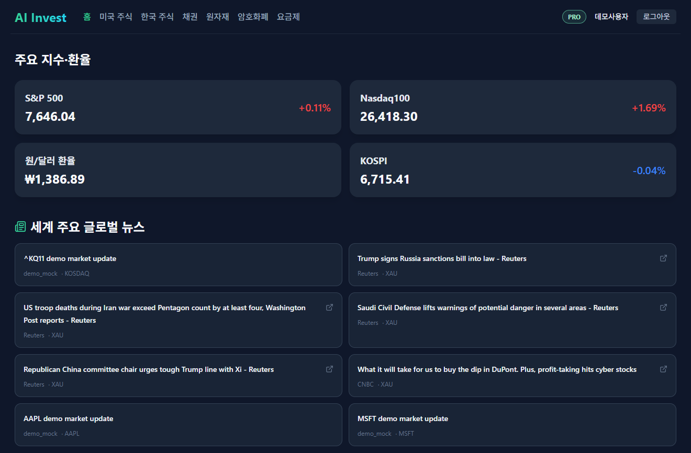
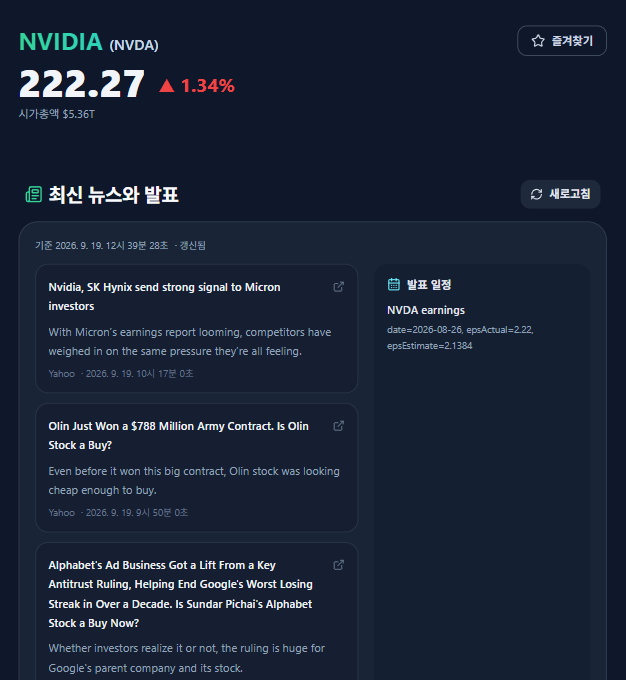
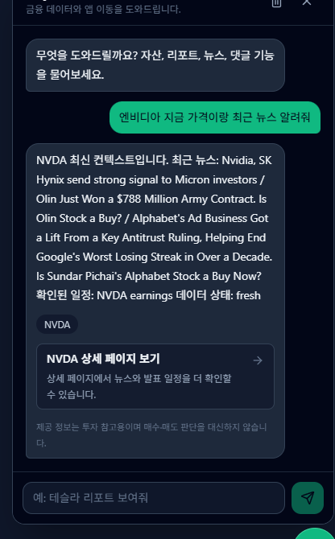
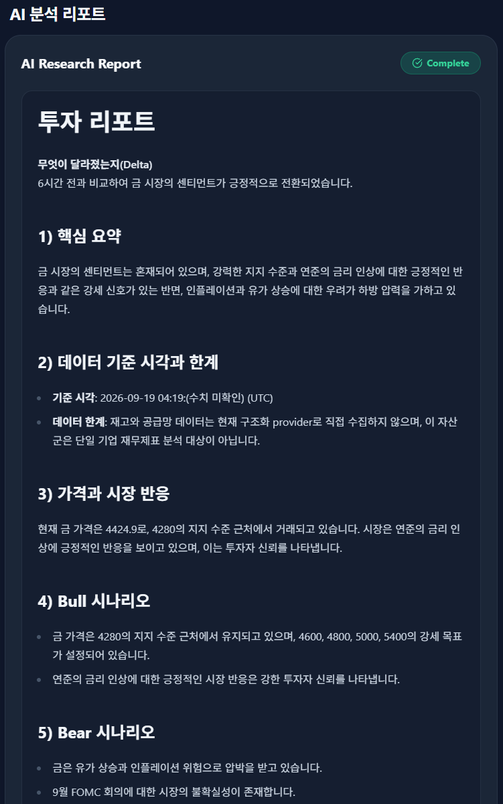
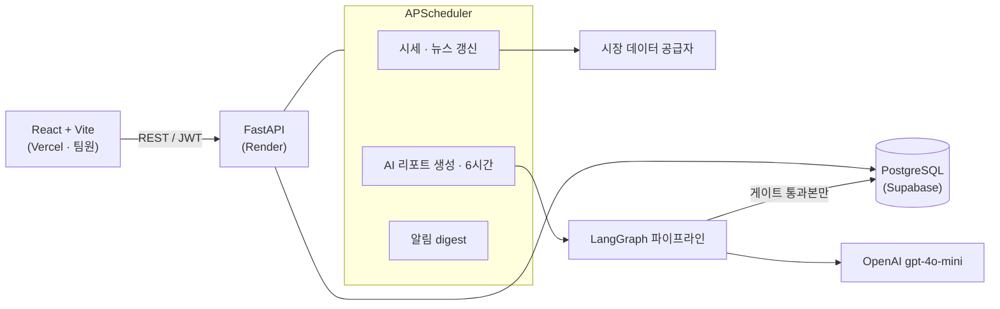
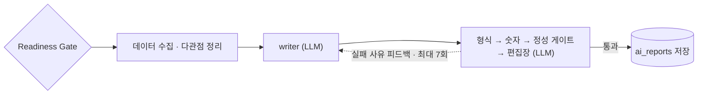

# AI Invest — LLM이 쓴 투자 리포트를 코드로 검증한 뒤에만 저장하는 서비스

> 흩어진 글로벌 시장 데이터를 한곳에 모으고, **LangGraph 파이프라인이 규칙 기반 게이트와 LLM 평가로 검증한 AI 투자 리포트**를 제공하는 웹 서비스입니다.

[](https://github.com/SunWoo1213/AI-Invest/actions/workflows/backend-tests.yml)


## 1. 프로젝트 개요

| 항목 | 내용 |
| --- | --- |
| 프로젝트명 | AI Invest |
| 개발 기간 | 2026.03 ~ 2026.06 (캡스톤디자인 1) |
| 참여 인원 | 2인 팀 |
| 나의 역할<br>&nbsp;&nbsp;&nbsp;&nbsp;&nbsp;&nbsp;&nbsp;&nbsp;&nbsp;&nbsp;&nbsp;&nbsp;&nbsp;&nbsp;&nbsp;&nbsp;&nbsp;&nbsp;&nbsp; | **백엔드 · 배포** — FastAPI API 41개 · 테이블 14개, LangGraph 리포트 파이프라인과 검증 게이트, 스케줄러 · 알림 · 챗봇 백엔드, Render · Supabase 배포. 프론트엔드(React)는 팀원이 맡았습니다 |

LLM이 쓴 투자 리포트에는 수집하지 않은 숫자가 섞일 수 있습니다. 그래서 생성은 LLM에 맡기고, 리포트의 숫자가 수집 데이터에 있는지는 코드 게이트로 확인한 뒤 통과한 리포트만 저장했습니다.
저장소는 본인 계정으로 관리해, 팀원이 작성한 프론트엔드 코드도 본인 계정의 커밋으로 들어가 있습니다.

| 대시보드 (지수 · 환율 · 뉴스) | 자산 상세 (시세 · 뉴스 · 발표 일정) |
| --- | --- |
|  |  |
| **챗봇** (저장된 데이터만 근거로 답변) | **AI 리포트** (게이트를 통과해 저장된 금(XAU) 리포트) |
|  |  |

## 2. 기술 스택

| 구분 | 기술 |
| --- | --- |
| 사용 언어 | Python (백엔드), JavaScript (프론트엔드 · 팀원) |
| 프레임워크 | FastAPI, SQLAlchemy 2 (Async) + asyncpg, Alembic, APScheduler, LangGraph · LangChain, React 19 + Vite (팀원) |
| 데이터베이스 | PostgreSQL 15 (Docker / Supabase), 테스트용 SQLite(aiosqlite) |
| AI · 외부 API<br>&nbsp;&nbsp;&nbsp;&nbsp;&nbsp;&nbsp;&nbsp;&nbsp;&nbsp;&nbsp;&nbsp;&nbsp;&nbsp;&nbsp;&nbsp;&nbsp;&nbsp;&nbsp;&nbsp;&nbsp;&nbsp;&nbsp;&nbsp; | OpenAI gpt-4o-mini, Finnhub · FMP · CoinGecko · FRED · 한국은행 ECOS · 공공데이터포털 · open.er-api · Naver 뉴스 검색, Gmail API · Telegram Bot |
| 개발 도구 | pytest · pytest-asyncio, GitHub Actions, Docker, Render · Supabase · Vercel, Codex · Claude Code |

## 3. 시스템 구조





리포트는 스케줄러만 만들고 사용자는 저장된 결과만 읽습니다(읽기와 생성의 분리). 그래서 LLM 비용이 사용자 수와 상관없이 정해집니다.
외부 API는 실패한다는 전제로, 공급자마다 타임아웃과 폴백을 두고 수집에 실패하면 직전 유효값을 유지합니다.

## 4. 주요 기능

### 핵심 기능

- **시장 대시보드**: 미국 · 한국 주식, 국채, 원자재, 암호화폐, 환율을 자산군별 공급자에서 모아 보여 줍니다.
- **AI 투자 리포트**: 5개 대표 자산(미 10년물 금리 · 금 · BTC · NVDA · 삼성전자)의 리포트를 스케줄러가 6시간마다 생성 · 검증해 저장합니다.
- **즐겨찾기 알림**: 즐겨찾기 자산 요약을 하루 3회(09 · 13 · 18시 KST) Gmail · Telegram으로 보냅니다.
- **AI 챗봇**: 기본은 규칙 기반이고, LLM 경로를 켜도 백엔드가 모은 시세 · 저장 리포트만 근거로 답합니다.
- **인증**: Google OAuth → JWT 발급.

### 기술적 차별점

- **생성은 LLM, 검증은 코드**: 형식 · 숫자 · 정성 게이트를 규칙 기반으로 둬 결과를 재현할 수 있고 비용이 들지 않습니다. 숫자 게이트는 리포트의 수치가 수집 데이터(`allowed_numbers`)에 있는지 대조하고, writer도 같은 허용 숫자 목록을 받아 씁니다.
- **실패해도 저장하지 않는 폴백**: 재작성 한도(7회)에 닿으면 근거 없는 숫자만 "(수치 미확인)"으로 바꾸고, 모든 게이트를 다시 통과할 때만 저장합니다.
- **운영 스키마 보호**: 운영에서는 `alembic upgrade head`를 먼저 적용하고, 기동 시 필수 테이블 · 컬럼이 없으면 기동을 멈춥니다.

### 성능 최적화

- **공공데이터포털 종목 조회**: 날짜 범위 없이 조회하면 응답에 약 19.6초가 걸려 타임아웃이 났습니다. 조회에 날짜 범위(`beginBasDt` · `endBasDt`)를 넣어 약 1~3초로 줄였습니다([기록](docs/harness/records/market-data/market-data-kr-data-go-index-name-throttle-fix-2026-06-04.md)).
- **LLM 비용 상한**: 대상 5개 자산, 6시간 주기, 자산별 6시간 쿨다운, LLM 호출 간 10초 대기를 설정값으로 둬 생성 비용이 사용자 수와 무관하게 정해집니다.

## 5. 문제 해결 사례

### AI 파이프라인 — NVDA 리포트만 계속 404가 나던 문제

**직면한 문제**
다른 종목과 달리 `/api/reports/NVDA`만 계속 404였고, 로그 끝의 "리포트 생성 종료"를 보고 서버 강제 종료가 아니라는 것을 확인했습니다. 로그를 따라가 보니 숫자 게이트가 초안을 반복해 거부해 재작성 한도를 넘기고 있었습니다. writer가 허용 숫자 목록 없이 학습 지식의 숫자를 썼고, 데이터 `-3.62`와 리포트 "3.62% 하락"을 다른 숫자로 보는 오탐도 있었습니다.

**해결 과정**
게이트를 느슨하게 하는 대신, 검증기와 같은 데이터에서 뽑은 허용 숫자 목록(최대 150개)을 writer 프롬프트에 넣었습니다. 숫자 비교는 절댓값으로 바꿔 크기만 보고, 상승 · 하락 방향은 정성 게이트와 편집장이 보게 나눴습니다. 재작성 한도는 설정값으로 빼 3회에서 7회로 늘렸습니다.

**결과 및 학습점**
NVDA 리포트 404가 사라졌고, 숫자 게이트의 기준은 그대로입니다. 부호만 다른 숫자와 근거 없는 숫자 치환을 확인하는 단위 테스트를 추가해 품질 게이트 테스트 31개가 통과했습니다. 검증을 느슨하게 하기보다, 생성 쪽에 검증과 같은 근거를 주는 편이 낫다는 것을 배웠습니다.

핵심 코드: [`backend/app/services/graph/nodes.py`](backend/app/services/graph/nodes.py) (`ALLOWED_NUMBERS_LIMIT`, `fact_checker_node`)

### 배포 · 스케줄러 — 배포 후 리포트가 한 번도 만들어지지 않던 문제

**직면한 문제**
배포 환경에서 리포트가 생기지 않았고, Render 로그에 "리포트 생성 시작"이 한 번도 없었습니다. 그래서 "잡이 돌았는데 실패"가 아니라 "잡이 애초에 발화하지 않음"으로 범위를 좁혔습니다. interval 잡은 기동 6시간 뒤에 처음 실행되는데, 그 전에 재배포 · 재시작으로 인스턴스가 종료되고 있었습니다.

**해결 과정**
리포트 잡에 `next_run_time`을 지정해 기동 60초 뒤 첫 실행되게 하고, 중복 등록되던 기동 시 잡을 하나로 합쳤습니다. 같은 증상의 독립된 원인도 있었습니다. Finnhub 502 · FMP 402로 현재가 0이 캐시되면 Readiness Gate에서 막혔기 때문에, 미국 주식 현재가 폴백 체인을 두고 가격 0은 캐시하지 않게 했습니다.

**결과 및 학습점**
기동할 때 리포트 잡이 한 번만 등록되고 60초 뒤 첫 실행이 잡히는지를 테스트로 확인합니다. 로그에 시작 줄이 있는지로 "발화 안 함"과 "실행 후 실패"를 먼저 나누는 습관이 생겼습니다.

핵심 코드: [`backend/app/main.py`](backend/app/main.py) (리포트 잡 등록 · `next_run_time`)

### 보안 — 배포 로그에 외부 API 키가 평문으로 찍히던 문제

**직면한 문제**
배포 로그를 확인하다가 외부 API 키가 평문으로 남은 것을 발견했습니다. 외부 호출이 실패하면 예외 메시지에 키가 담긴 URL이 그대로 들어갔고, `httpx` INFO 로그도 요청 URL을 출력하고 있었습니다.

**해결 과정**
URL 쿼리 · 경로의 키를 가리는 `redact_secrets`를 만들어 로그로 나가는 문자열에 적용했습니다. `httpx` · `httpcore` · `sqlalchemy.engine` 로거는 WARNING 이상만 남기게 조정하고, 노출된 키는 교체했습니다.

**결과 및 학습점**
키가 담긴 URL과 예외 메시지가 가려져 기록되는지 확인하는 로그 마스킹 테스트를 추가했습니다. 로그도 외부로 나가는 출력이라는 점을 배웠습니다.

핵심 코드: [`backend/app/core/log_sanitizer.py`](backend/app/core/log_sanitizer.py)

다른 사례(배포 · 인프라 · 시장 데이터 · 알림)는 [오류 사례집](docs/harness/error-casebook-2026-06-03.md)과 [개발 기록](docs/harness/records/)에 증상 → 원인 → 수정 → 예방 형식으로 있습니다.

## 6. 테스트와 품질

- **백엔드 테스트**: pytest + pytest-asyncio, 24개 파일 · 228 케이스 통과. DB는 SQLite(aiosqlite)를 쓰고, 외부 API와 LLM 호출은 monkeypatch로 대체합니다.
- **검증 범위**: 품질 게이트, 리포트 생성 스위치, 권한(401/403), 공급자 폴백 · 타임아웃, 로그 마스킹, 알림 digest, 챗봇 grounding.
- **CI**: GitHub Actions `backend-tests`가 push · PR마다 `.env` 없이 더미 설정으로 pytest를 실행합니다.
- **개발 절차**: AI 코딩 에이전트(Codex · Claude Code)와 개발하면서 [AGENTS.md](AGENTS.md)에 규칙을 두고, 작업마다 계획 · 구현 · 검증 기록을 [docs/harness/records/](docs/harness/records/)에 남겼습니다.
- 프론트엔드(팀원 담당)는 `npm run lint` · `npm run build`로만 확인했습니다.

### 6-1. 실제 실행 기록

게이트가 실제 데이터에서 어떻게 동작하는지 보려고 로컬에서 실제 OpenAI · 시세 API로 리포트를 생성했습니다([상세 기록](docs/harness/records/ai-report/local-report-run-trace-and-search-tool-fix-2026-09-19.md)). NVDA는 편집장이 "밸류에이션 · 베타 데이터 누락"으로 거부해 저장되지 않았고, 금(XAU)은 재작성 7회 뒤 저장됐습니다.
실행 중 결함 2건을 찾아 고쳤습니다. 검색 도구(`ddgs`) 하나의 예외가 파이프라인 전체를 멈추던 것은 "검색 불가"를 돌려주고 계속 진행하도록 감쌌고 버전을 고정했습니다. 숫자 게이트가 기준 시각 `04:19:57`의 초(`57`)를 근거 없는 숫자로 보던 것은 날짜 · 시각 표기를 검증에서 빼고 회귀 테스트를 추가했습니다.

### 6-2. 반복 측정 20건

스케줄러 대상 5개 자산을 4번씩 같은 조건(로컬 · 임시 DB · 실제 `gpt-4o-mini` · 시세 API)으로 생성했습니다. 편집장 프롬프트에 오늘 날짜 · 데이터 기준 시각이 없어 2026년 데이터를 "현재와 차이가 있다"며 거부하던 원인을 고친 뒤 같은 조건으로 다시 쟀습니다.

| 지표 | 처음 | 편집장 수정 후 |
| --- | --- | --- |
| 게이트 정상 통과 | 0 / 20 | 5 / 20 |
| 숫자 정제 폴백으로 저장 | 5 / 20 | 5 / 20 |
| 거부(미저장) | 15 / 20 | 10 / 20 |
| 건당 평균 비용 · 시간 · LLM 호출 | $0.0127 · 83초 · 15.4회 | $0.0120 · 78초 · 14.4회 |

20건 표본이라 실행마다 편차가 있고, 운영 서버 수치가 아닙니다.

## 7. 배포와 운영

- **구성**: 프론트 Vercel(팀원) · 백엔드 Render · DB Supabase(PostgreSQL). 백엔드는 in-process 스케줄러와 메모리 캐시, 긴 LLM 파이프라인에 기대는 상시 가동 구조라 서버리스 대신 Render를 골랐고, Free는 idle sleep로 스케줄러가 끊겨 Render Standard로 운영했습니다.
- **스케줄러 잡**: 시세 5분 · 뉴스 60분 · 리포트 기동 60초 후 1회와 이후 6시간마다 · 알림 digest 하루 3회. 모든 잡은 `coalesce=True` · `max_instances=1`로 중복 실행을 막습니다.
- **DB 마이그레이션**: Alembic 리비전 3개. 로컬은 부트스트랩, 운영은 `alembic upgrade head` 후 기동 시 스키마 검증.
- **헬스체크**: `/health`(liveness)와 `/db-check`(readiness)를 나눴습니다.
- **로컬**: `docker-compose.yml`로 PostgreSQL을 띄웁니다. 배포 절차는 [Render 배포 가이드](docs/harness/records/deployment/render-backend-deployment-guide-2026-06-03.md)에 있습니다.

## 8. 실행 방법

사전 준비: Python 3.11+, Node.js 20+, Docker. 환경변수 설명은 [ENVIRONMENT_VARIABLE_SETUP.md](docs/guides/ENVIRONMENT_VARIABLE_SETUP.md)에 있습니다.

```powershell
Copy-Item .env.example .env          # 값을 채웁니다. frontend/.env에는 공개 값(VITE_*)만 넣습니다
docker compose up -d db              # 1) 데이터베이스

cd backend                           # 2) 백엔드 http://localhost:8000
pip install -r requirements.txt
uvicorn app.main:app --reload
pytest                               #    테스트 (별도 터미널)

cd ../frontend                       # 3) 프론트엔드 http://localhost:5173
npm install
npm run dev
```

- **API 문서**: 백엔드 실행 후 `http://localhost:8000/docs`(FastAPI Swagger), 정리본은 [API 명세](docs/deliverables/05-API-명세서.md).
- AI 리포트 생성(`ENABLE_AI_REPORT_GENERATION`, OpenAI 키 필요) · 알림 스케줄러 · LLM 챗봇은 환경변수로 켜고 끕니다.

## 9. 문서

- [docs/README.md](docs/README.md) — 전체 문서 색인
- [CODE_UNDERSTANDING.md](docs/architecture/CODE_UNDERSTANDING.md) — 구조 · 데이터 흐름
- 캡스톤 산출물: [흐름도](docs/deliverables/01-시스템-흐름도.md) · [ERD](docs/deliverables/04-ERD.md) · [API 명세](docs/deliverables/05-API-명세서.md) · [기능 명세](docs/deliverables/03-기능상세-명세서.md)
- [오류 사례집](docs/harness/error-casebook-2026-06-03.md) · [기능 문서 색인](docs/harness/feature-index.md) · [개발 기록](docs/harness/records/)
