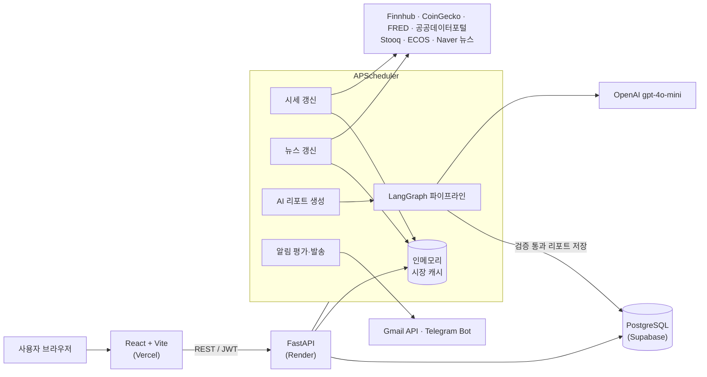
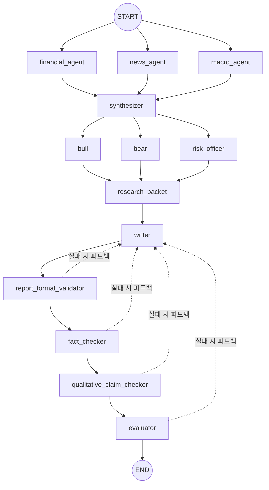

# AI Invest — 글로벌 금융 데이터 & AI 투자 리포트 플랫폼

> 흩어진 글로벌 시장 데이터를 한곳에 모으고, **LangGraph 멀티 에이전트가 스스로 검증한 AI 투자 리포트**를 구독 등급별로 제공하는 풀스택 웹 서비스입니다. (캡스톤 프로젝트)


- **배포**: Frontend — [Vercel](https://finance-assist-gray.vercel.app) · Backend — Render · DB — Supabase(PostgreSQL)
- **개발 기간**: 2026.05 ~ 2026.06 (캡스톤 최종 산출물 제출 2026-06-15)

---

## 목차

1. [주요 기능](#1-주요-기능)
2. [시스템 아키텍처](#2-시스템-아키텍처)
3. [AI 리포트 파이프라인](#3-ai-리포트-파이프라인)
4. [기술 스택](#4-기술-스택)
5. [기술적 도전과 해결](#5-기술적-도전과-해결)
6. [AI 코딩 하네스 기반 개발 프로세스](#6-ai-코딩-하네스-기반-개발-프로세스)
7. [프로젝트 구조](#7-프로젝트-구조)
8. [로컬 실행](#8-로컬-실행)
9. [문서](#9-문서)

---

## 1. 주요 기능

| 기능 | 설명 | 권한 |
| --- | --- | --- |
| **시장 대시보드** | S&P 500·NASDAQ·KOSPI·USD/KRW 등 주요 지수와 글로벌 뉴스를 한 화면에 표시 | 전체 |
| **자산 카테고리 탐색** | 지수 / 미국·한국 주식 / 미국·한국 채권 / 원자재 / 암호화폐 7개 카테고리, 검색, 즐겨찾기 | 전체 |
| **자산 상세** | 시세·등락률·관련 뉴스와 자산별 커뮤니티(댓글·좋아요·신고 누적 시 자동 숨김) | 전체 (작성은 로그인 + 닉네임 확정) |
| **AI 투자 리포트** | 스케줄러가 미리 생성·검증해 저장한 리포트를 조회 (강세/약세 시나리오, 리스크, 근거 수치 포함) | PLUS 이상 |
| **즐겨찾기 알림** | 가격 급변·새 뉴스·새 리포트를 감지해 Gmail / Telegram / 인앱으로 발송, 하루 3회 요약 다이제스트 | PLUS 이상 |
| **AI 챗봇** | 현재 페이지 맥락을 이해하고 저장된 데이터만 근거로 답하는 금융 어시스턴트 (최근 10턴 기억) | PRO |
| **인증** | Google OAuth → JWT 발급, 신규 사용자 자동 가입 | — |
| **구독 결제** | FREE / PLUS / PRO 3단계 요금제, 등급별 권한(entitlement) 제어 | — |

> 결제는 현재 **Mock 즉시 활성화** 방식으로 동작합니다. Toss Payments 빌링 연동은 인증 단계까지만 구현되어 있습니다.

## 2. 시스템 아키텍처



**설계 원칙**

- **읽기와 생성의 분리** — 사용자 요청이나 챗봇 질문은 LLM 리포트를 실시간으로 생성하지 않습니다. 리포트는 스케줄러만 만들고, 사용자는 저장된 결과만 읽습니다. 그래서 LLM 비용을 예측할 수 있고 응답 속도도 일정합니다.
- **외부 API는 실패한다는 전제** — 시세 공급자마다 타임아웃, 폴백 공급자, stale 캐시 유지(carry-forward)를 두어 한 공급자가 멈춰도 화면이 비지 않게 했습니다.
- **얇은 라우터, 두꺼운 서비스** — `api/`는 인증·권한·상태 코드만 다루고, 외부 연동·정규화·AI 로직은 모두 `services/`에 둡니다.

## 3. AI 리포트 파이프라인

LangGraph로 **데이터 수집 → 다관점 분석 → 작성 → 4단계 품질 게이트** 흐름을 구성했습니다. 검증에 실패하면 실패 사유를 피드백으로 받아 다시 작성합니다(최대 7회).



| 게이트 | 역할 |
| --- | --- |
| Format Validator | 자산군별(주식·채권·원자재·코인) 필수 섹션과 헤딩 구조 검사 |
| Fact Checker | 리포트의 모든 수치가 수집된 원천 데이터(`allowed_numbers`)에 있는지 대조해 **근거 없는 숫자 차단** |
| Qualitative Claim Checker | 근거가 없는 정성적 단정 표현 검출 |
| Evaluator | 최종 품질 평가 후 품질 메타데이터와 함께 `AIReport`에 저장 |

챗봇도 같은 원칙을 따릅니다. LLM에는 백엔드가 모은 grounding 데이터(시세 캐시, 저장된 리포트 요약)만 넘기고, 답변에 근거 없는 가격이나 퍼센트가 섞이면 `guard_answer`가 신뢰도를 낮추고 경고 문구를 붙입니다. LLM 호출이 실패하면 규칙 기반 응답으로 전환합니다.

## 4. 기술 스택

| 영역 | 기술 |
| --- | --- |
| Frontend | React 19, Vite 8, JavaScript, Tailwind CSS 3, Zustand 5, React Router 7, Axios, Recharts, react-markdown |
| Backend | Python, FastAPI, SQLAlchemy 2 (Async) + asyncpg, Pydantic Settings, Alembic, APScheduler |
| AI | LangGraph, LangChain (langchain-openai), OpenAI gpt-4o-mini, DuckDuckGo 검색(ddgs) |
| Database | PostgreSQL 15 (Docker / Supabase), 테스트용 SQLite(aiosqlite) |
| 인증 | Google OAuth (google-auth), JWT (python-jose) |
| 외부 연동 | Finnhub, CoinGecko, FRED, 공공데이터포털, 한국은행 ECOS, Stooq, open.er-api, Naver 뉴스, Gmail API, Telegram Bot API, Toss Payments |
| 테스트 | pytest, pytest-asyncio (백엔드 테스트 23개 파일, 216개 케이스) |
| 배포 | Vercel (FE), Render (BE), Supabase (DB) |

## 5. 기술적 도전과 해결

개발 중 겪은 문제와 해결 과정은 모두 [`docs/harness/records/`](docs/harness/records/)에 기록했습니다. 그중 대표 사례입니다.

| 문제 | 원인 | 해결 | 기록 |
| --- | --- | --- | --- |
| 특정 종목(NVDA) 리포트가 끝없이 재작성되다 404 | Fact Checker가 같은 수치의 부호·표기 차이를 근거 없는 숫자로 판단해 재작성을 반복 | 숫자 부호·표기 정규화, `allowed_numbers` 정합성 보정, 재작성 한도 초과 시 숫자 정제 폴백 | [근본 원인 분석](docs/harness/records/ai-report/nvda-report-factchecker-loop-root-cause-2026-06-04.md) · [해결 구현](docs/harness/records/ai-report/nvda-factchecker-loop-404-remediation-implementation-2026-06-04.md) |
| 배포 환경에서 AI 리포트가 생성되지 않음 | 서버 기동 직후 interval 잡이 발화하지 않음 + 유료 API(FMP) 402 응답 | `next_run_time`을 명시해 기동 시 발화, 기동 잡 통합, 데이터 공급자 폴백 | [로그 분석](docs/harness/records/ai-report/report-generation-scheduler-not-firing-log-audit-2026-06-08.md) · [수정](docs/harness/records/ai-report/report-scheduler-startup-firing-fix-implementation-2026-06-08.md) |
| 배포 로그에 외부 API 키가 평문으로 노출됨 | 외부 호출 실패 예외에 키가 담긴 URL이 그대로 포함되고, `httpx` INFO 로그도 요청 URL을 출력 | `log_sanitizer.redact_secrets`로 쿼리·경로의 키를 마스킹하고, 민감 로거 레벨을 WARNING으로 낮춤 | [구현](docs/harness/records/ai-report/report-404-and-secret-log-leak-remediation-implementation-2026-06-04.md) |
| 지수 카드가 0으로 굳거나 사라짐 | 데이터 공급자 봇 차단(proof-of-work), 빈 응답이 12시간 캐시에 고착 | PoW 대응, 빈 응답 캐시 제외, 수집 실패 시 직전 값 유지, 나스닥을 FRED로 전환 | [PoW 대응](docs/harness/records/market-data/stooq-pow-anti-bot-bypass-implementation-2026-06-09.md) · [캐시 고착](docs/harness/records/market-data/stooq-empty-history-12h-cache-stuck-fix-2026-06-09.md) |
| 리포트 저장 실패 | timezone 없는 datetime과 있는 datetime 비교 | `data_as_of` timezone 정규화 | [수정](docs/harness/records/ai-report/report-data-as-of-naive-datetime-fix-2026-06-09.md) |
| 알림 메일 링크가 `localhost`를 가리킴 | 다이제스트 본문 생성 시 개발용 URL 사용 | 발송 직전 링크를 운영 `FRONTEND_BASE_URL`로 보정 | [수정](docs/harness/records/notifications/scheduled-digest-localhost-link-fix-implementation-2026-06-10.md) |

전체 오류 사례 모음: [error-casebook](docs/harness/error-casebook-2026-06-03.md)

## 6. AI 코딩 하네스 기반 개발 프로세스

이 프로젝트는 **Codex / Claude Code 같은 AI 코딩 에이전트와 함께 개발**했습니다. 에이전트가 아무렇게나 코드를 고치지 않도록 운영 규칙과 문서 체계(하네스)를 먼저 설계했습니다.

- **단일 규칙 문서** — [AGENTS.md](AGENTS.md)에 레이어 규칙, 시크릿 취급, 위험 변경 시 확인 절차, AI 비용 정책을 정의하고 [CLAUDE.md](CLAUDE.md)가 이를 그대로 가져다 씁니다.
- **Plan → Implement → Verify → Document** — 슬래시 커맨드([.claude/commands/](.claude/commands/))와 전용 서브에이전트([.claude/agents/](.claude/agents/))로 모든 작업이 계획서, 구현 기록, 검증 기록을 남깁니다. 이렇게 쌓인 기록이 약 170건입니다.
- **기능 단위 문서** — [feature-index](docs/harness/feature-index.md) → [features/](docs/harness/features/) → [records/](docs/harness/records/)로 이어지는 링크 구조라서, 에이전트나 사람이 특정 기능을 고치기 전에 관련 맥락을 바로 찾을 수 있습니다.
- **자동 가드** — 환경변수 정의(`config.py`)와 문서(`.env.example`, 가이드) 사이의 불일치를 [scripts/check_env_var_doc_sync.py](scripts/check_env_var_doc_sync.py)가 검사합니다. `.env` 읽기와 파괴적 git 명령은 [.claude/settings.json](.claude/settings.json)에서 차단하거나 실행 전 확인을 받습니다.

## 7. 프로젝트 구조

```text
Project_Finance/
├─ backend/                      # FastAPI 백엔드
│  ├─ app/
│  │  ├─ api/                    # 라우터: auth, billing, chat, community, favorites, notifications, profile
│  │  ├─ core/                   # 설정, JWT, 캐시, 로그 마스킹
│  │  ├─ db/                     # Async 엔진·세션
│  │  ├─ services/               # 시장·거시·AI·챗봇·결제·알림 비즈니스 로직
│  │  │  └─ graph/               # LangGraph 리포트 워크플로우 (state, nodes, graph, tools)
│  │  ├─ main.py                 # 앱 진입점, 스케줄러, 시장·리포트 엔드포인트
│  │  ├─ models.py               # SQLAlchemy ORM
│  │  └─ schemas.py              # Pydantic 스키마
│  ├─ alembic/                   # DB 마이그레이션
│  └─ tests/                     # pytest
├─ frontend/                     # React + Vite 프론트엔드
│  └─ src/ (pages, components, store, utils)
├─ docs/
│  ├─ architecture/              # 아키텍처·코드 이해·기능 상세 명세
│  ├─ guides/                    # 환경변수·외부 연동 설정 가이드
│  ├─ deliverables/              # 캡스톤 최종 산출물 7종 (흐름도, ERD, API 명세 등)
│  └─ harness/                   # 기능 문서 + 영역별 개발 기록
├─ scripts/                      # 문서 동기화 검사기, 수동 점검 헬퍼
├─ docker-compose.yml            # 로컬 PostgreSQL
├─ AGENTS.md / CLAUDE.md         # AI 코딩 에이전트 운영 규칙
└─ DEVELOPMENT_DIRECTION.md      # 개발 방향 가드레일 (하위 폴더별로도 존재)
```

## 8. 로컬 실행

**사전 준비**: Python 3.11+, Node.js 20+, Docker

```powershell
# 0) 환경변수 — .env.example을 복사해 .env를 만들고 값을 채웁니다
#    자세한 설명: docs/guides/ENVIRONMENT_VARIABLE_SETUP.md
Copy-Item .env.example .env

# 1) 데이터베이스
docker compose up -d db

# 2) 백엔드 (http://localhost:8000, API 문서: /docs)
cd backend
pip install -r requirements.txt
uvicorn app.main:app --reload
pytest                     # 테스트

# 3) 프론트엔드 (http://localhost:5173)
cd frontend
npm install
npm run dev
```

> 외부 API 키가 없어도 기본 화면은 동작하도록 데모·mock 폴백이 준비되어 있습니다. AI 리포트 생성(`ENABLE_AI_REPORT_GENERATION`)과 알림 스케줄러(`ENABLE_NOTIFICATION_SCHEDULER`)는 환경변수로 켜고 끕니다.

## 9. 문서

| 분류 | 문서 |
| --- | --- |
| 전체 문서 색인 | [docs/README.md](docs/README.md) |
| 코드 이해 (구조·데이터 흐름) | [CODE_UNDERSTANDING.md](docs/architecture/CODE_UNDERSTANDING.md) |
| 캡스톤 최종 산출물 | [흐름도](docs/deliverables/01-시스템-흐름도.md) · [스토리보드](docs/deliverables/02-스토리보드.md) · [기능 명세](docs/deliverables/03-기능상세-명세서.md) · [ERD](docs/deliverables/04-ERD.md) · [API 명세](docs/deliverables/05-API-명세서.md) · [개발 환경](docs/deliverables/06-개발-환경.md) |
| 설정 가이드 | [환경변수](docs/guides/ENVIRONMENT_VARIABLE_SETUP.md) · [Gmail OAuth](docs/guides/GMAIL_OAUTH_REFRESH_TOKEN_SETUP.md) · [Telegram](docs/guides/TELEGRAM_MESSAGE_RECEIVE_PROCEDURE.md) · [Vercel + Supabase](docs/guides/VERCEL_SUPABASE_INTEGRATION_GUIDE.md) |
| 개발 기록 | [기능 색인](docs/harness/feature-index.md) · [영역별 기록](docs/harness/records/) |
