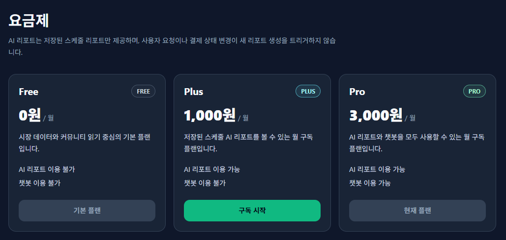
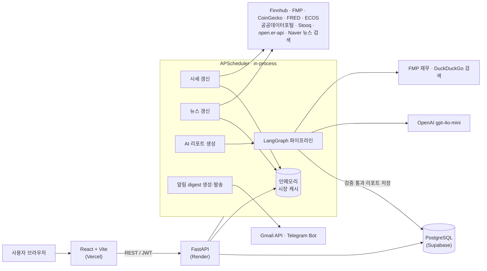
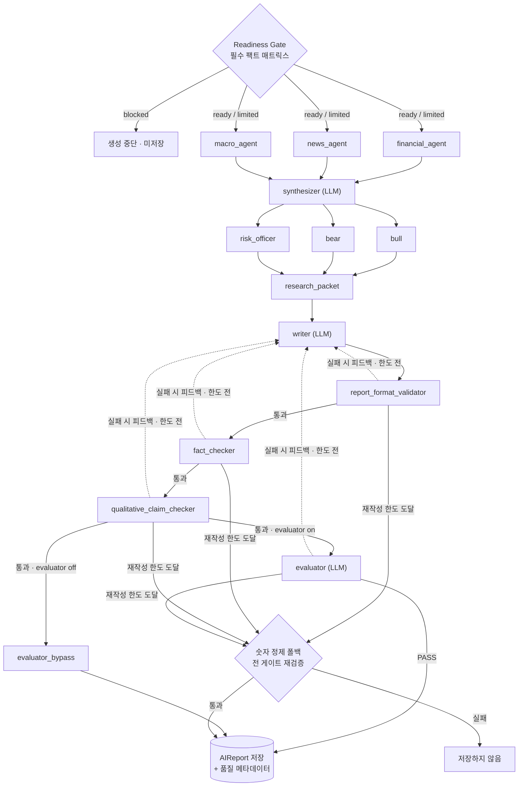
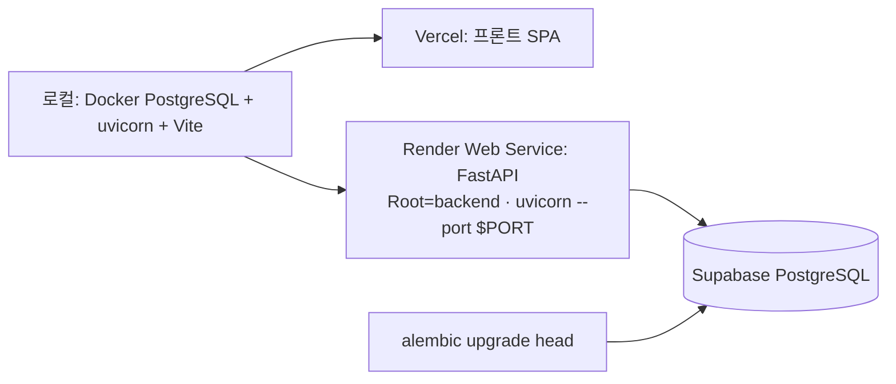

# AI Invest — 글로벌 금융 데이터 & AI 투자 리포트 플랫폼

> 흩어진 글로벌 시장 데이터를 한곳에 모으고, **LangGraph 파이프라인이 규칙 기반 게이트와 LLM 평가로 검증한 AI 투자 리포트**를 구독 등급별로 제공하는 웹 서비스입니다. (2인 팀 캡스톤 — 본인은 백엔드 · 배포 담당)


-20232A?logo=react&logoColor=61DAFB)

## 한눈에 보기

| | |
| --- | --- |
| **무엇** | 시장 데이터 대시보드 + LLM이 쓴 투자 리포트를 **코드 게이트로 검증한 뒤에만 저장**해 구독 등급(FREE/PLUS/PRO)별로 제공 |
| **내 역할** | 2인 팀 중 **백엔드 · 배포** — FastAPI API 46개 · 테이블 14개, LangGraph 리포트 파이프라인, 스케줄러 · 결제 · 알림 · 챗봇 백엔드, Render · Supabase 배포 |
| **핵심 결정 ①** | **생성은 LLM, 검증은 코드** — 리포트의 모든 숫자를 수집 데이터와 대조하는 규칙 게이트, 실패 시 최대 7회 재작성, 통과본만 저장 |
| **핵심 결정 ②** | **읽기와 생성의 분리** — 리포트는 스케줄러만 생성(5개 자산 · 6시간), 수동 생성 API는 403 → LLM 비용이 사용자 수와 무관 |
| **핵심 결정 ③** | **외부 API는 실패한다는 전제** — 공급자 멀티소스 폴백 + 직전 유효값 유지로 한 공급자 장애가 화면 · 리포트를 멈추지 않게 함 |
| **검증** | pytest 226 케이스 통과(LLM · 외부 API 모킹), 배포 · 운영 이슈 15건을 로그로 원인 추적해 기록([7절](#7-기술적-도전과-해결)), 로컬 실제 실행으로 게이트 동작 확인([실제 실행 기록](#실제-실행-기록-2026-09-19)) |
| **한계** | 리포트 품질 · 비용 실측 없음, 결제는 mock, CI 없음 ([13절](#13-한계와-다음-단계)) |

### 화면

| 대시보드 (지수 · 환율 · 뉴스) | 자산 상세 (시세 · 뉴스 · 발표 일정) |
| --- | --- |
|  |  |
| **PRO 챗봇** (기본 규칙 기반, 저장된 데이터만 근거로 답하고 화면 이동 카드 제공) | **요금제** (FREE / PLUS / PRO) |
|  |  |
| **AI 리포트** (게이트를 통과해 저장된 금(XAU) 리포트) | |
|  | |

> 로컬에서 실행한 화면입니다(2026-09-19, 실시간 시세는 9개 핵심 티커, 나머지는 데모 데이터). 리포트의 `기준 시각 … 04:19:(수치 미확인)`은 아래 실행 기록에서 찾은 결함이 그대로 드러난 부분입니다.

### 실제 실행 기록 (2026-09-19)

포트폴리오 정리 중 로컬에서 실제 OpenAI · 시세 API로 리포트를 생성해 봤습니다([상세 기록](docs/harness/records/ai-report/local-report-run-trace-and-search-tool-fix-2026-09-19.md)).

| 자산 | 결과 | 무슨 일이 있었나 |
| --- | --- | --- |
| NVDA | **저장 안 됨** | LLM 편집장이 "밸류에이션 · 베타 데이터 누락"으로 거부 → 품질 미달 리포트는 저장하지 않는 설계대로 동작 |
| XAU (금) | **저장됨** (재작성 7회) | 형식 게이트가 "계절성" 토픽 누락으로 3회 거부 → 숫자 게이트가 근거 없는 숫자 `57`을 3회 거부 → 한도 도달 후 숫자 정제 폴백이 `57`만 치환하고 전 게이트 재검증을 통과해 저장 |

실행하면서 결함 2건을 찾았습니다.

- **검색 도구 하나의 오류가 파이프라인 전체를 멈춤 → 수정함.** `requirements.txt` 버전 미고정으로 최신 `ddgs`가 설치됐고, 존재하지 않는 도메인을 조회하며 예외를 던졌습니다. 검색 도구가 실패하면 "검색 불가"를 돌려주고 수집된 데이터만으로 계속 진행하도록 감싸고 테스트 2건을 추가했습니다.
- **숫자 게이트가 시각 표기의 "초"를 근거 없는 숫자로 판단 → 미수정.** 거부된 `57`은 기준 시각 `04:19:57`의 초였고, 폴백이 이를 치환해 시각이 깨졌습니다. 숫자 추출에서 시각 · 날짜 패턴을 빼는 것이 다음 과제입니다.

- **팀 구성**: 2인 팀 (캡스톤)
- **담당 역할**: **백엔드 · 배포 · 서비스 로직 전반** — FastAPI, DB 설계·마이그레이션, LangGraph AI 리포트 파이프라인과 검증 게이트, 스케줄러, 구독·결제, 알림, 챗봇 백엔드, Render · Supabase · Vercel 배포와 운영 트러블슈팅
  - 프론트엔드(React 화면 구현)는 팀원이 담당했습니다. 저장소는 본인 계정으로 관리해, 팀원이 작성한 프론트엔드 코드도 본인 계정의 커밋으로 들어가 있습니다.
- **배포**: Frontend — [Vercel](https://finance-assist-gray.vercel.app) · Backend — Render (Standard, 상시 가동) · DB — Supabase(PostgreSQL)
- **개발 기간**: 2026.03 ~ 2026.06 (캡스톤 최종 산출물 제출 2026-06-15) — 단계별 내용은 [개발 타임라인](#6-개발-타임라인)

---

## 목차

1. [주요 기능](#1-주요-기능)
2. [시스템 아키텍처](#2-시스템-아키텍처)
3. [AI 리포트 파이프라인](#3-ai-리포트-파이프라인)
4. [백엔드 설계 상세](#4-백엔드-설계-상세)
5. [배포와 인프라](#5-배포와-인프라)
6. [개발 타임라인](#6-개발-타임라인)
7. [기술적 도전과 해결](#7-기술적-도전과-해결)
8. [AI 코딩 하네스 기반 개발 프로세스](#8-ai-코딩-하네스-기반-개발-프로세스)
9. [테스트와 검증](#9-테스트와-검증)
10. [기술 스택](#10-기술-스택)
11. [프로젝트 구조](#11-프로젝트-구조)
12. [로컬 실행](#12-로컬-실행)
13. [한계와 다음 단계](#13-한계와-다음-단계)
14. [문서](#14-문서)

---

## 1. 주요 기능

| 기능 | 설명 | 권한 |
| --- | --- | --- |
| **시장 대시보드** | S&P 500·NASDAQ Composite·KOSPI·USD/KRW 등 주요 지표와 글로벌 뉴스를 한 화면에 표시 | 전체 |
| **자산 카테고리 탐색** | 미국·한국 주식, 채권(미국·한국 국채), 원자재, 암호화폐, 주요 지표·환율 카테고리 + 검색, 즐겨찾기 | 전체 |
| **자산 상세** | 시세·등락률·관련 뉴스와 자산별 커뮤니티(댓글·좋아요·신고 **100건 누적 시 자동 삭제**) | 전체 (작성은 로그인 + 닉네임 확정) |
| **AI 투자 리포트** | 스케줄러가 미리 생성·검증해 저장한 리포트를 조회. 대상은 5개 대표 자산(미 10년물 금리·금·BTC·NVDA·삼성전자) | PLUS 이상 |
| **즐겨찾기 알림** | 즐겨찾기 자산 요약을 하루 3회(09·13·18시 KST) Gmail / Telegram으로 발송 | PLUS 이상 |
| **AI 챗봇** | 현재 페이지 맥락과 저장된 데이터만 근거로 답하는 금융 어시스턴트. 기본은 규칙 기반이고 `ENABLE_LLM_CHATBOT`을 켜면 LLM 경로 사용 (최근 10턴 기억) | PRO |
| **인증** | Google OAuth → JWT 발급, 신규 사용자 자동 가입 | — |
| **구독 결제** | FREE / PLUS(월 1,000원) / PRO(월 3,000원), 등급별 권한(entitlement) 제어 | — |

> - 무료 티어 API 호출 한도 때문에 **실시간 수집은 9개 핵심 티커**(`MARKET_LIVE_TICKERS`)로 제한했습니다. 나머지 자산은 결정론적 데모 데이터로 표시합니다.
> - 결제는 현재 **Mock 즉시 활성화** 방식입니다. Toss Payments는 빌링 인증 단계까지 구현했습니다. 자세한 내용은 [4-3](#4-3-구독결제-설계)에 있습니다.

## 2. 시스템 아키텍처



**설계 원칙**

- **읽기와 생성의 분리**: 사용자 요청이나 챗봇 질문은 리포트를 생성하지 않습니다. 리포트는 스케줄러만 만들고, 사용자는 저장된 결과만 읽습니다. 수동 생성 API(`POST /api/ai/generate/{ticker}`)는 항상 403을 돌려줍니다. 그래서 LLM 비용을 예측할 수 있고 응답 속도도 일정합니다.
- **외부 API는 실패한다는 전제**: 공급자마다 타임아웃과 폴백 공급자를 둡니다. 수집에 실패하면 직전 유효값을 유지(stale carry-forward)해서, 한 공급자가 멈춰도 화면이 비지 않게 했습니다.
- **얇은 라우터, 두꺼운 서비스**: `api/`는 인증·권한·상태 코드만 다룹니다. 외부 연동, 정규화, AI 로직은 모두 `services/`에 둡니다.

**스케줄러 잡 구성** ([main.py](backend/app/main.py))

모든 잡은 `coalesce=True`와 `max_instances=1`로 중복 실행을 막습니다.

| 잡 | 트리거 | 기본값 | 활성 조건 |
| --- | --- | --- | --- |
| 시장 캐시 warm-up | 기동 시 백그라운드 태스크 (포트 바인딩을 막지 않음) | 1회 | `ENABLE_MARKET_WARMUP` |
| `update_prices_task` | interval | 5분 | `ENABLE_SCHEDULER` |
| `update_news_task` | interval | 60분 | `ENABLE_SCHEDULER` |
| `generate_daily_reports` | interval + `next_run_time` | 기동 60초 후 1회, 이후 6시간마다 | + `ENABLE_AI_REPORT_GENERATION` |
| `notification_digest_HHMM` | cron (Asia/Seoul) | 09:00 · 13:00 · 18:00 | + `ENABLE_NOTIFICATION_SCHEDULER` (기본 off) |
| `notification_delivery` | interval | 1분 (대기 중인 알림 발송) | + `ENABLE_NOTIFICATION_SCHEDULER` |

## 3. AI 리포트 파이프라인

LangGraph로 **Readiness Gate → 데이터 수집 → 다관점 정리 → 작성 → 4단계 품질 게이트** 흐름을 구성했습니다.

- 게이트에서 실패하면 실패 사유를 피드백으로 받아 writer가 다시 작성합니다(`REPORT_MAX_REVISIONS=7`).
- 재작성 한도에 도달하면 그래프가 종료됩니다. 그 뒤 **숫자 정제 폴백**이 재검증을 통과할 때만 저장하고, 통과하지 못하면 저장하지 않습니다.



| 단계 | 방식 | 역할 |
| --- | --- | --- |
| Readiness Gate | 규칙 | 가격이 없거나 0인 경우, blocking 등급 팩트가 빠진 경우, 원자재·코인 핵심 팩트가 3개 이상 빠진 경우 **LLM 호출 전에 중단**합니다. 일부만 빠진 경우(`limited`)는 한계를 명시한 채로 진행합니다. |
| bull / bear / risk_officer | 규칙 | synthesizer가 만든 구조화 팩트를 상승·하락·리스크 관점으로 나눕니다(LLM 호출 없음). |
| Format Validator | 규칙 | 고정 10개 섹션(핵심 요약 ~ 투자 유의사항)과 자산군별 분석 토픽의 누락을 검사합니다. |
| Fact Checker | 규칙 | 리포트의 모든 수치가 수집된 원천 데이터(`allowed_numbers`)에 있는지 대조해 **근거 없는 숫자를 차단**합니다. |
| Qualitative Claim Checker | 규칙 | 고위험 정성 표현이 근거 텍스트 없이 쓰였는지 검출합니다. |
| Evaluator | LLM | "편집장" 역할로 최신성·팩트 무결성·한국어 품질·데이터 한계 표기·근거 없는 주장을 평가합니다. `ENABLE_REPORT_EVALUATOR`로 끌 수 있습니다. |

- 앞의 게이트를 모두 규칙 기반으로 둔 이유가 있습니다. 결과를 재현할 수 있고 비용이 들지 않으며, writer와 같은 허용 숫자 집합을 공유해 첫 초안 통과율을 올릴 수 있기 때문입니다.
- 저장은 그래프 밖의 `generate_report_for_ticker`가 합니다. 저장 시 게이트별 통과 여부, 재작성 횟수, 데이터 기준 시각, 소스 상태를 `ai_reports`에 함께 기록합니다. 다만 사용자 API 응답에는 내부 메타데이터를 내보내지 않습니다.

**비용 통제**

리포트 생성 비용은 설정으로 제한합니다([config.py](backend/app/core/config.py)).

- 대상 자산은 5개(`REPORT_SCHEDULER_TARGET_TICKERS`)입니다.
- 6시간 주기로 돌고, 한 번에 최대 5건까지 생성합니다.
- 같은 자산은 6시간 동안 다시 생성하지 않습니다(쿨다운).
- LLM 호출 사이에 10초씩 대기합니다.
- 생성 범위는 `conservative`로 고정했습니다.

**챗봇**

챗봇도 같은 원칙을 따릅니다.

- 기본 경로는 규칙 기반 의도 분류와 응답입니다.
- `ENABLE_LLM_CHATBOT`을 켜면 백엔드가 모은 grounding 데이터(시세 캐시, 저장된 리포트 요약)만 LLM에 넘깁니다.
- 답변에 근거 없는 가격이나 퍼센트가 섞이면 `guard_answer`가 신뢰도를 낮추고 경고 문구를 붙입니다.
- LLM 호출이 실패하면 규칙 기반 응답으로 전환합니다.

## 4. 백엔드 설계 상세

### 4-1. 데이터 수집과 공급자 변천

무료 티어만으로 안정적인 데모를 만들기 위해, 배포 환경에서 공급자를 여러 차례 교체했습니다([records/market-data](docs/harness/records/market-data/)).

| 시점 | 문제 | 결정 |
| --- | --- | --- |
| 03월 | — | yfinance 단일 소스로 시작 |
| 06-03 | Render 데이터센터 IP에서 Yahoo `401 Invalid Crumb` / `429` 발생 | yfinance를 제거하고 Finnhub · CoinGecko · 공공데이터포털 · Stooq · open.er-api · Naver 뉴스 멀티소스(`price_providers.py`)로 교체 |
| 06-04 | 공급자 직렬화(`Semaphore(1)`)와 종목별 타임아웃이 충돌해 대량 실패 | 공급자별 타임아웃·동시성 설정을 분리 (data.go.kr 25초, 동시성 2) |
| 06-07 | Stooq `ConnectTimeout` 반복 | Stooq를 기본 경로에서 제외하고 FMP Basic 무료 플랜 중심으로 재구성 |
| 06-08 | Finnhub 502 + FMP 402 → 현재가 0이 캐시됨 | 미국 주식 현재가 폴백(Finnhub → FMP → 최근 종가), 전 공급자 실패 시 직전 유효값 유지. 데모용 실시간 티커 allowlist와 mock 데이터 도입 |
| 06-09 | Stooq JS proof-of-work 봇 차단, 빈 응답이 12시간 캐시에 고착 | PoW 풀이 후 쿠키 재사용, 빈 응답은 캐시하지 않음, 수집 실패 시 카드 유지 |
| 06-10 | Stooq 키 경로 자체가 빈 응답 | 나스닥을 FRED `NASDAQCOM`으로 전환 |

### 4-2. DB와 마이그레이션 전략

- **스키마**: 사용자, 자산, AI 리포트, 커뮤니티, 구독·결제 이벤트, 즐겨찾기, 알림 등 14개 테이블로 구성했습니다([ERD](docs/deliverables/04-ERD.md)).
- **Alembic 리비전 3개**: 구독·결제 baseline, 즐겨찾기·알림 테이블, 닉네임 확정 컬럼입니다.
- **로컬과 운영의 분리**
  - 로컬(`ENABLE_DB_SCHEMA_BOOTSTRAP=true`)에서는 `create_all`과 `ADD COLUMN IF NOT EXISTS`로 편하게 부트스트랩합니다.
  - 운영(`false`)에서는 스키마를 만들지 않습니다. `alembic upgrade head`를 먼저 적용하고, 기동 시에는 필수 테이블·컬럼을 검증해 누락이 있으면 **기동을 중단**합니다.
- **연결 URL 정규화**
  - `postgres://` 형식을 `postgresql+asyncpg://`로 바꿉니다.
  - asyncpg가 인식하지 못하는 `sslmode`는 `ssl`로 변환합니다.
  - 호스팅 대시보드가 붙인 따옴표를 제거합니다.
  - `DATABASE_URL`이 없으면 Vercel/Supabase가 제공하는 `POSTGRES_URL` 계열을 폴백으로 씁니다.

### 4-3. 구독·결제 설계

- **권한 판정 일원화**: 등급별 권한은 `require_report_access` / `require_chatbot_access` / `require_notification_access` 라우터 의존성 한 곳에서 판정합니다. 인증 실패(401)와 권한 부족(403)을 분리했습니다.
- **Provider 추상화**: Mock / Toss 구현체를 같은 인터페이스로 교체할 수 있습니다.
  - 웹훅은 서명(HMAC-SHA256)을 검증합니다.
  - `billing_events`에서 이벤트 ID로 중복을 제거해 **멱등하게 처리**합니다.
  - 해지는 기간 말 종료(`cancel_at_period_end`) 방식입니다.
- **Mock 모드**: 결제 없이 즉시 구독을 활성화합니다. `PAYMENT_PROVIDER=toss`가 아니면 mock으로 동작하므로, 운영에서는 반드시 toss로 지정해야 합니다.
- **Toss Payments**
  - checkout 시 billing intent(`customerKey`)를 만들고, 프론트의 Toss 빌링 인증으로 넘어가는 단계까지 구현했습니다.
  - 빌링키 저장과 정기결제는 빌링키를 안전하게 저장할 DB 마이그레이션이 승인되기 전까지 `501`로 막아 두었습니다.
- **운영 도구**: 결제를 거치지 않고 등급을 부여하거나 회수하는 관리 스크립트([grant_subscription.py](backend/scripts/grant_subscription.py))를 제공합니다.

### 4-4. 알림

- **변화 감지형에서 정시 digest로 전환(06-09)**: 처음에는 가격 급변·뉴스·리포트 변화 감지형으로 설계했습니다. 이후 변화 여부와 관계없이 **하루 3회 정시 digest**를 보내는 방식으로 바꿨습니다. 변화 감지 함수는 코드에 남아 있지만 운영 스케줄러에서는 호출하지 않습니다.
- **중복 방지**: 같은 사용자·날짜·시각 슬롯의 digest는 dedupe key(`digest:{user}:{date}:{HHMM}`)로 한 번만 생성합니다.
- **발송 채널**: Gmail은 OAuth refresh token을 쓰고, Telegram은 봇 연결을 검증한 뒤 발송합니다.
- **등급 제한**: 외부 발송(Gmail·Telegram)은 **발송 시점에 PLUS 이상인지 다시 확인**합니다(06-10).

### 4-5. 보안

- **로그 시크릿 노출 차단**
  - `httpx`·`httpcore`·`sqlalchemy.engine` 로거를 WARNING으로 낮췄습니다.
  - `log_sanitizer.redact_secrets`로 URL 쿼리·경로에 들어간 API 키를 마스킹합니다.
  - 로그에 노출됐던 키는 손상된 것으로 보고 발급처에서 교체하도록 기록했습니다.
- **응답 최소화**: 리포트 API는 공급자 예외 문자열이나 소스 URL이 담길 수 있는 내부 메타데이터를 응답에서 제외합니다.
- **설정 분리**: CORS 허용 origin은 환경변수로 관리합니다. 시크릿은 backend env에만 두고, `VITE_*`에는 공개 값만 넣습니다.
- **Supabase RLS**: `rls_disabled_in_public` 경고를 받아 원인과 조치 절차를 정리했습니다([계획](docs/harness/records/deployment/supabase-rls-remediation-plan-2026-06-08.md)).

## 5. 배포와 인프라



- **호스트 선택**
  - 백엔드는 in-process APScheduler, 전역 메모리 캐시, 장시간 LLM 파이프라인에 의존하는 **상시 가동 런타임** 구조입니다. 그래서 Vercel 서버리스 대신 persistent 호스트인 Render를 선택했습니다.
  - Free · Starter · Standard 플랜을 비교했습니다. Free는 idle sleep 때문에 스케줄러가 끊기고, Starter는 리포트 생성 중 메모리가 부족할 위험이 있었습니다. 최종적으로 **Render Standard**로 운영했습니다([배포 가이드](docs/harness/records/deployment/render-backend-deployment-guide-2026-06-03.md)).
- **배포 절차**
  1. Supabase 프로젝트를 만들고 `alembic upgrade head`를 적용합니다.
  2. Render 서비스를 만듭니다(Root Directory `backend`, Start `uvicorn app.main:app --host 0.0.0.0 --port $PORT`).
  3. 환경변수를 등록합니다. 처음에는 `ENABLE_AI_REPORT_GENERATION=false` 상태로 smoke 테스트를 합니다.
  4. Vercel에 `VITE_API_BASE_URL`을 설정하고 재빌드합니다. SPA 새로고침은 [vercel.json](frontend/vercel.json)의 rewrite로 처리합니다.
  5. 비용과 rate limit을 확인한 뒤 리포트·알림 스케줄러를 켭니다.
- **헬스체크 분리**: `/health`는 앱이 살아 있는지만(liveness) 확인하고, `/db-check`는 DB 연결(readiness)을 확인합니다. DB 진단 정보는 자격증명 없이 표시합니다.
- **운영 비용**: Render Standard 외의 DB(Supabase)와 외부 API는 모두 무료 티어로 운영했습니다. 수집 주기와 대상은 환경변수로 조절합니다.

## 6. 개발 타임라인

| 기간 | 단계 | 주요 내용 |
| --- | --- | --- |
| 2026-03-18 ~ 03-19 | 프로토타입 | FastAPI + LangGraph 리포트 파이프라인 초안, 시장 데이터 수집, Docker PostgreSQL, 초기 화면 통합 |
| 2026-05-03 ~ 05-15 | 명세·방향 설정 | 기능 상세 명세서·프로젝트 명세서 작성, 폴더별 `DEVELOPMENT_DIRECTION.md` 가드레일 작성 |
| 2026-05-30 | 하네스 구축 | `AGENTS.md`, 계획 → 구현 → 검증 → 기록 체계 도입 |
| 2026-05-30 ~ 06-02 | 핵심 기능 확장 | 리포트 품질 게이트(형식·숫자·정성·평가), 챗봇, 구독 등급·결제, 마이페이지, 즐겨찾기 알림 |
| 2026-06-01 ~ 06-03 | 배포 | Vercel + Supabase 연동, Render 백엔드 배포, DB URL·CORS 문제 해결 |
| 2026-06-04 ~ 06-10 | 운영 안정화 | NVDA fact checker 루프, 로그 키 노출, 공급자 교체, 스케줄러 미발화 수정, Toss 빌링 인증, 알림 digest 전환과 PLUS 제한 |
| 2026-06-15 | 제출 | 캡스톤 최종 산출물 7종 제출 |
| 2026-09 | 정리 | 문서 구조 재정리, 포트폴리오 README 작성, 오래된 테스트 3건 · 리포트 정렬 버그 수정, `.env.example` 동기화, 추적되던 의존성 · 로그 파일 정리 |

**초기 설계에서 바뀐 점**

| 초기 설계 | 최종 구현 | 바꾼 이유 |
| --- | --- | --- |
| Next.js/TypeScript 청사진([ARCHITECTURE.md](docs/architecture/ARCHITECTURE.md)) | React + Vite + JavaScript | — |
| 이메일/비밀번호 가입 | Google 로그인 단일 흐름 | — |
| 사용자 요청 시 리포트 생성 | 스케줄러 전용 생성, 수동 생성 API는 403 | LLM 비용과 응답 속도를 통제하기 위해 |
| yfinance 단일 소스 | 무료 멀티소스 + 폴백 | 배포 환경에서 차단됨 |
| 변화 감지형 개별 알림 | 하루 3회 정시 digest | 예측 가능한 정시 요약 (채널별 1건) |

## 7. 기술적 도전과 해결

개발 중 겪은 문제와 해결 과정은 모두 [`docs/harness/records/`](docs/harness/records/)에 기록했고, 증상 → 원인 → 수정 → 예방 형식으로 [error-casebook](docs/harness/error-casebook-2026-06-03.md)에 모았습니다. 백엔드·배포 영역의 대표 사례입니다.

**AI 리포트**

| 문제 | 원인 | 해결 | 기록 |
| --- | --- | --- | --- |
| 특정 종목(NVDA) 리포트가 끝없이 재작성되다 404 | Fact Checker가 같은 수치의 부호·표기 차이(`-3.62` vs `3.62`)를 근거 없는 숫자로 판단해 재작성을 반복 | 숫자 부호·표기 정규화, `allowed_numbers`를 writer와 공유, 재작성 한도 초과 시 재검증을 거치는 숫자 정제 폴백 | [근본 원인 분석](docs/harness/records/ai-report/nvda-report-factchecker-loop-root-cause-2026-06-04.md) · [해결 구현](docs/harness/records/ai-report/nvda-factchecker-loop-404-remediation-implementation-2026-06-04.md) |
| 배포 환경 리포트 미생성 ① 잡 미발화 | interval 잡의 최초 발화는 기동 +6시간 후인데, 재배포·재시작으로 인스턴스가 그 전에 종료됨. 로그에 "리포트 생성 시작"이 한 번도 없음 | `next_run_time`을 명시해 기동 60초 후 발화, 중복 startup 잡 통합 | [로그 분석](docs/harness/records/ai-report/report-generation-scheduler-not-firing-log-audit-2026-06-08.md) · [수정](docs/harness/records/ai-report/report-scheduler-startup-firing-fix-implementation-2026-06-08.md) |
| 배포 환경 리포트 미생성 ② 데이터 끝단 | Finnhub 502 + FMP 402로 현재가 0이 캐시됨 → Readiness Gate가 `blocked` 처리. 스케줄러와는 **독립된 차단 지점** | 미국 주식 현재가 폴백 체인, 전 공급자 실패 시 직전 유효값 유지, 가격 0은 캐시하지 않음 | [구현](docs/harness/records/market-data/market-snapshot-price-fallback-and-stale-retention-implementation-2026-06-08.md) |
| 기동 직후 리포트 잡의 캐시 miss | 비차단 warm-up이 끝나기 전에 리포트 잡이 실행됨 | 리포트 생성 시 종목 단위로 캐시를 채우는 폴백 | [수정](docs/harness/records/ai-report/report-scheduler-market-cache-miss-fallback-2026-06-04.md) |
| 스케줄 리포트 schema 오류 + `MissingGreenlet` | strict JSON schema 충돌, rollback 뒤 ORM 객체 재접근 | `function_calling` 방식 structured output 사용, 필요한 값은 스칼라로 미리 추출 | [수정](docs/harness/records/ai-report/report-scheduler-structured-output-error-fix-2026-06-02.md) |
| 리포트 저장 실패 | timezone 없는 datetime과 있는 datetime 비교 | `data_as_of` timezone 정규화 | [수정](docs/harness/records/ai-report/report-data-as-of-naive-datetime-fix-2026-06-09.md) |

**배포·인프라 / 보안**

| 문제 | 원인 | 해결 | 기록 |
| --- | --- | --- | --- |
| `alembic upgrade head` 시 Supabase 연결 실패 | asyncpg가 `?sslmode=`를 인식하지 못함 | URL 정규화 단계에서 `sslmode` → `ssl` 변환 | [수정](docs/harness/records/deployment/supabase-asyncpg-url-normalization-2026-06-03.md) |
| Render 기동 시 `DATABASE_URL must use an async ... scheme` | 대시보드 값에 따옴표·공백이 포함됨 | 따옴표를 제거하고, 오류 메시지에 올바른 형식 안내 추가 | [수정](docs/harness/records/deployment/render-database-url-quote-normalization-2026-06-03.md) |
| 배포된 프론트가 `localhost:8000`을 호출해 CORS/PNA 차단 | `VITE_API_BASE_URL` 미설정으로 기본값 사용 | 코드가 아니라 배포 설정 문제: Vercel `VITE_API_BASE_URL`, 백엔드 `BACKEND_CORS_ORIGINS` 설정 후 재빌드 | [기록](docs/harness/records/deployment/cors-loopback-blocked-2026-06-03.md) |
| Docker DB 값 불일치를 bootstrap이 조용히 통과 | compose 하드코딩 값과 `.env` 불일치, liveness만 확인 | compose가 `.env` 값을 쓰도록 변경, `/db-check` readiness 분리 | [구현](docs/harness/records/deployment/docker-database-compatibility-implementation-2026-06-02.md) |
| 배포 로그에 외부 API 키가 평문으로 노출됨 | 외부 호출 실패 예외에 키가 담긴 URL이 그대로 포함되고, `httpx` INFO 로그도 요청 URL을 출력 | `redact_secrets`로 키 마스킹, 민감 로거를 WARNING으로 조정, 노출된 키 교체 | [구현](docs/harness/records/ai-report/report-404-and-secret-log-leak-remediation-implementation-2026-06-04.md) |

**시장 데이터 / 알림**

| 문제 | 원인 | 해결 | 기록 |
| --- | --- | --- | --- |
| Render에서 Yahoo 401/429 | 데이터센터 IP 차단과 동시 호출 폭주 | 무료 멀티소스 공급자로 교체 | [구현](docs/harness/records/market-data/market-data-provider-migration-implementation-2026-06-03.md) |
| 모든 HTTP가 200인데 다수 종목이 빈 `failed:`로 실패 | 공급자 직렬화와 종목별 타임아웃 충돌, `str(TimeoutError())`가 빈 문자열 | 타임아웃·동시성 조정, 예외를 `{exc!r}`로 로깅 | [구현](docs/harness/records/market-data/market-data-warmup-provider-throttle-timeout-implementation-2026-06-04.md) |
| 지수 카드가 0으로 굳거나 사라짐 | 데이터 공급자 봇 차단(proof-of-work), 빈 응답이 12시간 캐시에 고착 | PoW 대응, 빈 응답 캐시 제외, 수집 실패 시 직전 값 유지, 나스닥을 FRED로 전환 | [PoW 대응](docs/harness/records/market-data/stooq-pow-anti-bot-bypass-implementation-2026-06-09.md) · [캐시 고착](docs/harness/records/market-data/stooq-empty-history-12h-cache-stuck-fix-2026-06-09.md) |
| 알림 메일 링크가 `localhost`를 가리킴 | 다이제스트 본문 생성 시 개발용 URL 사용 | 발송 직전 링크를 운영 `FRONTEND_BASE_URL`로 보정 | [수정](docs/harness/records/notifications/scheduled-digest-localhost-link-fix-implementation-2026-06-10.md) |

## 8. AI 코딩 하네스 기반 개발 프로세스

이 프로젝트는 **Codex / Claude Code 같은 AI 코딩 에이전트와 함께 개발**했습니다. 에이전트가 아무렇게나 코드를 고치지 않도록 운영 규칙과 문서 체계(하네스)를 먼저 설계했습니다.

- **단일 규칙 문서**: [AGENTS.md](AGENTS.md)에 레이어 규칙, 시크릿 취급, 위험 변경 시 확인 절차(스키마 변경, 스케줄러 주기, 비용 증가), AI 리포트 생성 정책을 정의했습니다. [CLAUDE.md](CLAUDE.md)는 이를 그대로 import합니다.
- **Plan → Implement → Verify → Document**: 슬래시 커맨드([.claude/commands/](.claude/commands/))와 전용 서브에이전트([.claude/agents/](.claude/agents/))를 통해, 모든 작업이 계획서·구현 기록·검증 기록을 남깁니다. 이렇게 쌓인 기록이 약 170건입니다.
- **기능 단위 문서**: [feature-index](docs/harness/feature-index.md) → [features/](docs/harness/features/) → [records/](docs/harness/records/)로 이어지는 링크 구조입니다. 에이전트나 사람이 특정 기능을 고치기 전에 관련 맥락을 바로 찾을 수 있습니다.
- **가드**
  - 환경변수 정의(`config.py`)와 `.env.example` 사이의 불일치는 수동 검사 스크립트 [scripts/check_env_var_doc_sync.py](scripts/check_env_var_doc_sync.py)(`--check`)로 찾습니다.
  - `.env` 읽기는 [.claude/settings.json](.claude/settings.json)에서 차단합니다. 파괴적 git·파일·DB 명령은 실행 전에 확인을 받습니다.

## 9. 테스트와 검증

- **백엔드 테스트**: pytest + pytest-asyncio로 작성했습니다. **24개 파일 · 226 케이스 전부 통과**합니다.
  - 정리 과정(2026-09)에서 결제 provider 기본값을 mock 폴백으로 바꾼 뒤 갱신하지 않았던 테스트 3건을 현재 동작에 맞게 고쳤습니다.
  - 같은 시각에 저장된 리포트 두 건 중 "최신"을 고르는 정렬이 정해지지 않아 가끔 실패하던 테스트를 찾아, 최신 리포트 조회 4곳의 정렬에 `id`를 보조 키로 추가했습니다.
  - DB는 SQLite(aiosqlite)를 쓰고, 외부 API와 LLM 호출은 monkeypatch로 대체해 실제 호출 없이 검증합니다.
- **검증 범위**: 품질 게이트, 리포트 생성 스위치, 권한(401/403), 결제 웹훅 서명·멱등성, 공급자 폴백·타임아웃, 로그 마스킹, 알림 digest, 챗봇 grounding 등을 다룹니다.
- **검증 기록**: 주요 변경마다 검증 기록을 남겼습니다(예: [구독 결제 검증](docs/harness/records/billing/subscription-tier-payment-verification-2026-06-01.md)).
- **로컬 실제 실행**: 2026-09-19에 실제 LLM · 시세 API로 리포트를 생성해 게이트 · 재작성 · 폴백이 설계대로 동작하는 것을 로그로 확인했습니다([실제 실행 기록](#실제-실행-기록-2026-09-19)).
- **배포 후 확인**: Render 로그의 시작 로그 유무로 "잡이 돌았는데 실패"와 "잡이 애초에 발화하지 않음"을 구분했습니다. 확인 절차는 사례집에 정리했습니다.
- **CI와 프론트엔드 테스트는 구성하지 않았습니다.** 테스트는 로컬에서 수동으로 실행했고, 프론트엔드는 `npm run lint` / `npm run build`로만 확인했습니다.

## 10. 기술 스택

| 영역 | 기술 |
| --- | --- |
| Frontend (팀원 담당) | React 19, Vite 8, JavaScript, Tailwind CSS 3, Zustand 5, React Router 7, Axios, react-markdown |
| Backend | Python, FastAPI, SQLAlchemy 2 (Async) + asyncpg, Pydantic Settings, Alembic, APScheduler, httpx |
| AI | LangGraph, LangChain (langchain-openai), OpenAI gpt-4o-mini, DuckDuckGo 검색(ddgs) |
| Database | PostgreSQL 15 (Docker / Supabase), 테스트용 SQLite(aiosqlite) |
| 인증 | Google OAuth (google-auth), JWT (python-jose) |
| 외부 연동 | Finnhub, FMP, CoinGecko, FRED, 공공데이터포털, 한국은행 ECOS, Stooq, open.er-api, Naver 뉴스 검색, Gmail API, Telegram Bot API, Toss Payments |
| 테스트 | pytest, pytest-asyncio (24개 파일 · 226 케이스) |
| 배포 | Vercel (FE), Render Standard (BE), Supabase (DB) |

## 11. 프로젝트 구조

```text
Project_Finance/
├─ backend/                      # FastAPI 백엔드
│  ├─ app/
│  │  ├─ api/                    # 라우터: auth, billing, chat, community, favorites, notifications, profile + deps(권한)
│  │  ├─ core/                   # 설정·DB URL 정규화, JWT, 캐시, 로그 마스킹
│  │  ├─ db/                     # Async 엔진·세션
│  │  ├─ services/               # 시장·거시·공급자·AI·챗봇·결제·구독·알림 비즈니스 로직
│  │  │  └─ graph/               # LangGraph 리포트 워크플로우 (state, nodes, graph, tools)
│  │  ├─ main.py                 # 앱 진입점, 스키마 검증, 스케줄러, 시장·리포트 엔드포인트
│  │  ├─ models.py               # SQLAlchemy ORM
│  │  └─ schemas.py              # Pydantic 스키마
│  ├─ alembic/                   # DB 마이그레이션 (리비전 3개)
│  ├─ scripts/                   # 구독 수동 부여, 공공데이터포털 점검
│  └─ tests/                     # pytest
├─ frontend/                     # React + Vite 프론트엔드 (vercel.json: SPA rewrite)
│  └─ src/ (pages, components, store, utils)
├─ docs/
│  ├─ architecture/              # 아키텍처·코드 이해·기능 상세 명세
│  ├─ guides/                    # 환경변수·외부 연동 설정 가이드
│  ├─ deliverables/              # 캡스톤 최종 산출물 7종 (흐름도, ERD, API 명세 등)
│  └─ harness/                   # 기능 문서 + 영역별 개발 기록 + 오류 사례집
├─ scripts/                      # 환경변수 문서 동기화 검사기, 수동 점검 헬퍼
├─ .claude/ · .codex/            # AI 코딩 에이전트 커맨드·서브에이전트·권한 설정
├─ docker-compose.yml            # 로컬 PostgreSQL
├─ AGENTS.md / CLAUDE.md         # AI 코딩 에이전트 운영 규칙
└─ DEVELOPMENT_DIRECTION.md      # 개발 방향 가드레일 (하위 폴더별로도 존재)
```

## 12. 로컬 실행

**사전 준비**: Python 3.11+, Node.js 20+, Docker

```powershell
# 0) 환경변수 — .env.example을 복사해 .env를 만들고 값을 채웁니다
#    자세한 설명: docs/guides/ENVIRONMENT_VARIABLE_SETUP.md
Copy-Item .env.example .env
#    Vite는 frontend/.env를 읽으므로, 공개 값(VITE_API_BASE_URL, VITE_GOOGLE_CLIENT_ID)을
#    frontend/.env에도 넣습니다 (시크릿은 넣지 않습니다)

# 1) 데이터베이스
docker compose up -d db

# 2) 백엔드 (http://localhost:8000, API 문서: /docs)
cd backend
pip install -r requirements.txt
uvicorn app.main:app --reload
pytest                     # 테스트 (별도 터미널)

# 3) 프론트엔드 (http://localhost:5173)
cd ../frontend
npm install
npm run dev
```

> - 실시간 시세는 `MARKET_LIVE_TICKERS`에 포함된 티커만 외부 API로 수집하고, 나머지는 데모 데이터로 표시합니다.
> - 기능별 스위치(모두 환경변수로 켜고 끕니다)
>   - AI 리포트 생성: `ENABLE_AI_REPORT_GENERATION` (OpenAI 키 필요)
>   - 알림 스케줄러: `ENABLE_NOTIFICATION_SCHEDULER` (기본 off)
>   - LLM 챗봇: `ENABLE_LLM_CHATBOT` (기본 off)
>   - 결제 provider: `PAYMENT_PROVIDER` (미설정이면 mock)

## 13. 한계와 다음 단계

- **결제**: Toss 빌링키 저장과 정기결제(갱신 스케줄러)는 DB 마이그레이션이 필요해 `501`로 막아 두었습니다. 현재는 mock 즉시 활성화로 데모합니다.
- **스케줄러 구조**: in-process 스케줄러라 상시 가동 인스턴스 1개를 전제로 합니다. 수평 확장이나 서버리스로 옮기려면 외부 cron 또는 작업 큐로 분리해야 합니다.
- **보안 잔여 과제**: Supabase RLS는 조치 계획까지만 세운 상태입니다. 로그에 노출됐던 키의 교체는 운영 작업으로 남아 있습니다.
- **테스트·환경 관리**
  - CI와 프론트엔드 테스트가 없습니다.
  - `requirements.txt` 버전이 고정되어 있지 않아 uv 전환을 계획했습니다([계획](docs/harness/records/deployment/uv-migration-plan-2026-06-03.md)).
- **숫자 게이트의 시각 오탐**: 기준 시각 `HH:MM:SS`의 초를 근거 없는 숫자로 판단합니다(실제 실행에서 발견).
- **데이터**: 무료 티어 한도 때문에 실시간 데이터는 9개 티커, AI 리포트는 5개 자산으로 제한했습니다.
- **방학 로드맵**: 데이터 파이프라인 안정화, 리포트 품질, 결제 실연동을 검토합니다([07-방학-목표](docs/deliverables/07-방학-목표.md), [summer-roadmap](docs/harness/records/project/summer-roadmap-2026-06-18-to-08-28.md)).

## 14. 문서

| 분류 | 문서 |
| --- | --- |
| 전체 문서 색인 | [docs/README.md](docs/README.md) |
| 코드 이해 (구조·데이터 흐름) | [CODE_UNDERSTANDING.md](docs/architecture/CODE_UNDERSTANDING.md) |
| 캡스톤 최종 산출물 | [흐름도](docs/deliverables/01-시스템-흐름도.md) · [스토리보드](docs/deliverables/02-스토리보드.md) · [기능 명세](docs/deliverables/03-기능상세-명세서.md) · [ERD](docs/deliverables/04-ERD.md) · [API 명세](docs/deliverables/05-API-명세서.md) · [개발 환경](docs/deliverables/06-개발-환경.md) · [방학 목표](docs/deliverables/07-방학-목표.md) |
| 설정 가이드 | [환경변수](docs/guides/ENVIRONMENT_VARIABLE_SETUP.md) · [Gmail OAuth](docs/guides/GMAIL_OAUTH_REFRESH_TOKEN_SETUP.md) · [Telegram](docs/guides/TELEGRAM_MESSAGE_RECEIVE_PROCEDURE.md) · [Vercel + Supabase](docs/guides/VERCEL_SUPABASE_INTEGRATION_GUIDE.md) |
| 배포 | [Render 백엔드 배포 가이드](docs/harness/records/deployment/render-backend-deployment-guide-2026-06-03.md) · [배포 런타임 기능 문서](docs/harness/features/deployment-runtime.md) |
| 개발 기록 | [기능 색인](docs/harness/feature-index.md) · [영역별 기록](docs/harness/records/) · [오류 사례집](docs/harness/error-casebook-2026-06-03.md) |
