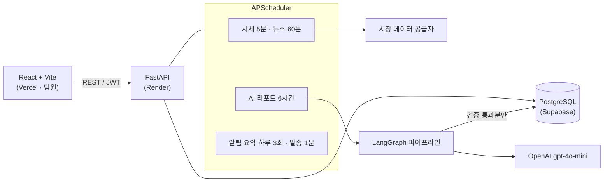
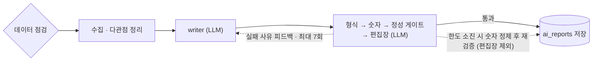
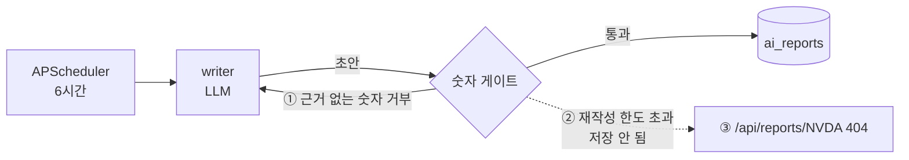
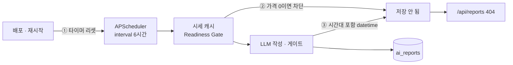
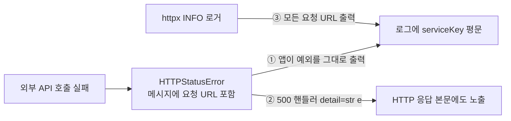
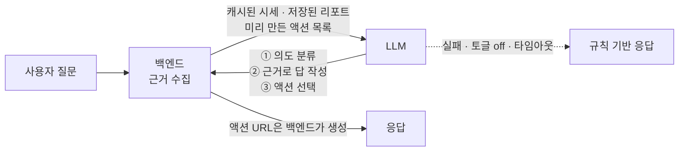

# AI Invest

LLM이 쓴 투자 리포트를 저장하기 전에, 리포트 속 숫자가 실제로 수집한 데이터에 있는지 코드로 확인하는 서비스입니다.

[](https://github.com/SunWoo1213/AI-Invest/actions/workflows/backend-tests.yml)


| 대시보드 | 자산 상세 |
| --- | --- |
|  |  |
| **챗봇** | **AI 리포트** |
|  |  |

## 개요

| 항목 | 내용 |
| --- | --- |
| 기간 | 2026년 3월 ~ 6월 (캡스톤디자인 1) |
| 인원과 역할 | 2인. 본인은 백엔드와 배포 전체를 맡았고, 프론트엔드(React 19 + Vite)는 팀원이 맡았습니다 |
| 상태 | 완료 |
| 핵심 기술 | FastAPI · SQLAlchemy 2.0(Async) · LangGraph · OpenAI gpt-4o-mini · PostgreSQL · APScheduler |
| 배포 | 백엔드 Render · DB Supabase · 프론트엔드 Vercel |

흩어져 있는 글로벌 시장 데이터를 한곳에 모으고, 그 데이터를 근거로 한 투자 리포트를 제공하는 것이 목표였습니다.

리포트 작성은 LLM에 맡길 수 있지만 그대로 쓸 수는 없었습니다. 모델이 학습 과정에서 본 숫자를 섞어 쓰면 읽는 사람은 그것이 수집한 데이터인지 아닌지 구분할 방법이 없습니다. 투자 판단에 쓰이는 글이라 이 문제를 그냥 둘 수 없었습니다.

그래서 생성과 검증을 나눴습니다. 글은 LLM이 쓰고, 그 글에 나온 숫자가 실제 수집 데이터에 있는지는 코드가 확인합니다. 근거를 찾지 못한 숫자가 남은 리포트는 저장하지 않습니다. 숫자 검증은 LLM에게 맡기지 않았습니다. 그래서 같은 입력에는 같은 판정이 나오고 이 단계에는 LLM 비용이 들지 않습니다.

## 아키텍처


```mermaid
flowchart LR
    FE["React + Vite<br/>(Vercel · 팀원)"] -->|REST / JWT| BE["FastAPI<br/>(Render)"]
    BE --> DB[("PostgreSQL<br/>(Supabase)")]
    subgraph SCH[APScheduler]
      S1[시세 5분 · 뉴스 60분]
      S3[AI 리포트 6시간]
      S4[알림 요약 하루 3회 · 발송 1분]
    end
    BE --- SCH
    S1 --> EXT[시장 데이터 공급자]
    S3 --> G[LangGraph 파이프라인]
    G --> LLM[OpenAI gpt-4o-mini]
    G -->|검증 통과분만| DB
```

리포트는 스케줄러만 만들고 사용자는 저장된 결과를 읽기만 합니다. 읽기와 생성을 나눠 두면 사용자가 늘어도 리포트 생성에 드는 LLM 호출 횟수는 그대로입니다.

### 리포트 생성과 검증


```mermaid
flowchart LR
    RD{데이터 점검} --> AG[수집 · 다관점 정리] --> W["writer (LLM)"]
    W --> V["형식 → 숫자 → 정성 게이트<br/>→ 편집장 (LLM)"]
    V -. 실패 사유 피드백 · 최대 7회 .-> W
    V -->|통과| SAVE[(ai_reports 저장)]
    V -.->|"한도 소진 시 숫자 정제 후 재검증 (편집장 제외)"| SAVE
```

- **형식 게이트**: 고정된 10개 섹션과 자산군별 분석 항목이 모두 있는지 확인합니다.
- **숫자 게이트**: 리포트에 나온 숫자가 수집 데이터에 있는지 대조합니다. writer에게도 검증기와 같은 데이터에서 뽑은 허용 숫자 목록을 넘깁니다.
- **정성 게이트**: 근거 없는 단정을 걸러냅니다.
- **편집장(LLM)**: 문체와 논리를 봅니다.

외부 API는 실패한다는 전제로 만들었습니다. 공급자마다 타임아웃과 폴백을 두고, 수집에 실패하면 직전 유효값을 유지합니다.

## 기술 스택

| 구분 | 기술 | 선택한 이유 |
| --- | --- | --- |
| 백엔드 | FastAPI, SQLAlchemy 2.0(Async) + asyncpg, Alembic | 외부 API를 여러 곳 동시에 호출해야 해서 비동기가 필요했습니다 |
| AI | LangGraph, LangChain, OpenAI gpt-4o-mini | 검증 실패 시 다시 쓰게 하는 반복 구조를 노드 단위로 표현할 수 있습니다 |
| 데이터베이스 | PostgreSQL 15 (Docker / Supabase) | 테스트는 SQLite(aiosqlite)로 대체해 외부 의존 없이 실행합니다 |
| 스케줄링 | APScheduler | 상시 가동 프로세스 안에서 주기 작업을 돌립니다 |
| 외부 데이터 | Finnhub, FMP, CoinGecko, FRED, 한국은행 ECOS, 공공데이터포털, Stooq, open.er-api, Naver 뉴스 | 자산군마다 무료로 쓸 수 있는 공급자가 달라 나눠 붙였습니다 |
| 알림 | Gmail API, Telegram Bot | |
| 테스트 · 배포 | pytest + pytest-asyncio, GitHub Actions, Render, Supabase, Vercel | |

프론트엔드는 React 19 + Vite로 팀원이 맡았습니다.

## 문제 해결 사례

1. [숫자 게이트가 초안을 반복 거부해 생긴 영구 404를 생성 쪽에 같은 근거를 줘서 해결](#1-숫자-게이트가-초안을-반복-거부해-생긴-영구-404를-생성-쪽에-같은-근거를-줘서-해결)
2. [배포 후 리포트가 한 건도 저장되지 않던 문제를 로그로 추적해 세 차단 지점을 차례로 해결](#2-배포-후-리포트가-한-건도-저장되지-않던-문제를-로그로-추적해-세-차단-지점을-차례로-해결)
3. [배포 로그에 외부 API 키가 평문으로 남던 문제를 세 경로 모두 막아 해결](#3-배포-로그에-외부-api-키가-평문으로-남던-문제를-세-경로-모두-막아-해결)
4. [챗봇에서 LLM에게 맡길 일과 코드가 할 일을 나눠 액션 URL을 코드가 만들게 함](#4-챗봇에서-llm에게-맡길-일과-코드가-할-일을-나눠-액션-url을-코드가-만들게-함)

사례별 테스트 개수는 그 사례를 마친 시점의 개수입니다.

### 1. 숫자 게이트가 초안을 반복 거부해 생긴 영구 404를 생성 쪽에 같은 근거를 줘서 해결

**문제 흐름**


```mermaid
flowchart LR
  S[APScheduler<br/>6시간] --> W[writer<br/>LLM]
  W -->|초안| F{숫자 게이트}
  F -->|① 근거 없는 숫자 거부| W
  F -->|통과| DB[(ai_reports)]
  F -.->|② 재작성 한도 초과<br/>저장 안 됨| X[③ /api/reports/NVDA 404]
```

**문제 원인**
- 배경: LLM이 쓴 투자 리포트는 스케줄러가 만들고, 숫자 게이트(리포트의 숫자가 수집 데이터에 있는지 코드로 검사)를 통과한 것만 저장
- `/api/reports/NVDA`만 계속 404가 나고, 시세 데이터는 정상 수신
- 로그 마지막에 "리포트 생성 종료"가 정상으로 남아 있어, 서버가 강제 종료된 것은 아님을 확인
- ① writer 프롬프트에 사용할 수 있는 숫자 목록이 없어 모델이 학습 데이터 속 숫자를 씀 → 게이트 거부가 반복돼 재작성 한도 3회 초과
- ② 로그에서 3.62%와 -3.62%처럼 부호만 다른 거부를 발견: 데이터의 -3.62와 리포트의 "3.62% 하락"을 서로 다른 숫자로 판단한 오탐

**해결 과정**
- ① 게이트 기준은 완화하지 않고, 검증기와 같은 데이터에서 뽑은 허용 숫자 목록(최대 150개)을 writer 프롬프트에 넣음
- ② 숫자는 절댓값으로 크기만 비교하고, 상승/하락 방향은 정성 게이트와 최종 검토 LLM(편집장 노드)이 확인하도록 나눔
- 재작성 한도를 설정값으로 분리해 3회에서 7회로 늘림. 한도를 모두 쓰면 근거 없는 숫자만 "(수치 미확인)"으로 바꾸고, 모든 게이트를 다시 통과해야 저장(LLM 재호출 없음)

**테스트**
- 환경: 로컬 pytest, LLM 그래프는 Mock으로 대체
- "3.62% 하락"처럼 부호만 다른 숫자가 게이트를 통과하는지, 근거 없는 숫자만 치환되는지 확인하는 단위 테스트 추가 → 품질 게이트 테스트 31개 통과, 재작성 한도 경계 테스트를 더해 33개 통과

> ✅ **결과** 저장 단계의 시간대 처리(사례 2)까지 정리해 NVDA 리포트 404 해결, 숫자 게이트 기준은 그대로 유지
>
> **배운 점** 검증기가 계속 거부하면 기준을 낮추기 전에 생성 쪽이 같은 근거를 보고 있는지, 검증기의 "같다"는 정의가 맞는지부터 확인

---

### 2. 배포 후 리포트가 한 건도 저장되지 않던 문제를 로그로 추적해 세 차단 지점을 차례로 해결

**문제 흐름**


```mermaid
flowchart LR
  D[배포 · 재시작] -->|① 타이머 리셋| S[APScheduler<br/>interval 6시간]
  S --> P[시세 캐시<br/>Readiness Gate]
  P -->|② 가격 0이면 차단| X[저장 안 됨]
  P --> G[LLM 작성 · 게이트]
  G --> DB[(ai_reports)]
  G -->|③ 시간대 포함 datetime| X
  X --> A["/api/reports 404"]
```

**문제 원인**
- 배포 환경(Render)에서 모든 종목의 `/api/reports/{ticker}`가 404, 저장된 리포트 0건
- ① 로그에 "AI 리포트 생성 시작"이 한 번도 없어서, 실행 후 실패한 것이 아니라 잡 자체가 실행되지 않은 것으로 범위를 좁힘. interval 잡은 서버 기동 6시간 뒤에 처음 실행되는데, 그 전에 재배포가 반복돼 타이머가 매번 초기화됨
- ② ①을 고친 뒤 로그: Finnhub 502 오류로 현재가가 0으로 캐시돼, 생성 전 데이터 점검(Readiness Gate)에서 차단
- ③ 그다음 로그: 작성과 게이트는 통과했지만, 시간대 정보가 있는 `data_as_of`를 `TIMESTAMP WITHOUT TIME ZONE` 컬럼에 넣다가 commit 실패

**해결 과정**
- ① interval 잡에 `next_run_time`을 지정해 기동 60초 뒤 첫 실행, 기동 시 중복 등록되던 잡은 하나로 통합. 주기, 회당 최대 개수, 쿨다운은 그대로 둬 LLM 비용은 늘지 않음
- ② 미국 주식 현재가에 Finnhub → FMP 폴백을 추가하고, 가격 0은 캐시하지 않음
- ③ DB 컬럼 타입은 바꾸지 않고, 저장할 때만 UTC 기준 naive datetime으로 변환

**테스트**
- 환경: 로컬 pytest, 스케줄러와 외부 API는 monkeypatch로 대체
- 기동 시 리포트 잡이 하나만 등록되고 첫 실행이 기동 직후로 잡히는지, Finnhub 502일 때 FMP로 넘어가고 가격 0이 캐시되지 않는지, 시간대 정보가 있는 `data_as_of`가 정상 저장되는지 확인하는 테스트 추가 → 스케줄러 · 공급자 35개, 공급자 · 매크로 38개, 품질 게이트 37개 통과

> ✅ **결과** 배포 로그에서 "리포트 생성 시작"부터 저장까지 이어지는 것을 확인
>
> **배운 점** 로그의 마지막 줄을 기준으로 어디서 멈췄는지부터 좁히기

---

### 3. 배포 로그에 외부 API 키가 평문으로 남던 문제를 세 경로 모두 막아 해결

**문제 흐름**


```mermaid
flowchart LR
  E[외부 API 호출 실패] --> X[HTTPStatusError<br/>메시지에 요청 URL 포함]
  X -->|① 앱이 예외를 그대로 출력| L[로그에 serviceKey 평문]
  X -->|② 500 핸들러 detail=str e| R[HTTP 응답 본문에도 노출]
  H[httpx INFO 로거] -->|③ 모든 요청 URL 출력| L
```

**문제 원인**
- 배포 로그를 확인하다가 외부 API 요청 URL이 쿼리스트링의 키까지 그대로 남아 있는 것을 발견
- ① 공급자 서비스가 `HTTPStatusError`를 그대로 로그에 출력했는데, 이 예외 문자열에 키가 든 URL 전체가 들어 있었음
- ② 일부 엔드포인트의 500 핸들러가 `detail=str(e)`로 응답해, 로그뿐 아니라 HTTP 응답 본문으로도 나갈 수 있었음
- ③ root 로거가 INFO라 httpx가 모든 외부 요청 URL을 출력하고 있었음. ①과 ②는 로거 레벨을 낮추는 것만으로는 막히지 않는 경로였음

**해결 과정**
- ①② `redact_secrets()`를 만들어 민감한 쿼리 파라미터 값과 리터럴 키를 가리고, 공급자와 매크로 서비스의 예외 로그, 500 핸들러 detail에 적용. 한국은행 ECOS처럼 키가 URL 경로에 들어가는 공급자는 별도로 처리
- ③ httpx, httpcore, sqlalchemy.engine 로거는 WARNING 이상만 남기도록 조정
- 노출된 키는 손상된 것으로 보고 재발급

**테스트**
- 환경: 로컬 pytest
- 키가 담긴 URL과 예외 메시지가 가려져 기록되는지 확인하는 로그 마스킹 테스트 4건 추가 → 품질 게이트 테스트와 함께 30개 통과

> ✅ **결과** 키가 포함된 URL과 예외 메시지가 마스킹되어 기록됨
>
> **배운 점** 로그도 외부로 나가는 출력이고, 로거 레벨 조정만으로는 애플리케이션이 직접 찍는 예외를 막을 수 없음

---

### 4. 챗봇에서 LLM에게 맡길 일과 코드가 할 일을 나눠 액션 URL을 코드가 만들게 함

**문제 흐름**


```mermaid
flowchart LR
  Q[사용자 질문] --> BE[백엔드<br/>근거 수집]
  BE -->|캐시된 시세 · 저장된 리포트<br/>미리 만든 액션 목록| L[LLM]
  L -->|① 의도 분류<br/>② 근거로 답 작성<br/>③ 액션 선택| BE
  BE -->|액션 URL은 백엔드가 생성| R[응답]
  L -.->|실패 · 토글 off · 타임아웃| RB[규칙 기반 응답]
```

**문제 원인**
- 배경: 초기 챗봇은 규칙 기반으로 의도를 분류해 안내만 했고, 사전에 없는 표현이나 문장형 질문을 이해하지 못했음
- LLM을 붙이면 자연어 이해는 좋아지지만 환각, 비용, 통제 문제가 함께 생김
- 특히 LLM이 이동 경로(URL)를 직접 만들게 하면, 프롬프트에 섞여 들어온 지시로 사용자를 의도하지 않은 주소로 보낼 수 있음
- 사용자 요청이 새 리포트 생성을 일으키면 LLM 비용이 사용자 수에 비례하게 됨

**해결 과정**
- 기본값은 규칙 기반으로 유지(LLM 호출 없음, 서버에 대화 미저장)하고 LLM 경로는 환경변수로 켜고 끄는 선택 사항으로 둠
- LLM이 하는 일을 세 가지로 제한: 의도 분류, 주어진 근거만으로 답 작성, 미리 만들어 둔 액션 중 선택
- 자산 후보, 카테고리, 캐시된 시세, 저장된 리포트 요약은 백엔드가 결정적으로 모아서 넘기고, 액션 URL은 백엔드가 직접 생성
- LLM 경로에 리포트 생성 도구를 두지 않아 사용자 요청으로는 새 리포트가 만들어질 수 없음

**테스트**
- 환경: 로컬 pytest, LLM 호출은 monkeypatch로 대체
- 토글이 꺼진 경우, 키가 없는 경우, LLM이 오류나 빈 답변을 준 경우 모두 규칙 기반 응답으로 돌아오는지 확인
- 허용된 의도 목록에 리포트 생성이 없는지, LLM이 고른 의도와 액션 번호가 허용 범위 안으로 검증되는지 확인하는 테스트 추가 → 챗봇 테스트 32개 통과

> ✅ **결과** 토글을 끄면 동작이 이전과 같고, 켜도 이동 경로와 리포트 생성 권한은 코드가 계속 쥐고 있음
>
> **배운 점** LLM을 붙일 때는 분류와 문장 작성은 맡기되, 무엇이 근거인지와 사용자를 어디로 보낼지는 코드가 정함

나머지 사례는 [오류 사례집](docs/harness/error-casebook-2026-06-03.md)과 [개발 기록](docs/harness/records/)에 증상, 원인, 수정, 예방 순서로 정리했습니다.

## 역할과 기여도

백엔드와 배포 전체를 맡았습니다. 프론트엔드는 팀원이 담당했습니다. 저장소는 제 계정으로 관리해서 팀원이 쓴 프론트엔드 코드도 제 커밋으로 들어가 있습니다.

- API 41개와 테이블 14개를 설계하고 구현했습니다. Alembic 리비전은 3개입니다.
- LangGraph 리포트 파이프라인과 검증 게이트 네 단계를 만들었습니다.
- 스케줄러 잡을 붙였습니다. 시세 5분, 뉴스 60분, 리포트 6시간, 알림 요약 하루 3회(기본 09:00 · 13:00 · 18:00), 알림 발송 1분이고 모두 중복 실행을 막았습니다.
- 시장 데이터 공급자 아홉 곳을 자산군별로 나눠 붙이고 공급자마다 캐시와 쿨다운을 뒀습니다.
- 챗봇을 만들었습니다. 기본은 규칙 기반이고 LLM 경로를 켜도 모델에는 저장된 데이터만 근거로 넘기며 이동 URL은 코드가 만듭니다.
- 구독 결제를 붙였습니다. 결제 공급자를 바꿀 수 있게 경계를 두고 Toss Payments 빌링 인증 단계까지 구현했습니다.
- Render와 Supabase에 배포하고 운영했습니다.
- pytest 228개를 작성하고 GitHub Actions로 자동 실행되게 했습니다.

## 실행 방법

Python 3.11+, Node.js 20+, Docker가 필요합니다.

```powershell
Copy-Item .env.example .env          # 값을 채웁니다
docker compose up -d db              # 데이터베이스

cd backend                           # 백엔드 http://localhost:8000
pip install -r requirements.txt
uvicorn app.main:app --reload
pytest

cd ../frontend                       # 프론트엔드 http://localhost:5173
npm install
npm run dev
```

API 문서는 백엔드 실행 후 `http://localhost:8000/docs`에서 볼 수 있습니다. 환경변수 설명은 [ENVIRONMENT_VARIABLE_SETUP.md](docs/guides/ENVIRONMENT_VARIABLE_SETUP.md)에 있습니다.

## 문서

- [docs/README.md](docs/README.md) — 전체 문서 색인
- [CODE_UNDERSTANDING.md](docs/architecture/CODE_UNDERSTANDING.md) — 구조와 데이터 흐름
- [오류 사례집](docs/harness/error-casebook-2026-06-03.md) · [개발 기록](docs/harness/records/)
- 캡스톤 산출물: [흐름도](docs/deliverables/01-시스템-흐름도.md) · [ERD](docs/deliverables/04-ERD.md) · [API 명세](docs/deliverables/05-API-명세서.md)
