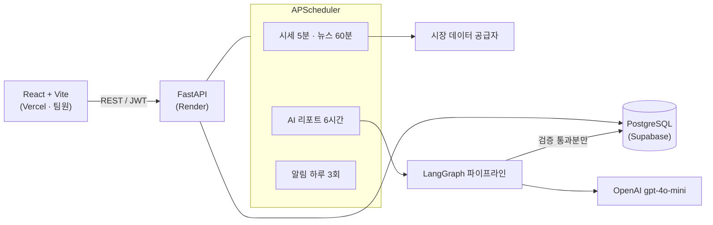
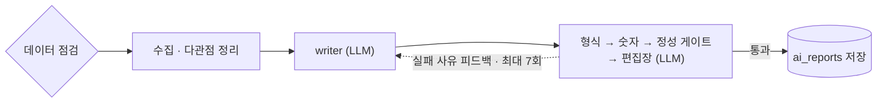

# AI Invest

LLM이 쓴 투자 리포트를 저장하기 전에, 리포트 속 숫자가 실제로 수집한 데이터에 있는지 코드로 확인하는 서비스입니다.

[](https://github.com/SunWoo1213/AI-Invest/actions/workflows/backend-tests.yml)


| 대시보드 | 자산 상세 |
| --- | --- |
|  |  |
| **챗봇** | **AI 리포트** |
|  |  |

## 프로젝트 목적

흩어져 있는 글로벌 시장 데이터를 한곳에 모으고, 그 데이터를 근거로 한 투자 리포트를 제공하는 것이 목표였습니다.

리포트 작성은 LLM에 맡길 수 있지만 그대로 쓸 수는 없었습니다. 모델이 학습 과정에서 본 숫자를 섞어 쓰면 읽는 사람은 그것이 수집한 데이터인지 아닌지 구분할 방법이 없습니다. 투자 판단에 쓰이는 글이라 이 문제를 그냥 둘 수 없었습니다.

그래서 생성과 검증을 나눴습니다. 글을 쓰는 일은 LLM이 하고, 그 글에 나온 숫자가 실제 수집 데이터에 있는지는 코드가 확인합니다. 확인을 통과하지 못한 리포트는 저장하지 않습니다. 검증을 LLM에게 다시 맡기지 않았기 때문에 같은 입력에는 같은 판정이 나오고 검증 비용도 들지 않습니다.

개발 기간은 2026년 3월부터 6월까지이고 2인 팀으로 진행했습니다. 캡스톤디자인 1 과제입니다.

## 사용 기술 스택

| 구분 | 기술 | 선택한 이유 |
| --- | --- | --- |
| 백엔드 | FastAPI, SQLAlchemy 2.0(Async) + asyncpg, Alembic | 외부 API를 여러 곳 동시에 호출해야 해서 비동기가 필요했습니다 |
| AI | LangGraph, LangChain, OpenAI gpt-4o-mini | 검증 실패 시 다시 쓰게 하는 반복 구조를 노드 단위로 표현할 수 있습니다 |
| 데이터베이스 | PostgreSQL 15 (Docker / Supabase) | 테스트는 SQLite(aiosqlite)로 대체해 외부 의존 없이 실행합니다 |
| 스케줄링 | APScheduler | 상시 가동 프로세스 안에서 주기 작업을 돌립니다 |
| 외부 데이터 | Finnhub, FMP, CoinGecko, FRED, 한국은행 ECOS, 공공데이터포털, Stooq, open.er-api, Naver 뉴스 | 자산군마다 무료로 쓸 수 있는 공급자가 달라 나눠 붙였습니다 |
| 알림 | Gmail API, Telegram Bot | |
| 테스트 · 배포 | pytest + pytest-asyncio, GitHub Actions, Render, Supabase, Vercel | |

프론트엔드는 React 19 + Vite로 팀원이 맡았습니다.

## 아키텍처 구조


```mermaid
flowchart LR
    FE["React + Vite<br/>(Vercel · 팀원)"] -->|REST / JWT| BE["FastAPI<br/>(Render)"]
    BE --> DB[("PostgreSQL<br/>(Supabase)")]
    subgraph SCH[APScheduler]
      S1[시세 5분 · 뉴스 60분]
      S3[AI 리포트 6시간]
      S4[알림 하루 3회]
    end
    BE --- SCH
    S1 --> EXT[시장 데이터 공급자]
    S3 --> G[LangGraph 파이프라인]
    G --> LLM[OpenAI gpt-4o-mini]
    G -->|검증 통과분만| DB
```

리포트는 스케줄러만 만들고 사용자는 저장된 결과를 읽기만 합니다. 읽기와 생성을 나눠 두면 사용자가 늘어도 LLM 호출 횟수는 그대로입니다.

### 리포트 생성과 검증


```mermaid
flowchart LR
    RD{데이터 점검} --> AG[수집 · 다관점 정리] --> W["writer (LLM)"]
    W --> V["형식 → 숫자 → 정성 게이트<br/>→ 편집장 (LLM)"]
    V -. 실패 사유 피드백 · 최대 7회 .-> W
    V -->|통과| SAVE[(ai_reports 저장)]
```

게이트는 네 단계입니다. 형식 게이트는 고정된 10개 섹션과 자산군별 분석 항목이 모두 있는지 확인합니다. 숫자 게이트는 리포트에 나온 숫자가 수집 데이터에 있는지 대조합니다. 정성 게이트는 근거 없는 단정을 걸러내고, 마지막으로 LLM 편집장이 문체와 논리를 봅니다.

writer에게도 검증기와 같은 데이터에서 뽑은 허용 숫자 목록을 넘깁니다. 검증하는 쪽과 쓰는 쪽이 다른 근거를 보면 통과할 수 없기 때문입니다.

외부 API는 실패한다는 전제로 만들었습니다. 공급자마다 타임아웃과 폴백을 두고, 수집에 실패하면 직전 유효값을 유지합니다.

## 역할과 기여도

백엔드와 배포 전체를 맡았습니다. 프론트엔드는 팀원이 담당했습니다. 저장소는 제 계정으로 관리해서 팀원이 쓴 프론트엔드 코드도 제 커밋으로 들어가 있습니다.

- API 41개와 테이블 14개를 설계하고 구현했습니다. Alembic 리비전은 3개입니다.
- LangGraph 리포트 파이프라인과 검증 게이트 네 단계를 만들었습니다.
- 스케줄러 잡 네 종류를 붙였습니다. 시세 5분, 뉴스 60분, 리포트 6시간, 알림 하루 3회이고 모두 중복 실행을 막았습니다.
- 시장 데이터 공급자 아홉 곳을 자산군별로 나눠 붙이고 공급자마다 캐시와 쿨다운을 뒀습니다.
- 챗봇을 만들었습니다. 기본은 규칙 기반이고 LLM 경로를 켜도 저장된 데이터만 근거로 답합니다.
- 구독 결제를 붙였습니다. 결제 공급자를 바꿀 수 있게 경계를 두고 Toss Payments 빌링 인증 단계까지 구현했습니다.
- Render와 Supabase에 배포하고 운영했습니다.
- pytest 228개를 작성하고 GitHub Actions로 자동 실행되게 했습니다.

## 트러블슈팅 해결 과정

### 리포트가 저장되지 않아 조회가 계속 404였던 문제

`/api/reports/NVDA`만 계속 404였습니다. 시세 데이터는 정상으로 들어오고 있었고, 로그 끝에 "리포트 생성 종료"가 남아 있어서 서버가 강제 종료된 것은 아니라는 것부터 확인했습니다.

로그를 따라가니 숫자 게이트가 초안을 반복해 거부하고 있었습니다. 원인은 두 가지였습니다. writer 프롬프트에는 "넘겨받지 않은 숫자를 쓰지 말라"는 문장만 있고 쓸 수 있는 숫자 목록은 없었습니다. 데이터가 적은 자산일수록 모델이 학습 데이터 속 숫자로 빈칸을 메웠습니다. 그리고 숫자를 비교할 때 앞의 마이너스 기호를 그대로 두는 바람에, 데이터의 -3.62와 리포트의 "3.62% 하락"을 서로 다른 숫자로 판단하고 있었습니다.

게이트를 느슨하게 하는 대신 쓰는 쪽에 같은 근거를 줬습니다. 검증기와 같은 데이터에서 뽑은 허용 숫자 목록을 writer 프롬프트에 넣고, 숫자는 절댓값으로 크기만 비교하도록 바꿨습니다. 오르고 내리는 방향은 정성 게이트와 편집장이 확인합니다. 재작성 한도는 설정값으로 빼서 3회에서 7회로 늘렸고, 한도를 다 쓰면 근거 없는 숫자만 "(수치 미확인)"으로 바꾼 뒤 모든 게이트를 다시 통과해야 저장하게 했습니다.

404가 사라졌고 게이트 기준은 그대로입니다. 부호만 다른 숫자와 숫자 치환을 확인하는 테스트를 더해 품질 게이트 테스트 31개가 통과합니다.

### 배포한 뒤 리포트가 한 건도 만들어지지 않던 문제

배포 환경에서 모든 종목이 404였고 저장된 리포트가 0건이었습니다.

로그 전체에 "AI 리포트 생성 시작"이 한 번도 없었습니다. 이 한 줄이 없다는 것으로 "잡이 돌았는데 실패"가 아니라 "잡이 아예 실행되지 않음"으로 범위를 좁혔습니다. APScheduler의 interval 잡은 첫 실행이 기동 후 한 주기 뒤인데, 그 전에 재배포가 반복되면서 타이머가 매번 초기화되고 있었습니다.

interval 잡에 `next_run_time`을 지정해 기동 60초 뒤에 한 번 실행되게 하고, 중복 등록되던 잡을 하나로 합쳤습니다.

이걸 고치자 다른 원인이 드러났습니다. Finnhub가 502를 내면 현재가가 0으로 캐시되고, 그러면 생성 전 데이터 점검에서 막혔습니다. 미국 주식 현재가에 폴백을 두고 가격 0은 캐시하지 않게 했습니다. 그다음에는 작성과 게이트는 통과했는데 저장 단계에서 실패했습니다. 시간대 정보가 있는 값을 시간대 없는 컬럼에 넣고 있었습니다. 컬럼 타입은 그대로 두고 저장할 때만 변환했습니다.

같은 증상에 원인이 세 번 달랐습니다. 하나를 고친 뒤 증상이 남아 있으면 고친 게 안 먹힌 것이 아니라 다른 원인이 있다고 보게 됐습니다.

### 배포 로그에 외부 API 키가 그대로 남던 문제

배포 로그를 확인하다가 외부 API 요청 주소가 키까지 포함된 채로 남아 있는 것을 봤습니다.

원인이 둘이었습니다. 외부 호출이 실패하면 예외 메시지에 요청 주소 전체가 들어가는데, 그 예외를 그대로 로그에 찍고 있었습니다. 일부 엔드포인트는 500 응답의 detail에도 예외 문자열을 넣고 있어서 HTTP 응답으로도 나갈 수 있었습니다. 여기에 httpx 로거가 INFO 레벨이라 모든 요청 주소를 출력하고 있었습니다. 로거 레벨만 낮춰서는 앞의 두 경로가 막히지 않습니다.

주소의 쿼리 파라미터와 리터럴 키를 가리는 함수를 만들어 예외 로그와 500 응답에 적용했습니다. 한국은행 ECOS처럼 키가 주소 경로에 들어가는 공급자는 따로 처리했습니다. httpx와 sqlalchemy 로거는 WARNING 이상만 남기게 했고, 노출된 키는 재발급했습니다.

키가 담긴 주소와 예외 메시지가 가려져 기록되는지 확인하는 테스트를 추가했습니다. 로그도 밖으로 나가는 출력이라는 것을 이때 알았습니다.

나머지 사례는 [오류 사례집](docs/harness/error-casebook-2026-06-03.md)과 [개발 기록](docs/harness/records/)에 증상, 원인, 수정, 예방 순서로 정리했습니다.

## 결과

**테스트** pytest 228개가 통과합니다. 데이터베이스는 SQLite로 대체하고 외부 API와 LLM 호출은 monkeypatch로 바꿔서 네트워크 없이 실행됩니다. GitHub Actions가 push와 PR마다 같은 테스트를 돌립니다.

**리포트 품질 측정** 스케줄러 대상 5개 자산을 4번씩, 총 20건을 같은 조건으로 생성해 쟀습니다. 처음에는 게이트를 온전히 통과한 것이 0건이었습니다. 원인은 편집장 프롬프트에 오늘 날짜와 데이터 기준 시각이 없어서 모델이 2026년 데이터를 오래된 것으로 판단한 것이었습니다. 편집장은 51번 호출되는 동안 한 번도 통과시키지 않았고, 한 번은 현재 시점이 2023년이라고 답했습니다.

| 지표 | 처음 | 수정 후 |
| --- | --- | --- |
| 게이트 통과 | 0 / 20 | 5 / 20 |
| 숫자 정제 후 저장 | 5 / 20 | 5 / 20 |
| 거부 | 15 / 20 | 10 / 20 |
| 건당 평균 비용 · 시간 | $0.0127 · 83초 | $0.0120 · 78초 |

20건 표본이라 실행마다 편차가 있고 운영 서버에서 잰 수치는 아닙니다.

**응답 속도** 국내 종목 조회가 19.6초 걸려 타임아웃이 났습니다. 조회에 날짜 범위를 넣어 1~3초로 줄였습니다.

**비용** 대상 자산 5개, 6시간 주기, 자산별 쿨다운, 호출 간 대기를 설정값으로 두어 LLM 비용이 사용자 수와 무관하게 정해집니다.

## 실행 방법

Python 3.11+, Node.js 20+, Docker가 필요합니다.

```powershell
Copy-Item .env.example .env          # 값을 채웁니다
docker compose up -d db              # 데이터베이스

cd backend                           # 백엔드 http://localhost:8000
pip install -r requirements.txt
uvicorn app.main:app --reload
pytest

cd ../frontend                       # 프론트엔드 http://localhost:5173
npm install
npm run dev
```

API 문서는 백엔드 실행 후 `http://localhost:8000/docs`에서 볼 수 있습니다. 환경변수 설명은 [ENVIRONMENT_VARIABLE_SETUP.md](docs/guides/ENVIRONMENT_VARIABLE_SETUP.md)에 있습니다.

## 문서

- [docs/README.md](docs/README.md) — 전체 문서 색인
- [CODE_UNDERSTANDING.md](docs/architecture/CODE_UNDERSTANDING.md) — 구조와 데이터 흐름
- [오류 사례집](docs/harness/error-casebook-2026-06-03.md) · [개발 기록](docs/harness/records/)
- 캡스톤 산출물: [흐름도](docs/deliverables/01-시스템-흐름도.md) · [ERD](docs/deliverables/04-ERD.md) · [API 명세](docs/deliverables/05-API-명세서.md)
