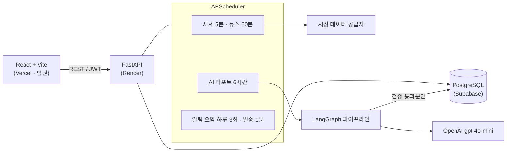
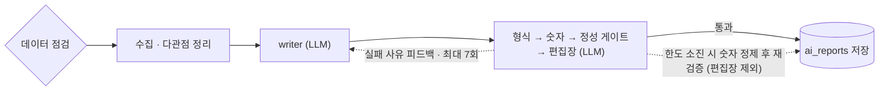

# AI Invest

LLM이 쓴 투자 리포트를 저장하기 전에, 리포트 속 숫자가 실제로 수집한 데이터에 있는지 코드로 확인하는 서비스입니다.

[](https://github.com/SunWoo1213/AI-Invest/actions/workflows/backend-tests.yml)


| 대시보드 | 자산 상세 |
| --- | --- |
|  |  |
| **챗봇** | **AI 리포트** |
|  |  |

## 개요

| 항목 | 내용 |
| --- | --- |
| 기간 | 2026년 3월 ~ 6월 (캡스톤디자인 1) |
| 인원과 역할 | 2인. 본인은 백엔드와 배포 전체를 맡았고, 프론트엔드(React 19 + Vite)는 팀원이 맡았습니다 |
| 상태 | 완료 |
| 핵심 기술 | FastAPI · SQLAlchemy 2.0(Async) · LangGraph · OpenAI gpt-4o-mini · PostgreSQL · APScheduler |
| 배포 | 백엔드 Render · DB Supabase · 프론트엔드 Vercel |

흩어져 있는 글로벌 시장 데이터를 한곳에 모으고, 그 데이터를 근거로 한 투자 리포트를 제공하는 것이 목표였습니다.

리포트 작성은 LLM에 맡길 수 있지만 그대로 쓸 수는 없었습니다. 모델이 학습 과정에서 본 숫자를 섞어 쓰면 읽는 사람은 그것이 수집한 데이터인지 아닌지 구분할 방법이 없습니다. 투자 판단에 쓰이는 글이라 이 문제를 그냥 둘 수 없었습니다.

그래서 생성과 검증을 나눴습니다. 글은 LLM이 쓰고, 그 글에 나온 숫자가 실제 수집 데이터에 있는지는 코드가 확인합니다. 근거를 찾지 못한 숫자가 남은 리포트는 저장하지 않습니다. 숫자 검증은 LLM에게 맡기지 않았습니다. 그래서 같은 입력에는 같은 판정이 나오고 이 단계에는 LLM 비용이 들지 않습니다.

## 문제 해결 사례

1. [숫자 게이트가 초안을 반복 거부해 생긴 영구 404를 생성 쪽에 같은 근거를 줘서 해결](#1-숫자-게이트가-초안을-반복-거부해-생긴-영구-404를-생성-쪽에-같은-근거를-줘서-해결)
2. [배포 후 리포트가 한 건도 저장되지 않던 문제를 로그로 추적해 세 차단 지점을 차례로 해결](#2-배포-후-리포트가-한-건도-저장되지-않던-문제를-로그로-추적해-세-차단-지점을-차례로-해결)
3. [배포 로그에 외부 API 키가 평문으로 남던 문제를 세 경로 모두 막아 해결](#3-배포-로그에-외부-api-키가-평문으로-남던-문제를-세-경로-모두-막아-해결)
4. [챗봇에서 LLM에게 맡길 일과 코드가 할 일을 나눠 액션 URL을 코드가 만들게 함](#4-챗봇에서-llm에게-맡길-일과-코드가-할-일을-나눠-액션-url을-코드가-만들게-함)

사례별 테스트 개수는 그 사례를 마친 시점의 개수입니다.

### 1. 숫자 게이트가 초안을 반복 거부해 생긴 영구 404를 생성 쪽에 같은 근거를 줘서 해결

**문제** 다른 종목은 리포트가 저장되는데 `/api/reports/NVDA`만 계속 404였습니다. 숫자 게이트(`fact_checker_node`)가 초안을 재작성 한도까지 거부해 `ReportQualityError`로 저장되지 않고 있었습니다.

**원인**
- 정규화 함수 `_normalize_numeric_token`이 선행 `-`를 남겨, 데이터의 `-3.62`와 초안의 "3.62% 하락"을 다른 숫자로 판정했습니다.
- writer 프롬프트에는 "숫자를 만들지 말라"는 지시만 있고 써도 되는 숫자 목록이 없어, 어느 소스에도 없는 `22`를 매 패스 다시 썼습니다.

**해결**
- 정규화에 `abs()`를 적용해 숫자 게이트는 크기만 보고, 증감 방향은 정성 게이트와 편집장이 확인하도록 책임을 나눴습니다.
- fact 소스 묶음을 `_fact_number_payload(state)` 하나로 만들어 writer 안내 목록과 게이트 검사가 같은 근거를 보게 했습니다.
- 한도를 다 쓰면 근거 없는 숫자만 `(수치 미확인)`으로 치환하고 네 게이트를 처음부터 다시 통과해야 저장하는 폴백을 넣었습니다. 검증하지 않은 초안을 그대로 저장하는 방안은 게이트를 무력화하므로 버렸습니다.

**결과** 게이트 기준을 낮추지 않고 반복 거부 루프를 끊었고, 품질 게이트 테스트 33개가 통과했습니다. 사례 2의 마지막 원인까지 고친 뒤 NVDA 리포트 404가 해소됐습니다.

### 2. 배포 후 리포트가 한 건도 저장되지 않던 문제를 로그로 추적해 세 차단 지점을 차례로 해결

**문제** 배포 환경(Render)에서 모든 종목의 `/api/reports/{ticker}`가 404였고 저장된 리포트는 0건이었습니다. 리포트는 APScheduler만 만들기 때문에 원인은 로그에만 남았습니다.

**원인** 로그에서 "어느 단계까지 갔는가"를 정하고 고친 뒤 다시 묻는 방식으로 세 원인을 차례로 찾았습니다.
- `AI 리포트 생성 시작` 로그가 한 줄도 없었습니다. `interval` 잡의 첫 실행은 한 주기 뒤인데 그 전에 인스턴스가 재시작됐습니다.
- Finnhub 현재가가 502를 내면 폴백 없이 가격 0이 캐시에 들어가 `ReportReadinessError`로 막혔습니다.
- timezone-aware `datetime`을 `TIMESTAMP WITHOUT TIME ZONE` 컬럼에 저장하다 asyncpg `DataError`가 났습니다.

**해결**
- 리포트 잡에 `next_run_time`을 지정해 기동 60초 뒤 첫 실행되게 했고, 운영은 idle sleep이 없는 Render Standard로 옮겼습니다.
- 현재가에 Finnhub → FMP quote → 마지막 종가 폴백 체인을 넣고, 모두 실패하면 0을 캐시하지 않고 직전 유효값을 돌려주게 했습니다.
- 컬럼 타입은 두고 저장 직전에 UTC로 변환한 뒤 `tzinfo`를 떼도록 고쳐 마이그레이션 없이 해결했습니다.

**결과** 가격 0 캐시와 시간대 타입 불일치는 코드와 테스트로 막았습니다(공급자 · 매크로 테스트 38개, 품질 게이트 테스트 37개 통과).

### 3. 배포 로그에 외부 API 키가 평문으로 남던 문제를 세 경로 모두 막아 해결

**문제** 배포 로그에 공공데이터포털 `serviceKey`가 담긴 URL이 평문으로 찍혀 있었습니다.

**원인** 처음엔 `httpx` 요청 로그로 보고 로거 레벨부터 조정했지만, 실제 누수는 앱이 `HTTPStatusError`를 그대로 출력한 WARNING이었습니다. 이 예외 문자열에는 요청 URL 전체가 들어가고, 500 핸들러의 `detail=str(e)`로 클라이언트에게 나가는 경로도 있었습니다.

**해결**
- 출력 직전에 한 곳에서 가리는 `redact_secrets()`를 만들어 공급자 · 매크로 서비스 예외 로그와 500 응답에 적용했습니다.
- `httpx` · `httpcore` · `sqlalchemy.engine` 로거는 WARNING 이상만 남기게 했습니다.
- 평문으로 확인된 `serviceKey`는 재발급했고, 9월 점검에서 마스킹 없이 나가던 `print()`도 로거로 바꿨습니다.

**결과** 로그와 HTTP 응답 어느 쪽으로도 키가 담긴 URL이 그대로 나가지 않게 됐습니다. `test_log_sanitizer.py` 4건을 포함해 30개 테스트가 통과했습니다.

### 4. 챗봇에서 LLM에게 맡길 일과 코드가 할 일을 나눠 액션 URL을 코드가 만들게 함

**문제** 규칙 기반 챗봇은 문장형 질문과 오타를 알아듣지 못했습니다. LLM을 붙이되, 수집하지 않은 숫자를 지어내거나 프롬프트 주입으로 엉뚱한 URL을 내보내거나 리포트 생성을 일으켜 비용이 사용자 수에 비례하는 일은 막아야 했습니다.

**원인** LLM에게 맡길 결정과 코드가 쥘 결정이 나뉘어 있지 않았습니다.

**해결**
- 근거 데이터(자산 후보, 캐시된 시세, 저장된 리포트 요약)와 액션 URL은 코드가 미리 만들고, LLM은 의도 분류와 답변 작성, 액션 인덱스 선택만 합니다.
- 구조화 출력 `LlmChatPlan`에는 URL 필드가 없고, 코드가 intent와 인덱스 범위를 다시 검증합니다.
- 리포트 생성 intent는 `ALLOWED_INTENTS`에서 뺐고, 토글 off · 예외 · 타임아웃 · 빈 답변이면 모두 규칙 경로로 돌아갑니다.

**결과** 챗봇 테스트 32개가 통과했습니다. 이 흐름은 모킹 테스트로 확인했고, `ENABLE_LLM_CHATBOT`를 끄면 이전 동작과 같습니다.

나머지 사례는 [오류 사례집](docs/harness/error-casebook-2026-06-03.md)과 [개발 기록](docs/harness/records/)에 증상, 원인, 수정, 예방 순서로 정리했습니다.

## 아키텍처


```mermaid
flowchart LR
    FE["React + Vite<br/>(Vercel · 팀원)"] -->|REST / JWT| BE["FastAPI<br/>(Render)"]
    BE --> DB[("PostgreSQL<br/>(Supabase)")]
    subgraph SCH[APScheduler]
      S1[시세 5분 · 뉴스 60분]
      S3[AI 리포트 6시간]
      S4[알림 요약 하루 3회 · 발송 1분]
    end
    BE --- SCH
    S1 --> EXT[시장 데이터 공급자]
    S3 --> G[LangGraph 파이프라인]
    G --> LLM[OpenAI gpt-4o-mini]
    G -->|검증 통과분만| DB
```

리포트는 스케줄러만 만들고 사용자는 저장된 결과를 읽기만 합니다. 읽기와 생성을 나눠 두면 사용자가 늘어도 리포트 생성에 드는 LLM 호출 횟수는 그대로입니다.

### 리포트 생성과 검증


```mermaid
flowchart LR
    RD{데이터 점검} --> AG[수집 · 다관점 정리] --> W["writer (LLM)"]
    W --> V["형식 → 숫자 → 정성 게이트<br/>→ 편집장 (LLM)"]
    V -. 실패 사유 피드백 · 최대 7회 .-> W
    V -->|통과| SAVE[(ai_reports 저장)]
    V -.->|"한도 소진 시 숫자 정제 후 재검증 (편집장 제외)"| SAVE
```

- **형식 게이트**: 고정된 10개 섹션과 자산군별 분석 항목이 모두 있는지 확인합니다.
- **숫자 게이트**: 리포트에 나온 숫자가 수집 데이터에 있는지 대조합니다. writer에게도 검증기와 같은 데이터에서 뽑은 허용 숫자 목록을 넘깁니다.
- **정성 게이트**: 근거 없는 단정을 걸러냅니다.
- **편집장(LLM)**: 문체와 논리를 봅니다.

외부 API는 실패한다는 전제로 만들었습니다. 공급자마다 타임아웃과 폴백을 두고, 수집에 실패하면 직전 유효값을 유지합니다.

## 기술 스택

| 구분 | 기술 | 선택한 이유 |
| --- | --- | --- |
| 백엔드 | FastAPI, SQLAlchemy 2.0(Async) + asyncpg, Alembic | 외부 API를 여러 곳 동시에 호출해야 해서 비동기가 필요했습니다 |
| AI | LangGraph, LangChain, OpenAI gpt-4o-mini | 검증 실패 시 다시 쓰게 하는 반복 구조를 노드 단위로 표현할 수 있습니다 |
| 데이터베이스 | PostgreSQL 15 (Docker / Supabase) | 테스트는 SQLite(aiosqlite)로 대체해 외부 의존 없이 실행합니다 |
| 스케줄링 | APScheduler | 상시 가동 프로세스 안에서 주기 작업을 돌립니다 |
| 외부 데이터 | Finnhub, FMP, CoinGecko, FRED, 한국은행 ECOS, 공공데이터포털, Stooq, open.er-api, Naver 뉴스 | 자산군마다 무료로 쓸 수 있는 공급자가 달라 나눠 붙였습니다 |
| 알림 | Gmail API, Telegram Bot | |
| 테스트 · 배포 | pytest + pytest-asyncio, GitHub Actions, Render, Supabase, Vercel | |

프론트엔드는 React 19 + Vite로 팀원이 맡았습니다.

## 역할과 기여도

백엔드와 배포 전체를 맡았습니다. 프론트엔드는 팀원이 담당했습니다. 저장소는 제 계정으로 관리해서 팀원이 쓴 프론트엔드 코드도 제 커밋으로 들어가 있습니다.

- API 41개와 테이블 14개를 설계하고 구현했습니다. Alembic 리비전은 3개입니다.
- LangGraph 리포트 파이프라인과 검증 게이트 네 단계를 만들었습니다.
- 스케줄러 잡을 붙였습니다. 시세 5분, 뉴스 60분, 리포트 6시간, 알림 요약 하루 3회(기본 09:00 · 13:00 · 18:00), 알림 발송 1분이고 모두 중복 실행을 막았습니다.
- 시장 데이터 공급자 아홉 곳을 자산군별로 나눠 붙이고 공급자마다 캐시와 쿨다운을 뒀습니다.
- 챗봇을 만들었습니다. 기본은 규칙 기반이고 LLM 경로를 켜도 모델에는 저장된 데이터만 근거로 넘기며 이동 URL은 코드가 만듭니다.
- 구독 결제를 붙였습니다. 결제 공급자를 바꿀 수 있게 경계를 두고 Toss Payments 빌링 인증 단계까지 구현했습니다.
- Render와 Supabase에 배포하고 운영했습니다.
- pytest 228개를 작성하고 GitHub Actions로 자동 실행되게 했습니다.

## 결과

**테스트** pytest 228개가 통과합니다. 데이터베이스는 SQLite로 대체하고 외부 API와 LLM 호출은 monkeypatch로 바꿔서 네트워크 없이 실행됩니다. GitHub Actions가 push와 PR마다 같은 테스트를 돌립니다.

**리포트 품질 측정** 스케줄러 대상 5개 자산을 4번씩, 총 20건을 같은 조건으로 생성해 쟀습니다. 처음에는 게이트를 온전히 통과한 것이 0건이었습니다. 원인은 편집장 프롬프트에 오늘 날짜와 데이터 기준 시각이 없어서 모델이 2026년 데이터를 오래된 것으로 판단한 것이었습니다. 편집장은 51번 호출되는 동안 한 번도 통과시키지 않았고, 한 번은 현재 시점이 2023년이라고 답했습니다. 프롬프트에 오늘 날짜와 데이터 기준 시각을 넣은 뒤 같은 조건으로 다시 쟀습니다.

| 지표 | 처음 | 수정 후 |
| --- | --- | --- |
| 게이트 통과 | 0 / 20 | 5 / 20 |
| 숫자 정제 후 저장 | 5 / 20 | 5 / 20 |
| 거부 | 15 / 20 | 10 / 20 |
| 건당 평균 비용 · 시간 | $0.0127 · 83초 | $0.0120 · 78초 |

20건 표본이라 실행마다 편차가 있고 운영 서버에서 잰 수치는 아닙니다.

**응답 속도** 국내 종목 조회가 19.6초 걸려 타임아웃이 났습니다. 조회에 날짜 범위를 넣어 1~3초로 줄였습니다.

**비용** 대상 자산 5개, 6시간 주기, 자산별 쿨다운, 호출 간 대기를 설정값으로 두어 리포트 생성 LLM 비용이 사용자 수와 무관하게 정해집니다.

## 실행 방법

Python 3.11+, Node.js 20+, Docker가 필요합니다.

```powershell
Copy-Item .env.example .env          # 값을 채웁니다
docker compose up -d db              # 데이터베이스

cd backend                           # 백엔드 http://localhost:8000
pip install -r requirements.txt
uvicorn app.main:app --reload
pytest

cd ../frontend                       # 프론트엔드 http://localhost:5173
npm install
npm run dev
```

API 문서는 백엔드 실행 후 `http://localhost:8000/docs`에서 볼 수 있습니다. 환경변수 설명은 [ENVIRONMENT_VARIABLE_SETUP.md](docs/guides/ENVIRONMENT_VARIABLE_SETUP.md)에 있습니다.

## 문서

- [docs/README.md](docs/README.md) — 전체 문서 색인
- [CODE_UNDERSTANDING.md](docs/architecture/CODE_UNDERSTANDING.md) — 구조와 데이터 흐름
- [오류 사례집](docs/harness/error-casebook-2026-06-03.md) · [개발 기록](docs/harness/records/)
- 캡스톤 산출물: [흐름도](docs/deliverables/01-시스템-흐름도.md) · [ERD](docs/deliverables/04-ERD.md) · [API 명세](docs/deliverables/05-API-명세서.md)
