# AI Invest

LLM이 쓴 투자 리포트를 저장하기 전에, 리포트 속 숫자가 실제로 수집한 데이터에 있는지 코드로 확인하는 서비스입니다.

[](https://github.com/SunWoo1213/AI-Invest/actions/workflows/backend-tests.yml)


| 대시보드 | 자산 상세 |
| --- | --- |
| 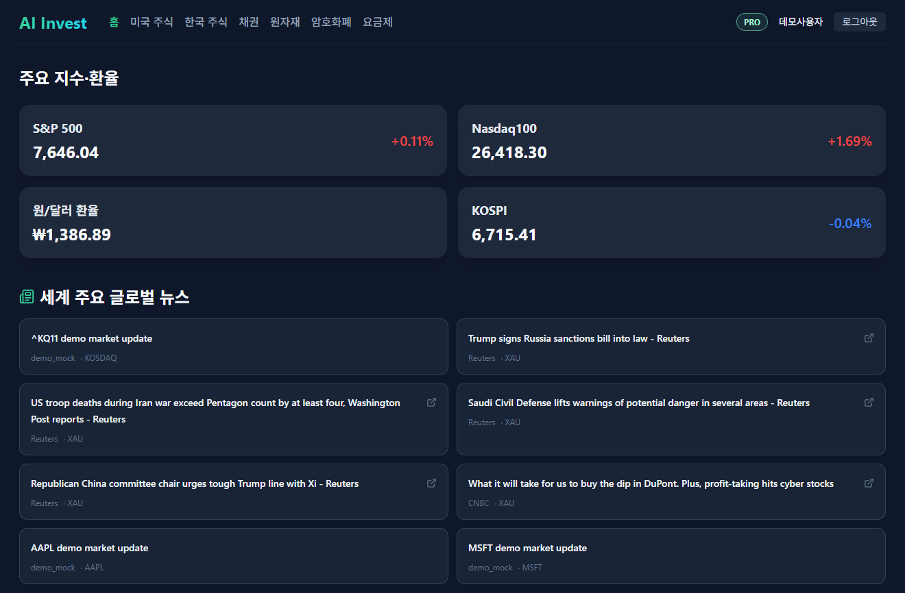 | 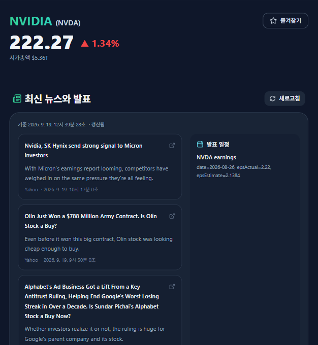 |
| **챗봇** | **AI 리포트** |
| 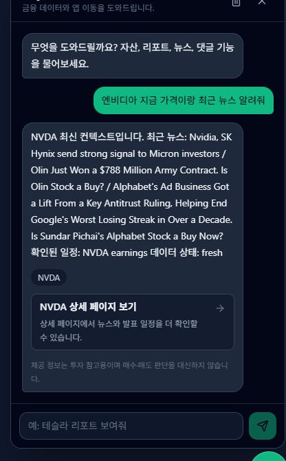 | 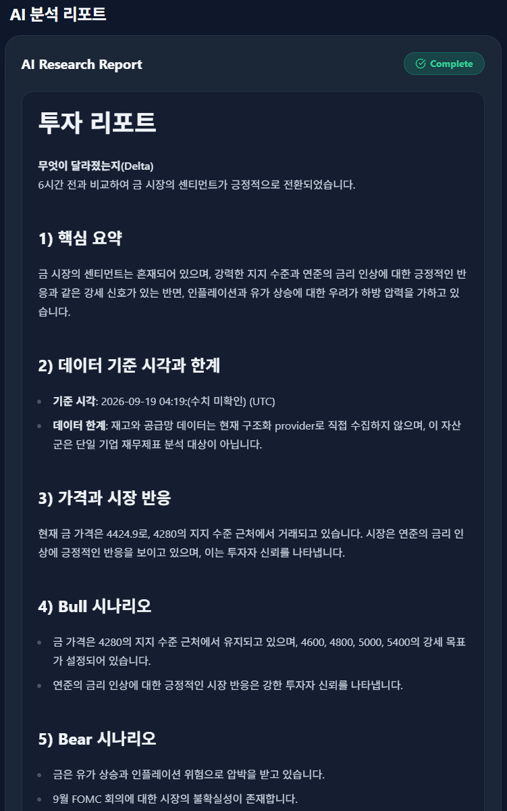 |

## 개요

| 항목 | 내용 |
| --- | --- |
| 기간 | 2026년 3월 ~ 6월 (캡스톤디자인 1) |
| 인원과 역할 | 2인. 본인은 백엔드와 배포 전체를 맡았고, 프론트엔드(React 19 + Vite)는 팀원이 맡았습니다 |
| 상태 | 완료 |
| 핵심 기술 | FastAPI · SQLAlchemy 2.0(Async) · LangGraph · OpenAI gpt-4o-mini · PostgreSQL · APScheduler |
| 배포 | 백엔드 Render · DB Supabase · 프론트엔드 Vercel |

흩어져 있는 글로벌 시장 데이터를 한곳에 모으고, 그 데이터를 근거로 한 투자 리포트를 제공하는 것이 목표였습니다.

리포트 작성은 LLM에 맡길 수 있지만 그대로 쓸 수는 없었습니다. 모델이 학습 과정에서 본 숫자를 섞어 쓰면 읽는 사람은 그것이 수집한 데이터인지 아닌지 구분할 방법이 없습니다. 투자 판단에 쓰이는 글이라 이 문제를 그냥 둘 수 없었습니다.

그래서 생성과 검증을 나눴습니다. 글은 LLM이 쓰고, 그 글에 나온 숫자가 실제 수집 데이터에 있는지는 코드가 확인합니다. 근거를 찾지 못한 숫자가 남은 리포트는 저장하지 않습니다. 숫자 검증은 LLM에게 맡기지 않았습니다. 그래서 같은 입력에는 같은 판정이 나오고 이 단계에는 LLM 비용이 들지 않습니다.

## 문제 해결 사례

1. [숫자 게이트가 초안을 반복 거부해 생긴 영구 404를 생성 쪽에 같은 근거를 줘서 해결](#1-숫자-게이트가-초안을-반복-거부해-생긴-영구-404를-생성-쪽에-같은-근거를-줘서-해결)
2. [배포 후 리포트가 한 건도 저장되지 않던 문제를 로그로 추적해 세 차단 지점을 차례로 해결](#2-배포-후-리포트가-한-건도-저장되지-않던-문제를-로그로-추적해-세-차단-지점을-차례로-해결)
3. [배포 로그에 외부 API 키가 평문으로 남던 문제를 세 경로 모두 막아 해결](#3-배포-로그에-외부-api-키가-평문으로-남던-문제를-세-경로-모두-막아-해결)
4. [빈 결과를 12시간 캐시해 지수가 종일 0으로 고착되던 문제를 빈 결과 캐시 제거로 해결](#4-빈-결과를-12시간-캐시해-지수가-종일-0으로-고착되던-문제를-빈-결과-캐시-제거로-해결)
5. [발송 코드는 정상인데 알림이 나가지 않던 문제를 세 관문으로 나눠 진단](#5-발송-코드는-정상인데-알림이-나가지-않던-문제를-세-관문으로-나눠-진단)
6. [공개 저장소에 노출된 JWT 서명 키와 Supabase RLS 미설정을 해결](#6-공개-저장소에-노출된-jwt-서명-키와-supabase-rls-미설정을-해결)
7. [챗봇에서 LLM에게 맡길 일과 코드가 할 일을 나눠 액션 URL을 코드가 만들게 함](#7-챗봇에서-llm에게-맡길-일과-코드가-할-일을-나눠-액션-url을-코드가-만들게-함)

사례별 테스트 개수는 그 사례를 마친 시점의 개수입니다.

### 1. 숫자 게이트가 초안을 반복 거부해 생긴 영구 404를 생성 쪽에 같은 근거를 줘서 해결

**문제 흐름**

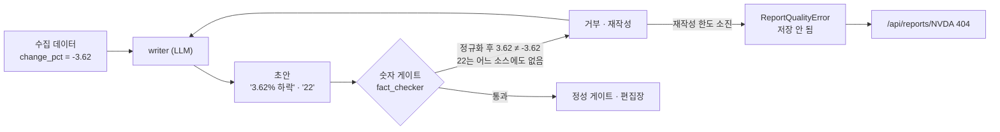
```mermaid
flowchart LR
  D["수집 데이터<br/>change_pct = -3.62"] --> W["writer (LLM)"]
  W --> R["초안<br/>'3.62% 하락' · '22'"]
  R --> F{"숫자 게이트<br/>fact_checker"}
  F -->|"정규화 후 3.62 ≠ -3.62<br/>22는 어느 소스에도 없음"| X["거부 · 재작성"]
  X --> W
  X -->|"재작성 한도 소진"| E["ReportQualityError<br/>저장 안 됨"]
  E --> N["/api/reports/NVDA 404"]
  F -->|통과| Q["정성 게이트 · 편집장"]
```

**문제 원인**

리포트는 LangGraph 그래프 안에서 만들어집니다. writer가 초안을 쓰면 형식 → 숫자 → 정성 게이트 → 편집장(LLM) 순서로 검사합니다. 숫자 게이트(`fact_checker_node`)는 수집한 fact 소스 다섯 가지(`report_facts` · `structured_facts` · `financial_facts` · `news_facts` · `macro_facts`)에 있는 숫자와 0~10 정수, 연도만 허용합니다. 그 밖의 숫자가 하나라도 있으면 거부하고, 거부 사유를 피드백으로 붙여 writer에게 다시 쓰게 합니다. 재작성 횟수(`revision_count`)는 모든 게이트가 함께 쓰고 당시 한도는 3회였습니다.

다른 종목은 리포트가 저장되는데 `/api/reports/NVDA`만 계속 404였습니다. Render 로그를 보면 NVDA 시세(Finnhub)는 정상으로 들어오고 있었습니다. 데이터가 부족해 생성 전에 막힌 것은 아니었습니다. 생성이 매번 실패하고 있었습니다.

```text
Fact checker failed: ... Unsupported numbers: 3.62%, 21
→ revision_count >= 3 → ReportQualityError → DB 미저장 → 조회 API 404
```

writer 프롬프트에는 "넘겨받지 않은 숫자를 만들지 말라"는 부정형 지시 한 줄만 있었습니다. 어떤 숫자를 써도 되는지는 알려 주지 않았습니다. 검사하는 쪽은 허용 목록을 알고 쓰는 쪽은 모르니, 데이터가 비어 있는 자리를 모델이 학습 지식 속 숫자로 채웠습니다. 그래서 1차로 같은 fact 소스에서 원문 숫자 토큰을 모으는 `_describe_supported_numbers(state)`를 만들고, 이 목록을 writer 프롬프트에 `allowed_numbers`로 넣었습니다(상한 40개). 게이트의 판정 로직과 허용 집합은 건드리지 않았습니다.

그런데도 404가 이어졌습니다. 다음 로그에서는 거부 사유가 패스마다 바뀌었습니다.

```text
fact_checker_node fail (unsupported=22, revision_count->2)
fact_checker_node fail (unsupported=3.62%, 22, revision_count->3)
ERROR ... ReportQualityError ... Unsupported numbers: -3.62%, 22 / 22 / 3.62%, 22
AI 리포트 생성 종료   (app.services.ai_service)
AI 리포트 생성 종료   (app.main)
```

이 시점에 두 가지 가설을 세웠습니다.

- **가설 1: 무료 배포 환경이 생성 도중 프로세스를 끊는다.** 로그가 반증했습니다. 트레이스백 뒤에 스케줄러의 except 블록이 남기는 `AI 리포트 생성 종료`가 두 줄 정상 출력돼 있었습니다. 외부에서 프로세스를 강제 종료했다면 이런 정상 종료 로그가 남을 수 없습니다. 코드가 의도적으로 던진 품질 예외였습니다.
- **가설 2: 평가 노드가 작성 노드와 다른 데이터를 본다.** 의심한 노드가 틀렸습니다. 이번 실행은 숫자 게이트에서 한도를 다 써 그래프가 `END`로 빠졌고, 편집장(`evaluator_node`)에는 한 번도 도달하지 않았습니다. 다만 "검사하는 쪽과 쓰는 쪽의 기준이 어긋난다"는 방향은 숫자 게이트에서 일부 맞았습니다. writer에게는 숫자를 40개까지만 안내하는데 게이트는 상한 없이 전체를 허용하고 있었습니다.

1차 조치 뒤의 로그를 보면 `22`는 모든 패스에 고정으로 나오고 `3.62%`는 부호만 바뀌며 나옵니다. 이 패턴이 원인 두 개를 가리켰습니다.

1. **부호 비대칭 오탐**: 숫자를 비교하기 전에 쓰는 `_normalize_numeric_token`이 `,` · `%` · `+`만 지우고 선행 `-`는 남겼습니다. 데이터의 `change_pct=-3.62`는 `-3.62`가 되고, writer가 "3.62% 하락"이라고 쓰면 `3.62`가 됩니다. 데이터에 실제로 있는 값을 근거 없는 숫자로 판정한 false positive입니다. writer가 어떤 패스에서는 `-3.62%`, 어떤 패스에서는 "3.62% 하락"으로 써서 거부 사유가 진동했습니다.
2. **writer의 숫자 환각**: `22`는 어떤 fact 소스에도 없는 값입니다. 피드백에 `Unsupported numbers: 22`가 명시된 뒤에도 writer는 매번 다시 썼습니다. 프롬프트 지시만으로는 강제력이 없었습니다.

두 원인이 겹치면 숫자 게이트는 어떤 패스에서도 통과할 수 없고, 한도 소진 → `ReportQualityError` → 미저장 → 404로 이어집니다.

**해결 과정**

크기 비교와 방향 비교를 나눴습니다. 숫자 게이트는 "데이터에 없는 크기의 숫자"를 막는 곳으로 정의하고, 정규화에 `abs()`를 적용했습니다. 허용 집합과 초안 토큰이 같은 함수를 거치므로 양쪽 모두 절댓값으로 비교됩니다.

```python
raw = raw.replace(",", "").replace("%", "").replace("+", "")
try:
    number = float(raw)
except ValueError:
    return None
number = abs(number)   # 증감 방향은 정성 게이트 · 편집장이 확인한다
```

이렇게 바꾸면 "상승"을 "하락"으로 잘못 쓴 문장은 숫자 게이트를 통과합니다. 방향 오류는 정성 게이트와 편집장의 책임으로 명시했습니다.

쓰는 쪽과 검사하는 쪽이 같은 근거를 보게 했습니다. fact 소스 묶음을 `_fact_number_payload(state)` 하나로 만들고, 허용 목록 생성 · 숫자 검사 · 숫자 정제가 모두 이 함수를 쓰게 했습니다. writer에게 안내하는 상한도 `ALLOWED_NUMBERS_LIMIT=150`으로 올려 데이터가 많은 자산에서 필요한 숫자가 목록에서 빠지지 않게 했습니다.

재작성 한도를 다 써도 결정적인 폴백을 한 번 더 시도합니다. 형식 게이트는 통과하고 숫자 게이트만 실패한 경우에 한해, 근거 없는 숫자만 `(수치 미확인)`으로 치환합니다. 치환한 초안은 형식 · 분석 프레임워크 · 숫자 · 정성 게이트를 처음부터 다시 통과해야 저장합니다. LLM은 다시 부르지 않으므로 편집장(LLM) 검토는 거치지 않습니다. 네 게이트 중 하나라도 실패하면 이전처럼 저장하지 않습니다. 폴백으로 저장한 리포트는 메타데이터에 `fallback_sanitized`와 치환한 숫자 목록(`sanitized_numbers`)을 남겨 나중에 추적할 수 있게 했습니다.

재작성 한도는 코드에 박힌 3회에서 설정값 `REPORT_MAX_REVISIONS`(기본 7회)로 바꿨습니다. 한 번에 통과하는 리포트는 호출 수가 그대로이고, 늘어나는 비용은 반복해서 실패하는 리포트에만 생깁니다.

원인 분석 단계에서는 한도를 다 쓴 초안을 품질 상태 표시와 함께 그대로 저장하는 방안도 검토했습니다. 이 방안은 버렸습니다. 검증하지 않은 숫자가 DB에 들어가면 게이트를 둔 의미가 없어지기 때문입니다. 게이트의 판정 기준과 허용 집합 정의, 스케줄러 주기와 쿨다운은 그대로 뒀습니다. 치환된 문장("P/E는 (수치 미확인)배")이 읽기 불편해지는 것은 감수했습니다. 폴백 저장이 늘어나면 데이터 커버리지를 넓혀야 한다는 신호로 보기로 했습니다.

핵심 코드: `backend/app/services/graph/nodes.py` · `backend/app/services/ai_service.py` · `backend/app/services/graph/graph.py`

**테스트**

- 환경: 로컬 pytest. 실제 LLM과 외부 API는 호출하지 않고 결정적 헬퍼와 mock DB · 그래프로 검증했습니다.
- 1차 조치 후: 허용 목록이 원문 토큰을 중복 없이 수집하는지, 목록의 모든 토큰이 게이트의 허용 집합에 들어 있는지 확인하는 테스트를 추가했습니다.
- 2차 조치 후 추가한 테스트
  - `test_fact_checker_is_sign_insensitive_for_change_pct`: `change_pct=-3.62`일 때 "3.62% 하락"과 "-3.62%"가 모두 통과
  - `test_sanitize_unsupported_numbers_replaces_only_unsupported`: 근거 있는 숫자(200, 1.25)는 남기고 `22`만 치환
  - `test_generate_report_saves_via_numeric_sanitization_fallback`: 한도 소진 → 정제 → 재검증 통과 → 저장
  - `test_numeric_sanitization_fallback_skips_when_format_failed`: 형식 게이트 실패는 폴백 대상이 아님
- 품질 게이트 테스트 31개 통과. 재작성 한도를 설정값으로 바꾼 뒤 한도 경계 테스트를 더해 33개 통과.

**결과** 숫자 게이트의 기준을 낮추지 않고 부호 오탐과 반복 거부 루프를 끊었습니다. 이후 배포 로그에서 NVDA 리포트가 `fact_checker 루프 소진 후 숫자 정제 폴백으로 저장` 단계까지 진행됐고, 그다음 남은 저장 실패는 [사례 2](#2-배포-후-리포트가-한-건도-저장되지-않던-문제를-로그로-추적해-세-차단-지점을-차례로-해결)의 세 번째 원인이었습니다. 그 원인까지 고친 뒤 NVDA 리포트 404는 해소됐습니다.

**배운 점** 검증기가 계속 거부하면 기준을 낮추기 전에 생성 쪽이 같은 근거를 보고 있는지, 검증기의 "같다"는 정의가 맞는지부터 확인합니다.

### 2. 배포 후 리포트가 한 건도 저장되지 않던 문제를 로그로 추적해 세 차단 지점을 차례로 해결

**문제 흐름**

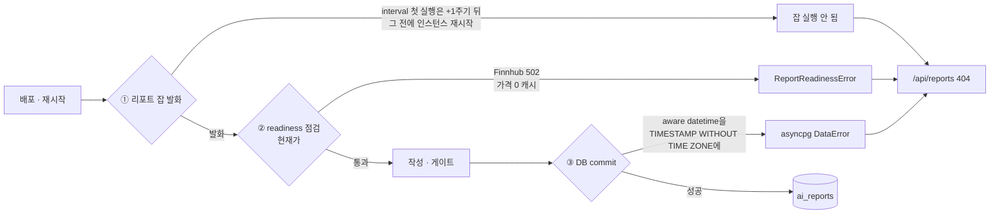
```mermaid
flowchart LR
  B["배포 · 재시작"] --> S{"① 리포트 잡 발화"}
  S -->|"interval 첫 실행은 +1주기 뒤<br/>그 전에 인스턴스 재시작"| X1["잡 실행 안 됨"]
  S -->|발화| P{"② readiness 점검<br/>현재가"}
  P -->|"Finnhub 502<br/>가격 0 캐시"| X2["ReportReadinessError"]
  P -->|통과| G["작성 · 게이트"]
  G --> C{"③ DB commit"}
  C -->|"aware datetime을<br/>TIMESTAMP WITHOUT TIME ZONE에"| X3["asyncpg DataError"]
  C -->|성공| OK[("ai_reports")]
  X1 --> N["/api/reports 404"]
  X2 --> N
  X3 --> N
```

**문제 원인**

리포트는 사용자 요청으로 만들지 않고 APScheduler가 주기적으로만 만듭니다. 사용자는 저장된 리포트를 읽기만 합니다. 그래서 스케줄러 잡이 돌지 않거나 중간에 실패하면 화면에는 404만 보이고, 원인은 로그에만 남습니다. 배포 환경(Render)에서 모든 종목의 `/api/reports/{ticker}`가 404였고 저장된 리포트는 0건이었습니다.

같은 증상 뒤에 원인이 세 개 있었습니다. 로그를 따라가며 "어느 단계까지 갔는가"를 먼저 정하고, 그 지점을 고친 뒤 다음 로그에서 다시 같은 질문을 했습니다.

**① 잡이 실행되지 않음 (2026-06-08 01:03~01:05 UTC 로그)**

로그 전체에 `AI 리포트 생성 시작`이 한 번도 없었습니다. 이 한 줄이 있느냐 없느냐로 "잡이 돌았는데 실패했다"와 "잡이 애초에 실행되지 않았다"를 가를 수 있었고, 후자로 범위를 좁혔습니다.

```text
01:04:18  Notification delivery ...          # 1분 주기 알림 잡만 실행
01:04:23  Shutting down
          Scheduler has been shut down
          Finished server process [64]
01:05:18  Notification delivery ...
```

APScheduler의 `interval` 잡은 `next_run_time`을 주지 않으면 첫 실행이 기동 시점에서 한 주기 뒤입니다. 리포트 주기 잡은 6시간 뒤에야 처음 돌 수 있었습니다. 기동 180초 뒤에 한 번 돌도록 별도 date 잡도 등록해 두었지만, 인스턴스가 180초를 연속으로 버티지 못하고 재시작되면서 타이머가 매번 0부터 다시 시작했습니다. 1분 주기 알림 잡만 종료 전에 실행돼 로그에 보였던 것입니다.

**② 현재가 0으로 readiness 차단 (같은 날 01:23 UTC 재배포 로그)**

이번에는 스케줄러가 정상 기동했지만 워밍업 단계에서 미국 주식 전 종목의 시세 수집이 실패했습니다.

```text
Market snapshot provider failed (ticker=NVDA, category=STOCK_US): 502 Bad Gateway (finnhub.io/quote)
FMP quote/history unavailable (^NDX): 402 Payment Required
```

미국 주식 경로는 시가총액과 과거 시세에는 폴백이 있었지만 현재가(quote) 호출에는 폴백이 없었습니다. Finnhub가 502를 던지면 예외가 dispatcher까지 올라가 기본 응답(가격 0)이 그대로 캐시에 들어갔습니다. 리포트 생성 전 데이터 점검(`_grade_report_readiness`)은 가격이 0이면 `blocked`로 판정하므로 `ReportReadinessError`가 나고 저장되지 않습니다. 워밍업 직후 한 번의 장애가 다음 갱신까지 리포트 생성을 막을 수 있었습니다.

**③ commit 단계 실패 (2026-06-09 로그)**

앞의 두 지점을 고친 뒤의 로그에서는 `NVDA 리포트 생성 시작` → writer · 게이트 반복 → `NVDA fact_checker 루프 소진 후 숫자 정제 폴백으로 저장`까지 정상으로 진행했습니다. 실패는 마지막 commit이었습니다.

```text
asyncpg.exceptions.DataError:
invalid input for query argument $11:
datetime.datetime(..., tzinfo=datetime.timezone.utc)
(can't subtract offset-naive and offset-aware datetimes)
```

`ai_reports.data_as_of` 컬럼은 `TIMESTAMP WITHOUT TIME ZONE`인데, 메타데이터의 `data_as_of`는 `2026-06-09T10:59:32.317389+00:00`처럼 offset이 붙은 문자열이었습니다. 이를 파싱한 timezone-aware `datetime`을 asyncpg가 naive 컬럼에 바인딩하다 실패했습니다.

**해결 과정**

**①** 리포트 잡을 `interval` 잡 하나로 합치고 `next_run_time`을 지정해 기동 직후 한 번 실행되게 했습니다. 중복으로 등록하던 startup date 잡은 지웠고, 기동 지연 기본값은 180초에서 60초로 줄였습니다.

```python
scheduler.add_job(
    run_daily_reports_job,
    "interval",
    hours=settings.REPORT_SCHEDULER_INTERVAL_HOURS,
    id="generate_daily_reports",
    replace_existing=True,
    coalesce=True,
    max_instances=1,
    next_run_time=datetime.now() + timedelta(seconds=settings.REPORT_SCHEDULER_STARTUP_DELAY_SECONDS),
)
```

주기 · 회당 최대 생성 수 · 자산별 쿨다운은 그대로 두었습니다. 첫 실행 시점만 앞당기는 변경이라 LLM 비용은 늘지 않습니다. 다만 인스턴스가 60초 안에 죽으면 여전히 실행되지 않으므로 이 변경만으로는 완전한 해결이 아닙니다. 근본 대책으로는 상시 가동 런타임으로 옮기는 안과, 토큰으로 보호한 생성 엔드포인트를 외부 cron이 부르는 안을 정리했습니다. 이 장애는 무료 플랜에서 겪었고 이후 운영은 idle sleep이 없는 Render Standard로 옮겨 했습니다.

**②** 미국 주식 현재가에 폴백 체인을 넣었습니다. Finnhub quote 호출을 감싸 502를 흡수하고, 현재가가 비면 FMP quote로, 그것도 비면 과거 시세(FMP → Stooq)의 마지막 종가로 채웁니다. 모든 공급자가 실패하면 가격 0을 캐시에 덮어쓰지 않고 직전 유효값(stale)을 다시 돌려줍니다. 직전 값도 없으면 0을 반환하되 캐시에는 쓰지 않아 다음 호출이 바로 재시도하게 했습니다.

테스트를 돌리다 하나를 더 찾았습니다. 캐시 조회 함수 `_cache_get`은 TTL이 지난 항목을 `pop`으로 지우기 때문에, 수집에 실패한 뒤에 stale 값을 찾으면 이미 사라진 뒤였습니다. 그래서 함수에 들어오자마자 `_cache_get_stale`로 직전 값을 먼저 확보해 두도록 순서를 바꿨습니다.

장애가 길어지면 오래된 가격으로 리포트가 만들어질 수 있습니다. "404로 아무것도 보여 주지 않는 것"보다 "마지막 유효값으로 만들고 기준 시각을 함께 보여 주는 것"을 택했고, 신선도는 리포트의 `data_as_of`로 드러납니다.

**③** DB 컬럼 타입은 바꾸지 않았습니다. 저장 직전에 `_parse_iso_datetime()`이 aware 값을 UTC로 변환한 뒤 `tzinfo`를 떼도록 고쳤습니다. 마이그레이션이 필요 없고, 메타데이터 JSON에는 원본 ISO 문자열이 남아 API 응답의 기준 시각 정보도 그대로입니다. 확인된 실패 지점만 좁게 고쳤기 때문에, 다른 naive 컬럼에 aware 값이 들어가는 경로가 새로 생기면 같은 오류가 날 수 있다는 점을 기록에 남겼습니다.

핵심 코드: `backend/app/main.py` · `backend/app/core/config.py` · `backend/app/services/price_providers.py` · `backend/app/services/ai_service.py`

**테스트**

- 환경: 로컬 pytest. 스케줄러는 FakeScheduler로, 외부 API는 monkeypatch로 바꿨습니다. 실제 LLM과 공급자는 호출하지 않았습니다.
- ①: `test_lifespan_registers_single_report_job_with_startup_next_run_time`이 리포트 잡이 하나만 등록되고 `interval` 트리거에 `next_run_time`이 설정되는지 확인합니다. 스케줄러 · 공급자 테스트 35개 통과.
- ②: Finnhub 502일 때 FMP quote로 넘어가는지, quote 계열이 모두 실패하면 마지막 종가를 쓰는지, live 값이 0이면 stale을 유지하는지, stale이 없으면 0을 캐시하지 않는지 확인하는 테스트 4개를 추가했습니다. 공급자 · 매크로 테스트 38개 통과. 이 중 stale 유지 테스트가 처음에 실패해 위의 `pop` 문제를 찾았습니다.
- ③: 저장 테스트에서 `data_as_of`가 timezone 없는 UTC datetime으로 정규화되는지 확인합니다. 이 테스트는 가짜 DB 세션(`FakeDbSession`)에 넘어간 객체를 보므로 asyncpg 오류 자체는 재현하지 못하고 변환 결과만 확인합니다. 품질 게이트 테스트 37개 통과.

**결과** 가격 0 캐시와 시간대 타입 불일치는 코드와 테스트로 막았습니다. 잡 미실행은 첫 실행을 기동 60초 뒤로 앞당겨 줄였고 운영 환경도 상시 가동 플랜으로 옮겼습니다.

**배운 점** 같은 404라도 원인은 여럿일 수 있습니다. 로그에서 어느 단계까지 갔는지부터 정하고, 하나를 고친 뒤에도 증상이 남으면 고친 것이 안 먹혔다고 보기 전에 다음 차단 지점을 찾습니다.

### 3. 배포 로그에 외부 API 키가 평문으로 남던 문제를 세 경로 모두 막아 해결

**문제 흐름**

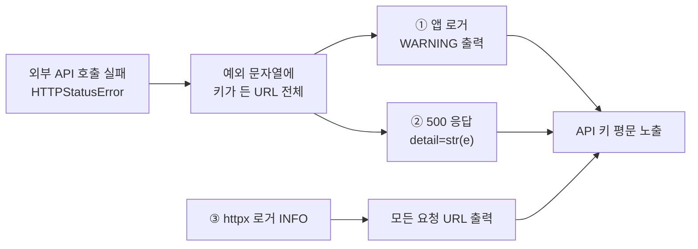
```mermaid
flowchart LR
  C["외부 API 호출 실패<br/>HTTPStatusError"] --> E["예외 문자열에<br/>키가 든 URL 전체"]
  E --> L1["① 앱 로거<br/>WARNING 출력"]
  E --> L2["② 500 응답<br/>detail=str(e)"]
  H["③ httpx 로거 INFO"] --> L3["모든 요청 URL 출력"]
  L1 --> K["API 키 평문 노출"]
  L2 --> K
  L3 --> K
```

**문제 원인**

이 서비스는 공공데이터포털 · Finnhub · FRED · 한국은행 ECOS · Stooq 같은 외부 API를 부릅니다. 대부분 키를 쿼리 파라미터(`serviceKey=`, `token=`, `api_key=`)로 받고, ECOS는 URL 경로에 키를 넣습니다.

배포 로그를 확인하다가 키가 그대로 찍힌 줄을 발견했습니다.

```text
app.services.price_providers WARNING ... for url 'https://apis.data.go.kr/...?serviceKey=<평문키>&...'
```

처음에는 root 로거가 INFO라서 `httpx`가 모든 요청 URL을 찍는 것이 원인이라고 보고 로거 레벨부터 조정했습니다. `sqlalchemy.engine`의 SQL echo도 INFO로 과하게 나오고 있었습니다. 그런데 실제 로그에서 확인한 누수 줄은 애플리케이션 자신의 로거가 남긴 WARNING이었습니다. 공급자 서비스가 `logger.warning("... %r", exc)`로 `HTTPStatusError`를 그대로 출력했는데, httpx의 이 예외 문자열에는 요청 URL 전체가 들어갑니다. 로거 레벨을 아무리 조정해도 앱이 WARNING으로 직접 찍는 줄은 막히지 않습니다.

같은 문자열이 HTTP 응답으로 나가는 경로도 있었습니다. `/api/market/history/{ticker}`의 500 핸들러가 `detail=str(e)`를 돌려주고 있어, FRED 호출이 실패하면 `api_key`가 담긴 URL이 클라이언트에게 갈 수 있었습니다. 로그보다 노출 범위가 넓은 경로입니다.

**해결 과정**

마스킹을 출력 직전에 한 곳에서 하도록 `app/core/log_sanitizer.py`에 `redact_secrets()`를 만들었습니다.

```python
_SENSITIVE_QUERY_PARAM = re.compile(
    r"(?i)([?&](?:serviceKey|api[_-]?key|apikey|token|auth|access[_-]?token|secret|key|password|pwd)=)[^&\s'\"]+"
)

def redact_secrets(value, extra_secrets=None) -> str:
    text = _SENSITIVE_QUERY_PARAM.sub(r"\1***", str(value))
    for secret in extra_secrets or []:
        if secret and len(str(secret)) >= 4:     # 빈 값 · 짧은 값으로 본문을 망가뜨리지 않게
            text = text.replace(str(secret), "***")
    return text
```

- 쿼리 파라미터는 정규식으로 가리고, 키가 경로에 들어가는 ECOS는 키 값을 `extra_secrets`로 넘겨 리터럴로 치환합니다.
- 공급자 서비스 4곳과 매크로 서비스 3곳의 예외 로그를 `redact_secrets(repr(exc))`로 감쌌습니다.
- 500 핸들러의 `detail`도 `redact_secrets(str(e))`로 바꿨습니다.
- `httpx` · `httpcore` · `sqlalchemy.engine` 로거는 WARNING 이상만 남기게 했습니다. root는 INFO를 유지해 앱 로그는 그대로 보입니다.

라이브러리 요청 로그(③)는 로거 레벨로 막고 앱이 직접 출력하는 예외와 응답(①②)은 마스킹으로 막았습니다. 운영 환경변수의 `SQLALCHEMY_ECHO`가 꺼져 있는지도 확인 항목으로 남겼습니다.

키 자체도 정리했습니다. 로그에서 평문으로 확인된 공공데이터포털 `serviceKey`는 손상된 것으로 보고 재발급했고, 같은 위험이 있는 Finnhub · FRED · ECOS · Stooq 키도 점검 대상으로 묶었습니다. 이후 9월 점검에서 관련 문제 두 가지를 더 정리했습니다. 기동 작업의 `print()`가 예외 `repr`을 마스킹 없이 표준출력으로 내보내고 있어 로거와 `redact_secrets`로 바꿨고, `test_log_sanitizer.py`의 픽스처에 실제 키로 보이는 값이 있어 가짜 값으로 교체했습니다.

핵심 코드: `backend/app/core/log_sanitizer.py` · `backend/app/services/price_providers.py` · `backend/app/services/macro_service.py` · `backend/app/main.py`

**테스트**

- 환경: 로컬 pytest
- `test_log_sanitizer.py`를 새로 만들었습니다(4건). `serviceKey` · Finnhub `token` · FRED `api_key`가 `***`로 가려지고 민감하지 않은 파라미터는 남는지, ECOS의 경로 키가 `extra_secrets`로 가려지는지, 빈 값과 짧은 값은 무시하는지 확인합니다.
- 품질 게이트 테스트와 함께 30개 통과(당시 기준)

**결과** 로그와 HTTP 응답 어느 쪽으로도 키가 담긴 URL이 그대로 나가지 않게 됐습니다.

**배운 점** 로거 레벨을 올리면 라이브러리 로그는 막히지만 앱이 직접 찍는 예외와 응답 본문은 그대로 나갑니다. 비밀이 지나가는 출력 경로를 하나씩 세고 경로마다 막습니다.

### 4. 빈 결과를 12시간 캐시해 지수가 종일 0으로 고착되던 문제를 빈 결과 캐시 제거로 해결

**문제 흐름**

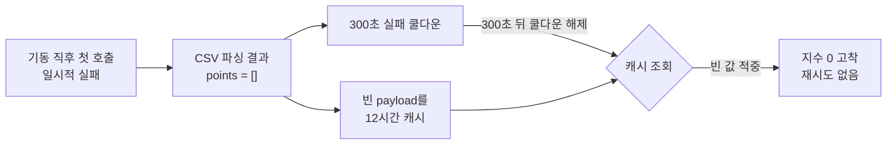
```mermaid
flowchart LR
  F["기동 직후 첫 호출<br/>일시적 실패"] --> E["CSV 파싱 결과<br/>points = []"]
  E --> C1["300초 실패 쿨다운"]
  E --> C2["빈 payload를<br/>12시간 캐시"]
  C1 -->|"300초 뒤 쿨다운 해제"| H{"캐시 조회"}
  C2 --> H
  H -->|"빈 값 적중"| Z["지수 0 고착<br/>재시도 없음"]
```

**문제 원인**

대시보드의 나스닥 100(`^NDX`) 지수 카드는 보이는데 값이 계속 0이었습니다. 이 지수의 일별 시세는 Stooq의 CSV 다운로드로 받습니다.

같은 머신에서 `_get_stooq_text`로 `^ndx` · `usdkrw` · `^spx`를 직접 부르면 모두 정상 CSV가 내려왔습니다(`^ndx`는 22,836행). 코드 · 키 · 네트워크가 지금은 정상이라는 뜻이므로, 과거의 실패가 어딘가에 남아 있다고 보고 캐시 경로를 따라갔습니다.

`fetch_stooq_history`는 파싱 결과가 비어도 그 빈 payload를 과거 시세 캐시에 `HISTORY_CACHE_TTL_SECONDS`(12시간) 동안 저장하고 있었습니다.

```python
if not points:
    _mark_failed_call(cache_key)      # 300초 실패 쿨다운
return _cache_set(_history_cache, cache_key, payload)  # 빈 payload도 12시간 캐시
```

기동 직후 첫 호출이 Stooq 쪽 봇 확인 단계나 키 일일 한도 또는 순간적인 네트워크 오류로 한 번만 실패해도 빈 결과가 12시간 동안 캐시됩니다. 300초 쿨다운이 풀려도 캐시에 빈 값이 적중하므로 실제 재요청은 일어나지 않습니다. "성공적으로 받은 빈 값"과 "실패"를 같은 TTL로 캐시한 탓에 일시적인 실패가 반나절짜리 장애로 바뀌었습니다.

**해결 과정**

빈 결과는 캐시에 쓰지 않도록 성공 경로와 분리했습니다.

```python
if not points:
    # 빈 결과를 12시간 캐시하면 한 번의 일시적 실패가 종일 0으로 고착된다.
    _mark_failed_call(cache_key)                          # 300초 쿨다운만 건다
    stale = _cache_get_stale(_history_cache, cache_key)
    if stale is not None and stale.get("points"):
        return stale                                      # 직전 유효값이 있으면 그것을 쓴다
    return _history_payload(ticker.upper(), [], ...)      # 없으면 캐시 없이 반환
...
return _cache_set(_history_cache, cache_key, payload)     # 데이터가 있을 때만 12시간 캐시
```

빈 결과를 12시간짜리 negative cache로 두지 않고, 이미 있던 300초 실패 쿨다운만 남겼습니다. 쿨다운 동안에는 같은 요청을 반복하지 않아 공급자에 부담을 주지 않고, 쿨다운이 끝나면 다음 수집 주기에 바로 다시 요청합니다. 직전 유효값이 있으면 그 값을 보여 주므로 화면이 0으로 떨어지지도 않습니다. 정상 데이터의 12시간 캐시는 그대로 뒀습니다.

같은 "빈 결과 12시간 캐시" 패턴이 차트용 `fetch_market_history`와 `fetch_coingecko_history` · `fetch_data_go_*`에도 있었습니다. 이번 수정은 카드가 의존하는 `fetch_stooq_history`로 범위를 한정했고, 나머지는 같은 증상이 보이면 같은 방식으로 고치기로 기록에 남겼습니다.

핵심 코드: `backend/app/services/price_providers.py` (`fetch_stooq_history`)

**테스트**

- 환경: 로컬 pytest와 실제 Stooq 호출
- `test_stooq_history_does_not_cache_empty_result`: 빈 결과가 캐시에 남지 않는지
- `test_stooq_history_reuses_last_good_when_parse_empties`: 직전 유효값이 있으면 빈 파싱 결과 대신 그 값을 돌려주는지
- `test_price_providers.py` · `test_market_warmup_timeout.py` 57개 통과
- 실측: `fetch_stooq_history("^NDX")` 30포인트

**결과** 일시적으로 빈 결과를 받아도 더 이상 12시간 동안 0에 묶이지 않고, 직전 유효값을 유지하거나 다음 주기에 스스로 회복합니다. fetch가 계속 실패하는 환경이라면 값은 여전히 0이지만, 매 주기 재시도하므로 조건이 돌아오면 자동으로 복구됩니다.

**배운 점** 캐시가 "받은 빈 값"과 "실패"를 구분하지 못하면 일시적 장애가 TTL만큼 길어집니다. TTL은 성공 경로를 기준으로 정하고, 빈 결과와 실패에는 따로 정책을 둡니다.

### 5. 발송 코드는 정상인데 알림이 나가지 않던 문제를 세 관문으로 나눠 진단

**문제 흐름**

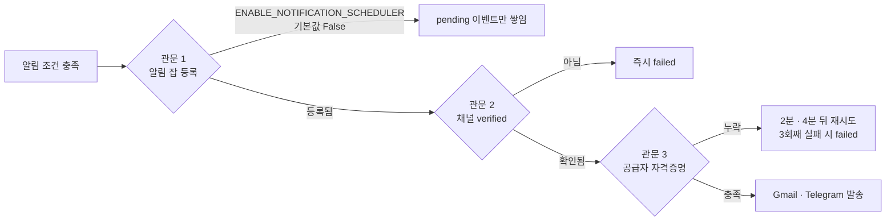
```mermaid
flowchart LR
  EV["알림 조건 충족"] --> G1{"관문 1<br/>알림 잡 등록"}
  G1 -->|"ENABLE_NOTIFICATION_SCHEDULER<br/>기본값 False"| P["pending 이벤트만 쌓임"]
  G1 -->|등록됨| G2{"관문 2<br/>채널 verified"}
  G2 -->|아님| F2["즉시 failed"]
  G2 -->|확인됨| G3{"관문 3<br/>공급자 자격증명"}
  G3 -->|누락| F3["2분 · 4분 뒤 재시도<br/>3회째 실패 시 failed"]
  G3 -->|충족| S["Gmail · Telegram 발송"]
```

**문제 원인**

즐겨찾기한 자산에 조건이 맞으면 Gmail과 Telegram으로 알림을 보내는 기능이 있습니다. "메일과 텔레그램이 나가지 않는다"는 증상이 보고됐는데, 발송 함수(`notification_service.py`) 자체에는 문제가 없었습니다.

코드부터 고치지 않고 진단 문서를 먼저 썼습니다. 알림이 실제로 나가려면 코드 경로상 세 관문을 모두 지나야 합니다. 관문마다 닫혔을 때 무엇이 남는지와 가능성을 정리했습니다.

| 관문 | 확인 위치 | 닫혀 있을 때 |
| --- | --- | --- |
| 1. 알림 스케줄러 | `ENABLE_SCHEDULER`(기본 `True`)와 `ENABLE_NOTIFICATION_SCHEDULER`(기본 `False`)가 모두 켜져야 평가 · 발송 잡이 등록됨 | 잡이 아예 없으므로 이벤트가 `pending`으로 쌓이기만 하고 에러도 남지 않음 |
| 2. 채널 검증 | 사용자 채널 연결이 `verified=True`이고 수신 대상(이메일 주소, Telegram `chat_id`)이 있어야 함 | 이벤트가 즉시 `failed`, `Notification channel is not verified.` |
| 3. 공급자 자격증명 | `TELEGRAM_BOT_TOKEN`, `EMAIL_PROVIDER=gmail`, Gmail OAuth 값 4개, `gmail.send` scope | 실패할 때마다 2분 · 4분 뒤 다시 시도하고(지수 백오프) 세 번째 실패에서 `failed` |

가능성은 관문 1 → 3 → 2 순으로 매겼습니다. 1순위는 관문 1입니다. 상위 플래그 `ENABLE_SCHEDULER`는 기본값이 `True`인데 알림 전용 플래그만 기본값이 `False`였습니다. 운영 `.env`에 이 플래그를 따로 켜지 않으면 발송 잡이 등록되지 않고, 발송 로직은 한 번도 실행되지 않습니다. "코드는 정상인데 아무 일도 일어나지 않는" 증상과 맞는 지점입니다.

진단 과정에서 문서와 구현이 어긋난 곳도 찾았습니다. Telegram 연결 API는 `/start <code>`로 webhook이 자동 검증하는 것처럼 안내했지만, 실제 구현은 사용자가 숫자 `chat_id`를 직접 입력하는 수동 방식이었습니다.

**해결 과정**

운영 환경에서 자동 알림을 쓰려면 두 플래그를 모두 켜야 한다는 점을 운영 절차에 명시했습니다. 그다음에는 같은 증상이 다시 생겼을 때 운영자가 비밀 값을 보지 않고도 어느 관문인지 알 수 있게 하는 데 집중했습니다.

- `get_delivery_configuration_status()`를 추가하고 `POST /api/notifications/test` 응답에 `delivery_status`로 넣었습니다. 스케줄러 활성 여부와 채널별 `configured`, 그리고 누락된 환경변수의 **이름**만 돌려주고 값은 돌려주지 않습니다.
- Gmail 실패 메시지를 `EMAIL_PROVIDER must be gmail.`, `Gmail email settings are incomplete: ...`, HTTP 오류 요약으로 나눴습니다. Gmail과 Telegram의 HTTP 오류는 마스킹한 원인 문자열로 `error_message`에 남깁니다.
- Telegram 연결 안내를 실제 구현인 수동 `chat_id` 방식으로 바로잡고, `chat_id`는 `^-?\d+$`만 받게 했습니다. 그룹 채팅의 `chat_id`는 음수일 수 있어 음수도 허용합니다.

응답만 보고 판단할 수 있도록 해석 기준도 문서에 남겼습니다. `scheduler.enabled == false`면 관문 1, `missing_keys`에 항목이 있으면 관문 3, 둘 다 정상인데 이벤트가 `failed`면 관문 2이거나 토큰 만료입니다.

Telegram webhook 자동 검증은 이번에 만들지 않고 안내를 실제 구현에 맞추는 데서 멈췄습니다.

핵심 코드: `backend/app/services/notification_service.py` · `backend/app/api/notifications.py` · `backend/app/schemas.py`

**테스트**

- 환경: 로컬 pytest. 진단 단계는 코드 변경 없이 정적 분석으로 진행했고 `.env`는 열지 않았습니다.
- 깨져 있던 알림 API 테스트 문자열을 복구하고, 수동 `chat_id` 계약, 숫자가 아닌 `chat_id` 거부, `delivery_status` 응답, 토큰 누락 시 재시도 한도 후 `failed` 처리 테스트를 추가했습니다.
- 알림 API · 서비스 테스트 10개 통과
- 실제 Gmail · Telegram 발송 smoke는 실행하지 않았습니다. 실제 자격증명과 외부 호출이 필요해서입니다.

**결과** "알림이 안 나간다"는 증상을 관문 세 개와 확인 순서로 바꿔 두었고, 운영자가 비밀 값 없이 응답 하나로 관문을 가릴 수 있게 됐습니다. 이후 운영 환경변수에 두 플래그를 설정해 알림이 나가게 했습니다.

**배운 점** 기능이 기본값으로 꺼져 있으면 에러도 없이 조용히 빠집니다. "동작 안 함"을 관문 목록과 확인 순서로 적어 두면 다음 사람이 같은 순서로 좁힐 수 있습니다.

### 6. 공개 저장소에 노출된 JWT 서명 키와 Supabase RLS 미설정을 해결

**문제 흐름**

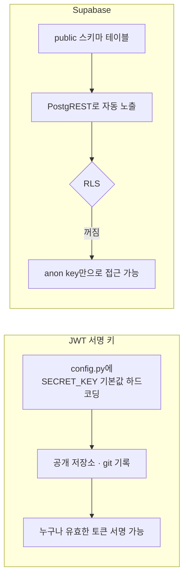
```mermaid
flowchart LR
  subgraph JW["JWT 서명 키"]
    K1["config.py에<br/>SECRET_KEY 기본값 하드코딩"] --> K2["공개 저장소 · git 기록"]
    K2 --> K3["누구나 유효한 토큰 서명 가능"]
  end
  subgraph SB["Supabase"]
    T1["public 스키마 테이블"] --> T2["PostgREST로 자동 노출"]
    T2 --> T3{"RLS"}
    T3 -->|"꺼짐"| T4["anon key만으로 접근 가능"]
  end
```

**문제 원인**

두 문제 모두 개발 편의용 기본값이 운영까지 그대로 남아 생겼습니다.

**JWT 서명 키.** 이 서비스는 Google 로그인 뒤 백엔드가 직접 JWT를 발급합니다. 그런데 `backend/app/core/config.py`의 `SECRET_KEY`에 기본값이 코드로 박혀 있었고, 저장소가 공개라 그 값이 그대로 노출돼 있었습니다. 운영 환경에서 이 값을 덮어쓰지 않았다면 누구든 이 키로 유효한 토큰을 서명할 수 있습니다. 기본값을 지워도 예전 값은 git 기록에 남으므로 이미 노출된 것으로 봐야 했습니다.

**Supabase RLS.** 2026-06-08 Supabase에서 보안 경고 두 건(`rls_disabled_in_public`, `sensitive_columns_exposed`)이 왔습니다. 경고의 의미와 이 저장소의 실제 구조를 대조했습니다.

- Supabase는 `public` 스키마의 모든 테이블을 REST Data API(PostgREST)로 자동 노출합니다. 이 API는 프로젝트 URL과 anon key만 있으면 외부에서 부를 수 있고, 그 앞에서 행 단위 접근을 막는 장치는 RLS뿐입니다.
- 이 서비스의 백엔드는 `DATABASE_URL`로 Postgres에 직접 붙고, 프론트엔드는 Supabase client를 쓰지 않습니다. PostgREST를 전혀 쓰지 않는데도 자동 노출은 켜져 있었습니다.
- 노출 대상에는 `users`(`email`, `google_sub`)와 `notification_channel_connections`(`destination`, `verification_code`) 같은 개인정보 컬럼, 구독 · 결제 테이블이 있었습니다.
- 이 서비스는 프론트엔드에 anon key를 싣지 않아 당장 악용되기는 어려웠습니다. 하지만 anon key는 원래 브라우저에 공개하도록 만든 키입니다. 보안이 "그 키가 새지 않는다"는 가정 한 겹에만 기대고 있었습니다.

**해결 과정**

**JWT 서명 키.** 기본값을 빈 문자열로 바꾸고, pydantic `model_validator`로 기동 시점에 키를 검사합니다.

```python
@model_validator(mode="after")
def resolve_secret_key(self) -> "Settings":
    if hashlib.sha256(self.SECRET_KEY.encode()).hexdigest() in LEAKED_SECRET_KEY_SHA256:
        raise ValueError("SECRET_KEY uses a publicly leaked value. Generate a new random secret.")
    if not self.SECRET_KEY:
        if self.ENVIRONMENT != "development":
            raise ValueError("SECRET_KEY is required outside development.")
        # 로컬 개발 편의용: 프로세스마다 임시 키를 만든다. 재시작하면 기존 토큰은 무효가 된다.
        self.SECRET_KEY = secrets.token_urlsafe(32)
        logger.warning("SECRET_KEY is not set; using a temporary per-process key for development.")
    return self
```

- 예전에 공개된 값이 설정돼 있으면 기동을 거부합니다. 키를 바꾸는 것만으로는 누군가 예전 값을 다시 넣는 실수를 막지 못하므로 코드가 그 값을 거부하게 했습니다.
- 처음에는 거부 목록에 예전 값을 원문으로 넣었습니다. 그러면 현재 코드에 비밀이 다시 공개되는 셈이라, 같은 날 SHA-256 해시로 비교하도록 바꿨습니다.
- 운영 환경에서 값이 비어 있으면 기동을 거부합니다(fail-closed). 개발 환경에서만 프로세스별 임시 키를 만들고 경고를 남깁니다.

운영에서 `SECRET_KEY`를 설정하지 않았다면 이 변경 뒤로는 서버가 뜨지 않습니다. 배포 전에 새 랜덤 값을 넣어야 하고, 키를 바꾸면 기존 JWT는 모두 무효가 된다는 점을 함께 기록했습니다.

**Supabase RLS.** 이 서비스는 PostgREST가 필요 없으므로 RLS와 Data API 차단 두 겹으로 막고 anon key 노출 여부를 점검하는 절차를 정리했습니다.

1. `public` 스키마의 모든 테이블에 RLS를 켜고 policy는 만들지 않습니다. policy가 없으면 anon · REST 경로는 기본 거부(default deny)됩니다. 백엔드는 테이블 소유자 롤로 직접 접속하므로 RLS의 영향을 받지 않고 기존 API 동작은 바뀌지 않습니다(`FORCE ROW LEVEL SECURITY`를 쓰지 않는 한).
2. `Exposed schemas`에서 `public`을 빼거나 Data API를 끕니다. PostgREST 경로 자체를 닫는 근본 차단입니다.
3. anon key가 프론트 번들 · 커밋 · 로그에 노출된 적이 있는지 점검하고, 정황이 있으면 교체합니다.

```sql
-- 적용 확인: 모든 행의 rowsecurity가 true여야 한다
select tablename, rowsecurity from pg_tables where schemaname = 'public' order by tablename;
```

적용 후 확인 절차(`rowsecurity` 확인, Security Advisor 경고 해소, `/health` · `/db-check`와 로그인 · 댓글 · 알림 API 회귀, REST 엔드포인트가 더 이상 데이터를 돌려주지 않는지)도 함께 적었습니다. 문서에는 DB 비밀번호 · connection string · anon/service role key · JWT secret을 쓰지 않았습니다. 나중에 브라우저에서 Supabase client를 쓰게 되면 "RLS on + policy 없음" 전제가 깨지므로, 그때는 `auth.uid()` 기반 테이블별 policy를 따로 설계해야 한다는 점도 남겼습니다.

핵심 코드: `backend/app/core/config.py` (`resolve_secret_key`) · `docs/harness/records/deployment/supabase-rls-remediation-plan-2026-06-08.md`

**테스트**

- JWT: 로컬 pytest 전체 227개 통과(당시 기준, 현재 228개). 예전 값을 설정하면 `ValueError`로 기동이 거부되는 것을 확인했습니다.
- RLS: 정리한 절차대로 적용했습니다. 자동화된 테스트는 없습니다.

**결과** 노출된 서명 키로는 서버가 뜨지 않게 됐습니다. RLS는 경고의 원인을 이 구조에 맞춰 분석하고, 정리한 절차대로 적용했습니다.

**배운 점** 관리형 서비스를 쓸 때는 기본으로 켜진 기능 중 우리 구조가 쓰지 않는 것부터 확인합니다. 노출된 비밀은 교체한 뒤에도 코드가 그 값을 거부하게 만듭니다.

### 7. 챗봇에서 LLM에게 맡길 일과 코드가 할 일을 나눠 액션 URL을 코드가 만들게 함

**문제 흐름**

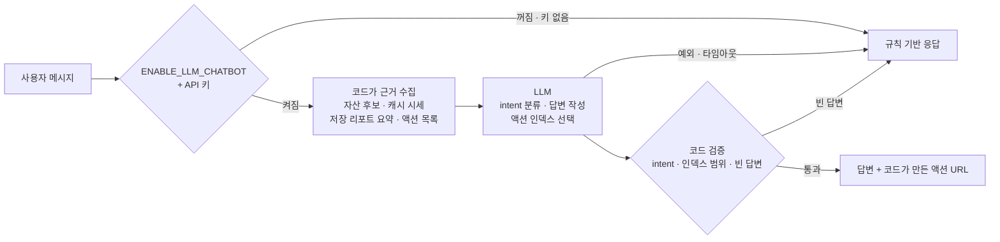
```mermaid
flowchart LR
  M["사용자 메시지"] --> T{"ENABLE_LLM_CHATBOT<br/>+ API 키"}
  T -->|"꺼짐 · 키 없음"| R["규칙 기반 응답"]
  T -->|켜짐| GR["코드가 근거 수집<br/>자산 후보 · 캐시 시세<br/>저장 리포트 요약 · 액션 목록"]
  GR --> L["LLM<br/>intent 분류 · 답변 작성<br/>액션 인덱스 선택"]
  L --> V{"코드 검증<br/>intent · 인덱스 범위 · 빈 답변"}
  L -->|"예외 · 타임아웃"| R
  V -->|"빈 답변"| R
  V -->|통과| A["답변 + 코드가 만든 액션 URL"]
```

**문제 원인**

챗봇은 처음에 규칙 기반이었습니다. 키워드 사전에 없는 문장형 질문이나 오타를 알아듣지 못했고, 답은 대부분 "상세 페이지로 이동하세요"였습니다. LLM을 붙이면 자연어 이해는 나아지지만, 이 서비스에서는 그대로 붙이기 어려운 이유가 있었습니다.

- 서비스의 전제가 "수집하지 않은 숫자는 내보내지 않는다"입니다. LLM이 시세나 리포트 내용을 지어내면 리포트에서 막은 문제가 챗봇으로 다시 들어옵니다.
- 리포트는 스케줄러만 만든다는 원칙이 있습니다. 챗봇이 "NVDA 리포트 만들어 줘"에 응해 생성을 일으키면 LLM 비용이 사용자 수에 비례하게 됩니다.
- 답변의 액션 버튼은 앱 안의 페이지로 이동시킵니다. LLM이 URL을 직접 쓰면 사용자 입력에 섞인 지시(프롬프트 주입)로 엉뚱한 곳을 가리킬 수 있습니다.
- 메시지마다 호출 비용이 들고 외부 API 장애가 챗봇 장애가 됩니다.

그래서 LLM에게 맡길 결정과 코드가 쥘 결정을 먼저 나눴습니다.

**해결 과정**

기본값은 규칙 기반으로 두고(LLM 호출 · 서버 대화 저장 · 스트리밍 없음), LLM 경로는 `ENABLE_LLM_CHATBOT` 토글(기본 `false`)로 얹었습니다. 토글을 켜도 LLM이 하는 일은 셋으로 제한했습니다.

| 코드가 하는 일 | LLM이 하는 일 |
| --- | --- |
| 자산 후보(`find_asset_candidates`) · 카테고리 · **캐시된** 시세 조각(네트워크 호출 없음) · **저장된** 리포트 요약을 결정적으로 수집 | 의도(intent) 분류 |
| 보여 줄 수 있는 액션 목록과 각 액션의 URL을 미리 생성 | 주어진 근거만으로 답변 작성 |
| LLM 출력 검증과 실패 시 규칙 경로로 폴백 | 미리 만든 액션 중 노출할 인덱스 선택 |

LLM은 구조화 출력 `LlmChatPlan`(`answer`, `intent`, `confidence`, `action_indices`)만 돌려줍니다. 출력 스키마에는 URL 필드가 없습니다. 액션 버튼에 대해 모델이 고를 수 있는 것은 코드가 만든 목록의 인덱스뿐이고 코드는 그 출력을 한 번 더 검증합니다. 답변 본문(`answer`)은 자유 텍스트이므로 이 보장은 버튼에 한정됩니다.

```python
if not isinstance(plan, LlmChatPlan):
    return None
if plan.intent not in ALLOWED_INTENTS:
    plan.intent = "unknown"
# 모델이 범위 밖 인덱스를 돌려줘도 버린다
action_count = len(grounding.get("actions") or [])
plan.action_indices = [i for i in plan.action_indices if 0 <= i < action_count]
if not (plan.answer or "").strip():
    return None
return plan
```

- **리포트 생성은 경로 자체에서 뺐습니다.** LLM 경로에는 리포트 생성 도구나 액션이 없고, `ALLOWED_INTENTS`에도 생성 계열 intent가 없습니다. 저장된 리포트 요약이 없으면 "아직 저장된 리포트가 없다"고 안내합니다.
- **실패는 모두 한 곳으로 모았습니다.** 토글 off · 키 없음 · LLM 예외 · 타임아웃(`asyncio.wait_for`) · 빈 답변이면 `compose_chat_answer`가 `None`을 돌려주고, 호출부는 기존 규칙 경로로 돌아갑니다. 토글을 끄면 동작이 이전과 같으므로 별도 롤백 절차가 필요 없습니다.
- **캐시가 비면 모른다고 답합니다.** 시세는 네트워크 호출 없이 캐시만 쓰므로, 캐시가 비어 있으면 숫자를 지어내지 않고 모른다고 답하도록 유도했습니다.
- **대화 맥락은 클라이언트가 들고 있습니다.** 프론트엔드가 최근 대화를 `history`로 보내고, 백엔드는 `CHATBOT_HISTORY_MAX_TURNS * 2`개 메시지로 잘라 프롬프트에만 씁니다. 서버는 대화를 저장하지 않습니다. 이후 기본값을 6턴에서 10턴(20메시지)으로 늘렸고, 스키마의 `history` 최대 길이는 경계에서 검증이 거부되지 않도록 24로 여유를 뒀습니다.
- **접근은 활성 Pro 사용자로 제한했습니다.** JWT가 없거나 잘못되면 401, Pro가 아니면 403입니다.

검토했지만 하지 않은 것도 있습니다. LLM이 URL을 직접 쓰게 하는 방식은 이동 경로를 코드 밖으로 내주는 일이라 택하지 않았습니다. 서버에 대화를 저장하는 방식은 보존 기간과 삭제 정책을 따로 설계해야 해서 넣지 않았습니다. 메시지당 호출 빈도 제한(rate limit)은 아직 넣지 않았고, 트래픽이 늘기 전에 필요한 후속 작업으로 남겼습니다.

핵심 코드: `backend/app/services/chat_llm.py` · `backend/app/services/chat_service.py`

**테스트**

- 환경: 로컬 pytest. `_get_structured_llm`과 `compose_chat_answer`를 모킹해 실제 LLM을 호출하지 않았습니다.
- 토글 off와 키 없음일 때 `None`, intent 검증과 범위 밖 인덱스 제거, LLM 예외 시 규칙 폴백, 근거 데이터에 생성 액션이 없는지 확인합니다. `test_allowed_intents_have_no_report_generation_intent`가 허용 intent에 생성 계열이 없음을 보장합니다.
- LLM 경로 추가 후 챗봇 테스트 19개 통과, 10턴 확장 후 32개 통과
- 토글을 켠 실제 OpenAI 호출 smoke는 비용과 키가 필요해 실행하지 않았습니다.

**결과** 토글을 켜면 LLM이 의도 분류와 답변 작성을 맡고 근거 데이터 · 이동 경로 · 리포트 생성 여부는 코드가 정합니다. 이 흐름은 모킹 테스트로 확인했고 실제 OpenAI 호출로는 확인하지 않았습니다. 토글을 끄면 이전 동작과 같습니다.

**배운 점** LLM을 붙일 때는 분류와 문장 작성은 맡기되, 무엇이 근거인지와 사용자를 어디로 보낼지는 코드가 정합니다.

나머지 사례는 [오류 사례집](docs/harness/error-casebook-2026-06-03.md)과 [개발 기록](docs/harness/records/)에 증상, 원인, 수정, 예방 순서로 정리했습니다.

## 아키텍처

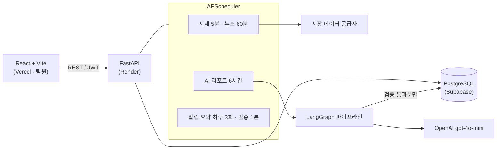
```mermaid
flowchart LR
    FE["React + Vite<br/>(Vercel · 팀원)"] -->|REST / JWT| BE["FastAPI<br/>(Render)"]
    BE --> DB[("PostgreSQL<br/>(Supabase)")]
    subgraph SCH[APScheduler]
      S1[시세 5분 · 뉴스 60분]
      S3[AI 리포트 6시간]
      S4[알림 요약 하루 3회 · 발송 1분]
    end
    BE --- SCH
    S1 --> EXT[시장 데이터 공급자]
    S3 --> G[LangGraph 파이프라인]
    G --> LLM[OpenAI gpt-4o-mini]
    G -->|검증 통과분만| DB
```

리포트는 스케줄러만 만들고 사용자는 저장된 결과를 읽기만 합니다. 읽기와 생성을 나눠 두면 사용자가 늘어도 리포트 생성에 드는 LLM 호출 횟수는 그대로입니다.

### 리포트 생성과 검증

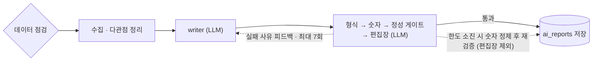
```mermaid
flowchart LR
    RD{데이터 점검} --> AG[수집 · 다관점 정리] --> W["writer (LLM)"]
    W --> V["형식 → 숫자 → 정성 게이트<br/>→ 편집장 (LLM)"]
    V -. 실패 사유 피드백 · 최대 7회 .-> W
    V -->|통과| SAVE[(ai_reports 저장)]
    V -.->|"한도 소진 시 숫자 정제 후 재검증 (편집장 제외)"| SAVE
```

- **형식 게이트**: 고정된 10개 섹션과 자산군별 분석 항목이 모두 있는지 확인합니다.
- **숫자 게이트**: 리포트에 나온 숫자가 수집 데이터에 있는지 대조합니다. writer에게도 검증기와 같은 데이터에서 뽑은 허용 숫자 목록을 넘깁니다.
- **정성 게이트**: 근거 없는 단정을 걸러냅니다.
- **편집장(LLM)**: 문체와 논리를 봅니다.

외부 API는 실패한다는 전제로 만들었습니다. 공급자마다 타임아웃과 폴백을 두고, 수집에 실패하면 직전 유효값을 유지합니다.

## 기술 스택

| 구분 | 기술 | 선택한 이유 |
| --- | --- | --- |
| 백엔드 | FastAPI, SQLAlchemy 2.0(Async) + asyncpg, Alembic | 외부 API를 여러 곳 동시에 호출해야 해서 비동기가 필요했습니다 |
| AI | LangGraph, LangChain, OpenAI gpt-4o-mini | 검증 실패 시 다시 쓰게 하는 반복 구조를 노드 단위로 표현할 수 있습니다 |
| 데이터베이스 | PostgreSQL 15 (Docker / Supabase) | 테스트는 SQLite(aiosqlite)로 대체해 외부 의존 없이 실행합니다 |
| 스케줄링 | APScheduler | 상시 가동 프로세스 안에서 주기 작업을 돌립니다 |
| 외부 데이터 | Finnhub, FMP, CoinGecko, FRED, 한국은행 ECOS, 공공데이터포털, Stooq, open.er-api, Naver 뉴스 | 자산군마다 무료로 쓸 수 있는 공급자가 달라 나눠 붙였습니다 |
| 알림 | Gmail API, Telegram Bot | |
| 테스트 · 배포 | pytest + pytest-asyncio, GitHub Actions, Render, Supabase, Vercel | |

프론트엔드는 React 19 + Vite로 팀원이 맡았습니다.

## 역할과 기여도

백엔드와 배포 전체를 맡았습니다. 프론트엔드는 팀원이 담당했습니다. 저장소는 제 계정으로 관리해서 팀원이 쓴 프론트엔드 코드도 제 커밋으로 들어가 있습니다.

- API 41개와 테이블 14개를 설계하고 구현했습니다. Alembic 리비전은 3개입니다.
- LangGraph 리포트 파이프라인과 검증 게이트 네 단계를 만들었습니다.
- 스케줄러 잡을 붙였습니다. 시세 5분, 뉴스 60분, 리포트 6시간, 알림 요약 하루 3회(기본 09:00 · 13:00 · 18:00), 알림 발송 1분이고 모두 중복 실행을 막았습니다.
- 시장 데이터 공급자 아홉 곳을 자산군별로 나눠 붙이고 공급자마다 캐시와 쿨다운을 뒀습니다.
- 챗봇을 만들었습니다. 기본은 규칙 기반이고 LLM 경로를 켜도 모델에는 저장된 데이터만 근거로 넘기며 이동 URL은 코드가 만듭니다.
- 구독 결제를 붙였습니다. 결제 공급자를 바꿀 수 있게 경계를 두고 Toss Payments 빌링 인증 단계까지 구현했습니다.
- Render와 Supabase에 배포하고 운영했습니다.
- pytest 228개를 작성하고 GitHub Actions로 자동 실행되게 했습니다.

## 결과

**테스트** pytest 228개가 통과합니다. 데이터베이스는 SQLite로 대체하고 외부 API와 LLM 호출은 monkeypatch로 바꿔서 네트워크 없이 실행됩니다. GitHub Actions가 push와 PR마다 같은 테스트를 돌립니다.

**리포트 품질 측정** 스케줄러 대상 5개 자산을 4번씩, 총 20건을 같은 조건으로 생성해 쟀습니다. 처음에는 게이트를 온전히 통과한 것이 0건이었습니다. 원인은 편집장 프롬프트에 오늘 날짜와 데이터 기준 시각이 없어서 모델이 2026년 데이터를 오래된 것으로 판단한 것이었습니다. 편집장은 51번 호출되는 동안 한 번도 통과시키지 않았고, 한 번은 현재 시점이 2023년이라고 답했습니다. 프롬프트에 오늘 날짜와 데이터 기준 시각을 넣은 뒤 같은 조건으로 다시 쟀습니다.

| 지표 | 처음 | 수정 후 |
| --- | --- | --- |
| 게이트 통과 | 0 / 20 | 5 / 20 |
| 숫자 정제 후 저장 | 5 / 20 | 5 / 20 |
| 거부 | 15 / 20 | 10 / 20 |
| 건당 평균 비용 · 시간 | $0.0127 · 83초 | $0.0120 · 78초 |

20건 표본이라 실행마다 편차가 있고 운영 서버에서 잰 수치는 아닙니다.

**응답 속도** 국내 종목 조회가 19.6초 걸려 타임아웃이 났습니다. 조회에 날짜 범위를 넣어 1~3초로 줄였습니다.

**비용** 대상 자산 5개, 6시간 주기, 자산별 쿨다운, 호출 간 대기를 설정값으로 두어 리포트 생성 LLM 비용이 사용자 수와 무관하게 정해집니다.

## 실행 방법

Python 3.11+, Node.js 20+, Docker가 필요합니다.

```powershell
Copy-Item .env.example .env          # 값을 채웁니다
docker compose up -d db              # 데이터베이스

cd backend                           # 백엔드 http://localhost:8000
pip install -r requirements.txt
uvicorn app.main:app --reload
pytest

cd ../frontend                       # 프론트엔드 http://localhost:5173
npm install
npm run dev
```

API 문서는 백엔드 실행 후 `http://localhost:8000/docs`에서 볼 수 있습니다. 환경변수 설명은 [ENVIRONMENT_VARIABLE_SETUP.md](docs/guides/ENVIRONMENT_VARIABLE_SETUP.md)에 있습니다.

## 문서

- [docs/README.md](docs/README.md) — 전체 문서 색인
- [CODE_UNDERSTANDING.md](docs/architecture/CODE_UNDERSTANDING.md) — 구조와 데이터 흐름
- [오류 사례집](docs/harness/error-casebook-2026-06-03.md) · [개발 기록](docs/harness/records/)
- 캡스톤 산출물: [흐름도](docs/deliverables/01-시스템-흐름도.md) · [ERD](docs/deliverables/04-ERD.md) · [API 명세](docs/deliverables/05-API-명세서.md)
